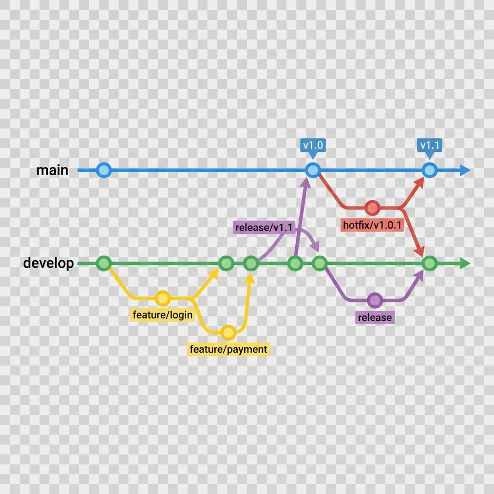
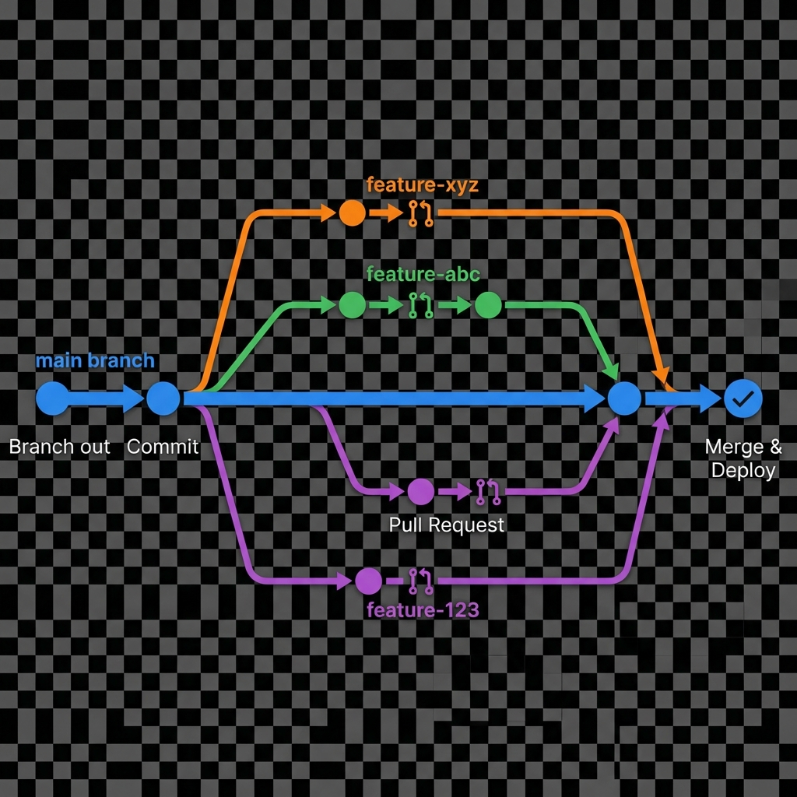

## **Git** {#git}

### **Branching Strategy** {#branching-strategy}

Git branching strategies are sets of rules and conventions that dictate how a team uses Git branches to manage a project's development. The most common strategies are GitFlow, GitHub Flow, and Trunk-Based Development. Choosing the right one depends on your team's size, project complexity, and release frequency.

---

#### **1\. GitFlow** {#1.-gitflow}

GitFlow is a complex, structured branching model for projects with scheduled release cycles. It uses two main long-lived branches and three supporting branches. Typically for waterfall.

This is a good example from youtube

[Gitflow Explained](https://youtu.be/Aa8RpP0sf-Y)

* **`main` (or `master`)**: This branch contains the **production-ready** code. It is the official release history, and commits here are tagged with version numbers.  
* **`develop`**: This is the main development branch. All new feature work is integrated here.  
* **`feature/*`**: Short-lived branches created from `develop` to develop new features. They are merged back into `develop` when complete.  
* **`release/*`**: Short-lived branches created from `develop` when a new version is ready for release. They are used for final bug fixes and are then merged into **both** `main` and `develop`.  
* **`hotfix/*`**: Short-lived branches created from `main` to fix urgent bugs in production. They are merged back into **both** `main` and `develop`.

**Best for**: Projects with long, planned release cycles. 🗓️

---

#### **2\. GitHub Flow** {#2.-github-flow}

GitHub Flow is a simpler, more lightweight strategy built for continuous delivery. It revolves around a single, always-deployable branch.

[Git Flow vs GitHub Flow: What You Need to Know](https://youtu.be/hG_P6IRAjNQ)

* **`main` (or `master`)**: The **only** long-lived branch. All code on this branch is considered deployable at any time.  
* **`feature/*`**: Short-lived branches for new features or bug fixes. They are created from `main`, and when the work is complete, a pull request is opened, reviewed, and merged directly back into `main`.

**Best for**: Agile teams practicing continuous integration and delivery, especially for web applications. 🚀

---

#### **3\. Trunk-Based Development (TBD)** {#3.-trunk-based-development-(tbd)}

TBD is an extreme form of continuous integration where all developers work on a **single, shared branch** called the "trunk" or "mainline." It prioritizes fast, frequent code merges.

* **`trunk` (or `main`)**: The single source of truth. Developers commit to this branch multiple times a day.  
* **Short-lived feature branches**: In some variations, developers may create branches for a few hours at most, and then merge them back into the trunk as quickly as possible. This is often done in combination with **feature flags** to hide incomplete features from users.

**Best for**: Highly disciplined teams focused on high-frequency releases. This is a core practice for DevOps. ⚡

#### **The Key Difference** {#the-key-difference}

While both use a single long-lived branch and short-lived feature branches, the distinction is in the **frequency of integration** and the tools used to achieve it.

| Feature | GitHub Flow | Trunk-Based Development (TBD) |
| :---- | :---- | :---- |
| **Branch Lifespan** | **Short-lived**, but can last for a while (days or weeks) depending on the feature's size. | **Extremely short-lived** (hours, not days). Commits happen multiple times a day. |
| **Core Principle** | Pull Requests as a collaboration tool. | Frequent integration to avoid conflicts. |
| **Key Enabler** | Pull Requests and code reviews. | **Feature flags** and **robust automated testing**. |

### **Git cli** {#git-cli}

#### **Viewing All Configuration Settings** {#viewing-all-configuration-settings}

* **`git config --list`**: This is the most common command. When run inside a repository, it will show all configuration settings from the **system**, **global**, and **local** levels. Local settings override global, which in turn override system settings.  
* The most direct command to open your Git configuration file in your default text editor is **`git config --global --edit`**.

#### **Initial Setup and Configuration** {#initial-setup-and-configuration}

Before you start, you'll want to tell Git who you are. This information is attached to your commits. This is a one-time setup on your computer.

* `git config --global user.name "Your Name"`  
* `git config --global user.email "youremail@example.com"`

#### **Creating a New Project** {#creating-a-new-project}

If you're starting a new project, you'll create a local repository from scratch.

* `git init` \- Initializes a new, empty Git repository in the current directory. This creates a hidden `.git` folder.

#### **Basic Workflow (Staging and Committing)** {#basic-workflow-(staging-and-committing)}

This is the core loop of using Git. You make changes to your files, tell Git which changes to track, and then save a snapshot of those changes.

* `git status` \- Shows the status of your working directory. It tells you which files have been modified, are new (untracked), or are ready to be committed (staged).  
* `git add <file>` \- Adds a specific file to the **staging area**. This marks the file to be included in the next commit.  
* `git add .` \- Adds all new and modified files in the current directory and its subdirectories to the staging area.  
* `git commit -m "Your commit message"` \- Takes a snapshot of the files in the staging area and saves it to the local repository. The `-m` flag lets you add a concise message describing the changes.

#### **Working with a Remote Repository** {#working-with-a-remote-repository}

Often, you'll be working with a project that already exists on a service like GitHub, GitLab, or Bitbucket.

* `git clone <repository_url>` \- Creates a local copy of a remote repository. This is what you do when you first start working on a project.  
* `git push` \- Uploads your local commits to the remote repository.  
* `git pull` \- Downloads the latest changes from the remote repository and merges them into your local branch.

#### **Branching and Merging** {#branching-and-merging}

Branches allow you to work on new features or bug fixes in an isolated environment without affecting the main codebase.

* `git branch` \- Lists all local branches in your repository.  
* `git branch <new_branch_name>` \- Creates a new branch, but you remain on your current branch.  
* `git checkout <branch_name>` \- Switches to a different branch.  
* `git checkout -b <new_branch_name>` \- Creates a new branch and switches to it in one command.  
* `git merge <branch_to_merge>` \- Merges the changes from a specified branch into your current branch. This is how you integrate finished work.

#### **Git Merge Versus Git Rebase** {#git-merge-versus-git-rebase}

The key difference between `git merge` and `git rebase` is how they integrate changes from one branch into another. Both commands serve a similar purpose, but they do so in fundamentally different ways that affect your repository's history.

---

#### **Git Merge** {#git-merge}

**`git merge`** combines the histories of two branches by creating a **new merge commit**. This commit has two parent commits—one from each of the branches being merged. This approach preserves the complete history of both branches, including the chronological order of all commits. It's a non-destructive operation because it doesn't alter the existing commits.

**Workflow:** You are on the `main` branch and want to integrate a feature branch.

* `git checkout main`  
* `git merge feature-branch`

**When to use it:** Use `git merge` when you want to preserve an accurate and traceable history of how branches were integrated. It's the safer option, especially when working on a public or shared branch, as it avoids rewriting history that other developers might be relying on.

---

#### **Git Rebase** {#git-rebase}

**`git rebase`** moves or "re-bases" a sequence of commits to a new base commit, effectively rewriting the project's history. Instead of creating a new merge commit, it takes all the commits from your feature branch and reapplies them, one by one, on top of the latest commit on the target branch. This results in a clean, linear history.

**Workflow:** You are on your feature branch and want to rebase it onto the `main` branch.

* `git checkout feature-branch`  
* `git rebase main`

**When to use it:** Use `git rebase` to maintain a clean and linear project history. This makes the `git log` easier to read and can simplify debugging with tools like `git bisect`. The golden rule is to **never rebase a public or shared branch** because rewriting its history can cause major problems for other developers. It's best used for cleaning up your personal, local branches before integrating them into a shared branch.

#### **Git Revert, Reset, Hard and Soft** {#git-revert,-reset,-hard-and-soft}

**The primary difference is how they handle your commit history.**

`git revert` is a **safe**, forward-moving command that creates a **new commit** to undo changes from a previous commit, preserving the history. `git reset` is a **destructive** command that **erases** commits from the branch's history by moving the branch pointer, and it has three modes (`soft`, `mixed`, and `hard`) that determine what happens to your files.

---

#### **git revert** {#git-revert}

This command creates a new commit that **reverses the changes** of a specified commit. It does not delete any commits from the history. This is the **safest** way to undo changes, especially on a shared or public branch, because it doesn't rewrite history and won't cause problems for other developers.

**When to use it:** To undo a commit that has already been pushed to a remote repository.

---

#### **git reset** {#git-reset}

This command changes where your branch pointer is pointing, effectively **rewriting history** by removing commits from the end of the branch. Because it changes history, it is only safe to use on **local, un-pushed commits**. It is a dangerous command if used incorrectly, as it can lead to data loss.

`git reset` has three modes that affect the state of your files in the working directory and staging area:

* **`git reset --soft <commit_hash>`**  
  * **Action:** Moves the branch pointer to the specified commit.  
  * **Files:** Keeps all changes from the "removed" commits and puts them in the **staging area** (ready to be committed again). Your working directory is untouched.  
  * **Use case:** You made a few commits but want to combine them into a single, cleaner commit.  
* **`git reset --mixed <commit_hash>`** (This is the default mode)  
  * **Action:** Moves the branch pointer to the specified commit.  
  * **Files:** Keeps the changes from the "removed" commits but puts them in the **working directory** as unstaged changes.  
  * **Use case:** You made some commits but realized they were bad and want to restart by re-adding and re-committing the files.  
* **`git reset --hard <commit_hash>`** ⚠️  
  * **Action:** Moves the branch pointer to the specified commit.  
  * **Files:** **Discards all changes** from the "removed" commits. All uncommitted changes in your working directory and staging area are permanently deleted.  
  * **Use case:** You made a bunch of changes and commits, but you want to completely throw away all of that work and go back to a clean state. Use this with extreme caution.
