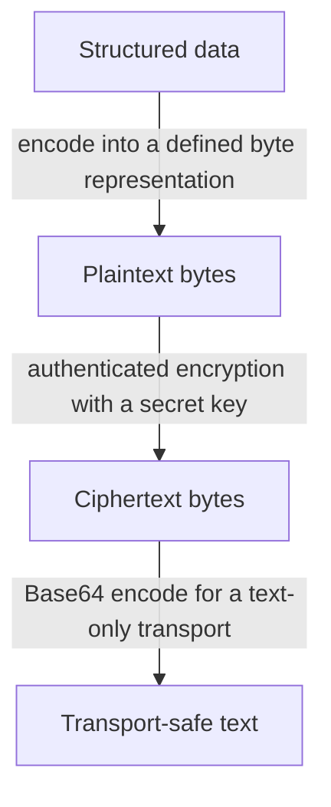

---
tags:
  - engineering-foundations
---

# Encoding

Encoding converts data from one representation into another so that a system can store, transmit, or interpret it correctly.

```text
original data -- encode --> encoded representation
original data <-- decode -- encoded representation
```

The rules are public and no secret is involved. Anyone who knows the format can decode the result, so encoding does not provide confidentiality.

## Common Forms of Encoding

- **Character encoding:** UTF-8 represents text as bytes.
- **Base64:** represents binary data using a limited set of text characters.
- **URL encoding:** escapes characters that have special meaning in a URL.
- **Image and audio formats:** define how media data is represented and interpreted.

Base64 is useful when a text-only channel must carry binary data. Its output may look unreadable, but it is trivially reversible:

```text
hello -> aGVsbG8= -> hello
```

Encoding credentials, tokens, or private keys does not protect them. Access controls, encryption, and careful secret handling are still required.

## Encoding Compared with Encryption and Hashing

| Technique | Primary purpose | Reversible? | Secret required? |
| --- | --- | --- | --- |
| Encoding | Represent data in a compatible format | Yes | No |
| [Encryption](./encryption.md) | Keep data confidential | Yes, with the correct key | Yes |
| [Hashing](./hashing.md) | Create a fixed-size fingerprint | No, by design | No |

These are categories of operations, not interchangeable levels of security. Data may pass through all three during its lifecycle because each transformation has a separate responsibility.

For example, a service sending a sensitive structured message might use this flow:



The receiver reverses the applicable operations in the opposite order: Base64-decode, authenticate and decrypt, then interpret the encoded structure.

## Common Misconceptions

- **“It looks unreadable, so it is encrypted.”** Encoded data is often unreadable to a person but remains publicly reversible.
- **“Base64 protects secrets.”** Base64 only changes the representation; anyone can decode it.
- **“Encoding and compression are the same.”** Encoding changes representation, while compression aims to reduce size. A format may use both.

The reliable mental model is simple: **encoding preserves meaning across representations**.

## A Simple Real-World Example

An email system uses Base64 to represent a photo attachment as text that can travel safely within an email message. The recipient's email application decodes that text back into the original photo.

```text
photo bytes -> Base64 text -> email transport -> photo bytes
```

Anyone who obtains the Base64 text can decode the photo. Encoding makes the data compatible with the transport; it does not keep the photo secret.

## Worked Prediction: Characters Are Not Bytes

Predict the lengths and the final value before running this Python example:

```python
import base64

text = "café"
raw = text.encode("utf-8")
encoded = base64.b64encode(raw)
print(len(text), len(raw))
print(base64.b64decode(encoded).decode("utf-8"))
```

**Check your reasoning:** The lengths are `4` and `5`; UTF-8 uses two bytes for `é`. Decoding returns `café`. Base64 transforms bytes into a transport representation; it does not identify the original character encoding or protect the text.

If the receiver interprets the UTF-8 bytes as Latin-1, it gets corrupted-looking text instead of the original characters. Agree the encoding at the boundary and preserve it through storage and transport. For a second attempt, explain why character count, byte count, and user-perceived symbol count can all differ for emoji or combining accents.

## Interview Questions

> [!question] Interview Questions
> - Why doesn't Base64 provide confidentiality, even though the output looks unreadable?
> - How would you explain the difference between encoding, encryption, and hashing to someone who conflates them?
> - In a pipeline that encodes, encrypts, and then Base64-encodes a message, in what order would the receiver reverse those steps?
> - What's the difference between encoding and compression?

## Answer Notes

1. Base64 is a reversible representation with a public decoding algorithm and no secret key. Anyone who has the output can decode it.

2. Encoding changes representation for storage or transport; encryption protects confidentiality using keys; hashing produces a fixed-size digest and is not designed to be reversed.

3. Base64-decode first, then decrypt using the required key and parameters, then decode the recovered bytes using the original character encoding. Reverse the transformations in the opposite order.

4. Encoding changes representation; compression exploits redundancy to reduce size. Neither inherently provides confidentiality, and Base64 usually makes binary data larger.

Return to [Engineering Foundations](./README.md).
