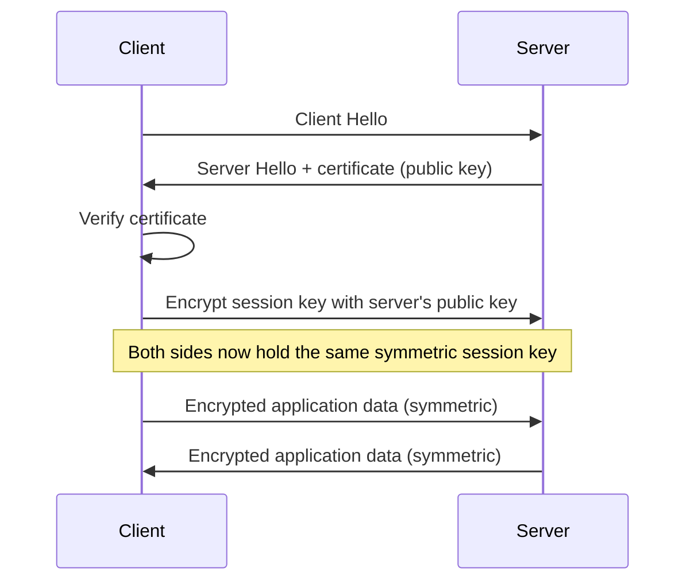
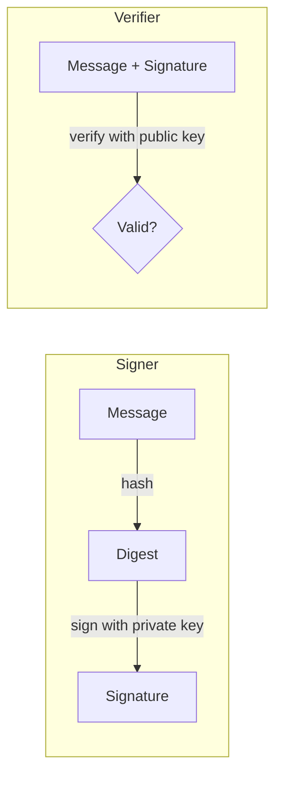

---
tags:
  - engineering-foundations
---

# Encryption

Encryption transforms plaintext into ciphertext using an algorithm and a key. Its purpose is to keep data confidential from anyone who does not have the appropriate key.

```text
plaintext -- encryption algorithm + key --> ciphertext
plaintext <-- decryption algorithm + key -- ciphertext
```

The algorithm can be public; security depends on protecting the key and using a well-studied scheme correctly. Custom cryptography is difficult to evaluate and should not replace established libraries and protocols.

## Symmetric Encryption

Symmetric encryption uses the same secret key, or directly related secret keys, for encryption and decryption.

```text
sender -- shared secret key --> ciphertext -- shared secret key --> recipient
```

Algorithms such as AES and ChaCha20 are efficient for protecting files, database fields, backups, and network traffic. The main challenge is key distribution: every party that can decrypt the data must obtain and protect the secret.

Modern systems normally use **authenticated encryption**, such as AES-GCM or ChaCha20-Poly1305. It protects confidentiality and also detects accidental or malicious modification. Encryption without authentication can hide content while still allowing an attacker to alter the ciphertext in dangerous ways.

## Asymmetric Encryption

Asymmetric cryptography uses a mathematically related key pair:

- a **public key** may be distributed;
- a **private key** must remain secret.

Data encrypted for a recipient with the public key can be decrypted with the corresponding private key. Asymmetric operations are comparatively expensive, so protocols commonly use them to establish or protect a temporary symmetric key and then use symmetric encryption for the actual data.

```text
public-key cryptography establishes a shared session key
                         |
                         v
symmetric encryption protects the conversation efficiently
```

This hybrid approach is used by protocols such as TLS. The full security of such a protocol also depends on certificate validation, secure configuration, and correct endpoint identity—not merely on encryption being present.



## Key Management

Strong encryption cannot compensate for exposed or unavailable keys. A secure design considers:

- how keys are generated using cryptographically secure randomness;
- where keys are stored and who or what may use them;
- how keys are rotated, backed up, revoked, and destroyed;
- how environments and tenants are isolated;
- how access is audited without logging secrets;
- what happens when a key is lost or compromised.

Hard-coding a key beside the ciphertext usually defeats the intended protection. [Encoding](./engineering-foundations-encoding.md) a key with Base64 does not make its storage safer.

## Digital Signatures

Digital signatures use asymmetric cryptography and [hashing](./engineering-foundations-hashing.md) to provide integrity and evidence that the signer controlled a particular private key.



Unlike a message authentication code, a signature can be verified using a public key without sharing the signing key. A valid signature does not automatically identify a person or organisation; that trust depends on how the public key is associated with an identity, such as through a certificate or a trusted registration process.

Signing does not encrypt the message. A signed message can remain completely readable unless encryption is applied separately.

## Choosing Encryption

| Requirement | Appropriate mechanism |
| --- | --- |
| Protect stored or transmitted content from disclosure | Authenticated encryption |
| Protect a large amount of data efficiently | Symmetric encryption |
| Establish a secret with a remote party | A standard hybrid protocol |
| Let others verify a private-key holder approved content | Digital signature |

Use mature libraries with secure defaults. Algorithm choice is only one part of the design: key custody, randomness, protocol context, error handling, metadata exposure, and upgrade planning all affect the security of the overall system.

## Common Misconceptions

- **“Encryption proves who sent the data.”** Confidentiality alone does not authenticate a sender; use authenticated encryption, a message authentication code, or a signature as appropriate.
- **“A public key must be secret.”** Public keys are designed to be shared. Private keys and symmetric keys require protection.
- **“Encrypted data cannot be changed.”** Encryption alone may not detect tampering. Authenticated encryption also verifies integrity.

The reliable mental model is simple: **encryption protects secrecy by making data readable only with the correct key**.

## A Simple Real-World Example

When you visit a website over HTTPS, your browser and the website establish temporary encryption keys. They use those keys to encrypt information such as passwords, messages, and payment details while it travels across the network.

```text
browser data -> encrypt -> unreadable network traffic -> decrypt -> website
```

Someone monitoring the connection may see that traffic exists, but should not be able to read its protected contents.

## Interview Questions

> [!question] Interview Questions
> - What's the difference between symmetric and asymmetric encryption, and why do protocols like TLS use both together?
> - Why is authenticated encryption preferred over plain encryption?
> - If a public key must be shared to be useful, what actually needs to stay secret in asymmetric cryptography?
> - How does a digital signature differ from encryption, and what does a valid signature actually prove?
> - What happens to your data's confidentiality if a private key is exposed, and how would you contain the damage?
> - Why doesn't encrypting a message also guarantee no one tampered with it?

Return to [Engineering Foundations](./README.md).
