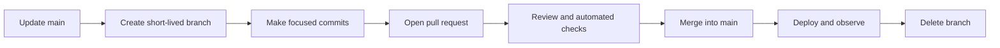
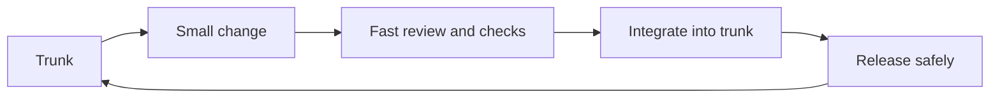
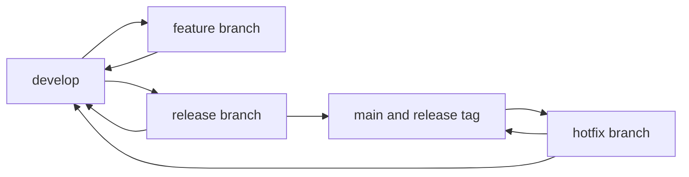

# Git

Git is a distributed version-control system. It records snapshots of a project, supports parallel development, and gives teams tools for reviewing, integrating, releasing, and recovering changes.

Git and GitHub are related but different:

- **Git** manages repository history locally and communicates with remotes.
- **GitHub**, GitLab, and Bitbucket host Git repositories and add collaboration features such as pull requests, reviews, permissions, and CI/CD integrations.

## The Git State Model

Most Git commands become easier to understand when you know which state they affect.

```text
Working tree -> staging area -> local repository -> remote repository
    git add       git commit         git push

Working tree <- staging area <- local repository <- remote repository
 git restore   restore --staged   fetch, then integrate
```

### Working Tree

The files currently checked out on disk. Editing, creating, or deleting a file changes the working tree.

### Staging Area

Also called the **index**, this is the proposed content of the next commit. `git add` copies selected changes into it.

### Local Repository

The commit history and references stored inside `.git`. `git commit` creates a new local snapshot from the staging area.

### Remote Repository

A repository available through a server or another path. A remote such as `origin` is a named connection; `git push` publishes local references and `git fetch` updates local knowledge of remote references.

## Initial Configuration

Set the identity attached to new commits:

```bash
git config --global user.name "Your Name"
git config --global user.email "you@example.com"
```

Use repository-local values when work and personal identities differ:

```bash
git config user.name "Work Name"
git config user.email "work@example.com"
```

Configure `main` as the initial branch name for new repositories:

```bash
git config --global init.defaultBranch main
```

Inspect effective configuration and where each value came from:

```bash
git config --list --show-origin --show-scope
git config --global --edit
git config --local --edit
```

Repository-local settings normally override global settings, which normally override system settings. Command-scoped and optional worktree-specific configuration can add further levels.

## Create or Clone a Repository

Create a repository in the current directory:

```bash
git init
```

Clone an existing repository and configure its default remote as `origin`:

```bash
git clone <repository-url>
```

Inspect configured remotes:

```bash
git remote -v
```

## The Daily Workflow

### Inspect Changes

```bash
# Summarise working-tree and staged changes
git status

# Show unstaged changes
git diff

# Show staged changes
git diff --staged
```

Inspect both diffs before committing. `git status` shows file state, while `git diff` shows the actual line-level changes.

### Stage Changes

```bash
# Stage one path
git add <path>

# Interactively select hunks
git add --patch

# Stage changes under the current directory
git add .
```

`git add .` can stage more than intended. Use `git status`, `git diff`, and `git diff --staged` to confirm the commit boundary. Prefer focused commits that represent one coherent change.

### Commit Changes

```bash
git commit -m "Describe the completed change"
```

A useful commit message explains the outcome or reason for the change. Avoid vague messages such as `fix`, `updates`, or `changes`.

Modify the most recent local commit:

```bash
git commit --amend
```

Amending replaces the commit with a new one. Avoid amending a commit that collaborators may already depend on unless the history rewrite is coordinated.

## Branches

A branch is a movable name pointing to a commit. Creating a branch does not copy the repository's files or commit history.

```bash
# List local branches
git branch

# Create and switch to a branch
git switch --create feature/login

# Switch branches
git switch main

# Delete a fully merged local branch
git branch --delete feature/login
```

Older repositories and documentation commonly use these equivalent `checkout` forms:

```bash
git checkout -b feature/login
git checkout main
```

`git switch` is clearer for branch movement because `git checkout` also performs file-restoration operations.

## Remotes, Fetching, Pulling, and Pushing

### Fetch Before Integrating

```bash
git fetch origin
git branch --verbose --verbose
```

`git fetch` downloads remote objects and updates remote-tracking references such as `origin/main`. It does not modify the current branch or working tree, which makes it useful for inspecting incoming work safely.

Compare local and remote history:

```bash
git log --oneline main..origin/main
git diff main...origin/main
```

### Pull Explicitly

`git pull` performs a fetch and then integrates an upstream branch. Make the intended integration strategy explicit:

```bash
# Accept only a fast-forward; fail if histories diverged
git pull --ff-only

# Rebase local commits onto the updated upstream
git pull --rebase

# Integrate with merge behaviour
git pull --no-rebase
```

Teams should agree on a strategy. `git fetch` followed by inspection and an explicit merge or rebase is easier to reason about when learning or when the incoming history is uncertain.

### Push a Branch

Publish a new branch and configure its upstream:

```bash
git push --set-upstream origin feature/login
```

Later pushes can use:

```bash
git push
```

If a private feature branch was intentionally rebased, prefer:

```bash
git push --force-with-lease
```

`--force-with-lease` refuses to overwrite remote work that the local repository does not expect. It is safer than `--force`, but rewriting a shared branch can still disrupt collaborators.

## Branching Strategies

A branching strategy is a team convention rather than a Git requirement. Choose one based on release frequency, deployment model, review requirements, compliance needs, and the team's ability to integrate small changes safely.

### GitHub Flow

GitHub Flow is a lightweight, branch-based workflow centred on a deployable default branch.



Typical steps are:

1. Create a descriptively named branch from the current default branch.
2. Make focused commits and push the branch.
3. Open a pull request early enough to support discussion.
4. Run automated checks and complete review.
5. Merge after the change meets the repository's requirements.
6. Deploy according to the team's release process and observe the result.
7. Delete the merged branch.

**Good fit:** Teams using continuous integration and frequent delivery with one primary release line.

### Trunk-Based Development

Trunk-based development keeps integration intervals very short. Developers either commit small changes directly to a protected trunk through an agreed process or use short-lived branches that return to trunk quickly.



Incomplete behaviour is often separated from release using feature flags, branch-by-abstraction, or incremental implementation. Feature flags require ownership and removal so they do not become permanent complexity.

**Good fit:** Teams able to integrate small changes frequently with strong automated feedback and disciplined release controls.

### GitFlow

GitFlow separates feature integration, release preparation, production history, and emergency fixes using multiple branch types.



- `main` records production releases, which are commonly tagged.
- `develop` integrates work intended for a future release.
- `feature/*` branches start from and return to `develop`.
- `release/*` branches stabilise a planned release and return fixes to both `main` and `develop`.
- `hotfix/*` branches start from production history and return urgent fixes to both release lines.

**Good fit:** Explicitly versioned products with scheduled releases or multiple maintained release lines.

GitFlow introduces more merging and long-lived divergence than simpler workflows. It is not inherently a waterfall process, and teams practising continuous delivery often prefer a lighter strategy.

### Strategy Comparison

| Concern | GitHub Flow | Trunk-Based Development | GitFlow |
| :--- | :--- | :--- | :--- |
| Long-lived branches | Usually one default branch | One trunk | `main` and `develop`, sometimes maintained releases |
| Integration frequency | Frequent pull-request merges | Very frequent, usually at least daily | Features integrate into `develop`; releases integrate later |
| Release model | Often continuous or frequent | Decoupled from integration | Explicit release preparation |
| Key enablers | Pull requests, checks, deployable default branch | Small changes, fast tests, feature flags | Release discipline and careful branch coordination |
| Main risk | Feature branches living too long | Insufficient checks exposing trunk instability | Merge overhead and branch divergence |

## Merge and Rebase

Both commands integrate histories, but they produce different commit graphs.

### Merge

```bash
git switch main
git merge feature/login
```

If `main` has not diverged, Git may perform a **fast-forward** by moving the branch pointer. If histories have diverged, Git normally creates a merge commit with two parents after conflicts are resolved.

Force a merge commit when the team wants to preserve the branch boundary:

```bash
git merge --no-ff feature/login
```

Merge preserves existing commits and is generally suitable for integrating shared history.

### Rebase

Update a private feature branch onto the latest remote default branch:

```bash
git fetch origin
git switch feature/login
git rebase origin/main
```

Rebase finds commits unique to the current branch and reapplies their changes on a new base. The resulting commits have new identities, producing a linear history but rewriting that portion of history.

Do not rebase commits that other people may have based work on unless everyone affected coordinates the rewrite. A remotely published feature branch owned by one person may still be rebased when team conventions allow it.

### Resolve Conflicts

When Git pauses for conflicts:

```bash
git status
```

Open each conflicted file, resolve the marked regions, and stage the resolution:

```bash
git add <resolved-path>
```

Then continue the active operation:

```bash
git merge --continue
git rebase --continue
```

Or abandon it and return to the pre-operation state:

```bash
git merge --abort
git rebase --abort
```

Run relevant tests after resolving semantic conflicts; a file can be textually resolved while its combined behaviour remains wrong.

## Undo and Recovery

Choose a command based on where the unwanted change exists.

| Situation | Typical command | History rewritten? |
| :--- | :--- | :--- |
| Discard an unstaged tracked-file change | `git restore <path>` | No |
| Unstage a change but keep it in the working tree | `git restore --staged <path>` | No |
| Replace the most recent private commit | `git commit --amend` | Yes |
| Reverse a published commit safely | `git revert <commit>` | No |
| Move a private branch while preserving staged changes | `git reset --soft <commit>` | Yes |
| Move a private branch and unstage preserved changes | `git reset --mixed <commit>` | Yes |
| Move a private branch and discard tracked changes | `git reset --hard <commit>` | Yes |
| Find a lost branch position or commit | `git reflog` | No |

### Restore

Discard an unstaged change to a tracked file:

```bash
git restore <path>
```

Unstage a path while retaining its working-tree changes:

```bash
git restore --staged <path>
```

These commands can discard work. Inspect `git diff` and `git diff --staged` first.

### Revert

Create a new commit that reverses the changes introduced by an earlier commit:

```bash
git revert <commit>
```

Revert preserves existing history and is normally the appropriate way to undo a commit already shared with collaborators. Reverting a merge commit requires selecting its mainline parent and deserves additional care.

### Reset

Reset moves the current branch reference. Its mode determines how the staging area and working tree are updated.

```bash
# Preserve removed commit changes in the staging area
git reset --soft <commit>

# Preserve removed commit changes as unstaged working-tree changes
git reset --mixed <commit>

# Make tracked files and the index match the target commit
git reset --hard <commit>
```

`--mixed` is the default mode. `--hard` can permanently destroy uncommitted tracked-file changes and may delete untracked paths that obstruct tracked files being restored. It does not generally clean unrelated untracked files.

Reset commits are often recoverable temporarily because the objects still exist, but recovery should not replace caution.

### Reflog Recovery

The reflog records recent movements of local references:

```bash
git reflog
git show HEAD@{1}
git branch recovered-work <commit>
```

Reflogs are local and expire. They cannot be relied upon as a permanent backup or as a way to recover another person's unpublished work.

### Stash Temporary Work

Temporarily store tracked changes before switching context:

```bash
git stash push -m "Work in progress"
git stash list
git stash show --patch stash@{0}
git stash pop
```

A stash is useful for short interruptions, but a work-in-progress commit on a private branch is often easier to inspect and recover.

## Inspect History and Diagnose Regressions

```bash
# Compact graph of branches and commits
git log --oneline --graph --decorate --all

# Inspect one commit
git show <commit>

# Show commits that changed a path
git log --follow -- <path>

# Attribute lines to commits
git blame <path>
```

Use `git blame` to find historical context, not to assign personal blame.

### Bisect a Regression

`git bisect` performs a binary search through commits to find where a failure began:

```bash
git bisect start
git bisect bad
git bisect good <known-good-commit>
```

Git checks out candidate commits. Test each one and mark it:

```bash
git bisect good
git bisect bad
```

When finished:

```bash
git bisect reset
```

If a reliable test command returns zero for success and non-zero for failure, `git bisect run <test-command>` can automate the search.

## Ignore Files and Protect Secrets

Place generated files, local configuration, build output, and editor-specific files in `.gitignore` where appropriate:

```text
.env
build/
test-results/
*.log
```

Ignoring a path does not stop tracking a file already committed. Remove it from the index while retaining the local copy:

```bash
git rm --cached <path>
```

Never commit credentials. Removing a secret in a later commit does not remove it from earlier history; rotate the credential immediately and follow the repository's incident and history-cleaning process.

## Tags and Releases

Create an annotated tag for a release:

```bash
git tag --annotate v1.0.0 --message "Release v1.0.0"
git push origin v1.0.0
```

A tag identifies a specific commit. A hosted-platform release may add notes and artefacts around that tag, but the Git tag and platform release are distinct concepts.

## Git Practices for SDETs

- Keep test and production-code changes reviewable and logically grouped.
- Run fast, deterministic checks on pull requests and publish actionable failure artefacts.
- Treat CI configuration as production code: review it, test it, and restrict permissions and secrets.
- Avoid committing generated reports, screenshots, recordings, dependency caches, or environment secrets unless the repository explicitly requires them.
- Use commit SHAs and image digests to connect a test result to the exact software tested.
- Test the combined result after merging or rebasing, not only each branch independently.
- Use `git bisect` with a reliable automated test to locate regressions efficiently.
- Protect release branches and require appropriate review and status checks.

## Practice Exercises

1. Initialise a repository and create three focused commits.
2. Stage only part of a modified file using `git add --patch`.
3. Create two branches that edit the same line, then resolve the merge conflict.
4. Rebase a private feature branch onto an updated `origin/main` and explain which commit IDs changed.
5. Undo a published commit with `git revert`.
6. Recover a deliberately reset local commit using `git reflog`.
7. Use `git bisect` to locate a commit that makes a test fail.
8. Draw the team's current branching and release workflow and identify its integration risks.

## Readiness Checklist

You should be able to:

- explain the working tree, staging area, local history, and remote-tracking references;
- build focused commits and inspect exactly what each contains;
- distinguish fetch, pull, merge, rebase, and push;
- resolve and abort merge and rebase conflicts;
- choose safely between restore, revert, reset, amend, and reflog;
- explain fast-forward, merge-commit, rebase, and squash outcomes;
- compare GitHub Flow, trunk-based development, and GitFlow;
- diagnose a regression using repository history;
- protect secrets and avoid overwriting collaborators' work.

## Quick Command Reference

| Task | Command |
| :--- | :--- |
| Inspect file state | `git status` |
| View unstaged changes | `git diff` |
| View staged changes | `git diff --staged` |
| Stage selected hunks | `git add --patch` |
| Create a branch | `git switch --create <branch>` |
| Update remote references | `git fetch origin` |
| Publish a new branch | `git push --set-upstream origin <branch>` |
| View the commit graph | `git log --oneline --graph --decorate --all` |
| Undo a published commit | `git revert <commit>` |
| Find previous local states | `git reflog` |
| Abort a merge | `git merge --abort` |
| Abort a rebase | `git rebase --abort` |

## Further Reading

- [Pro Git book](https://git-scm.com/book/en/v2)
- [`git pull` documentation](https://git-scm.com/docs/git-pull)
- [`git merge` documentation](https://git-scm.com/docs/git-merge)
- [`git rebase` documentation](https://git-scm.com/docs/git-rebase)
- [`git reset` documentation](https://git-scm.com/docs/git-reset)
- [`git reflog` documentation](https://git-scm.com/docs/git-reflog)
- [GitHub Flow](https://docs.github.com/en/get-started/using-github/github-flow)

Return to [Engineering Foundations](./README.md).
