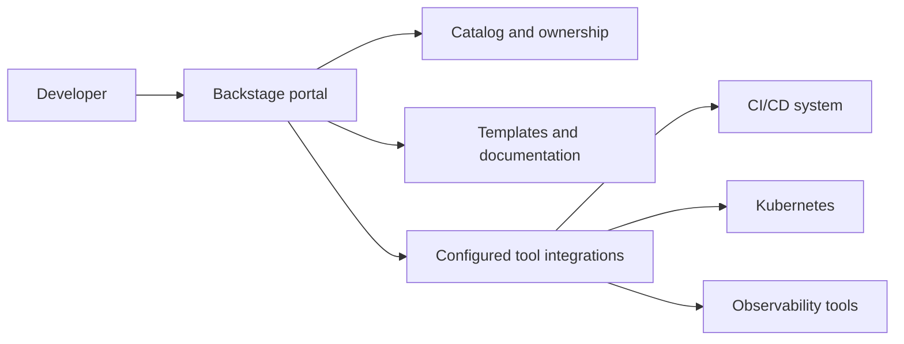

---
tags:
  - platform-engineering
---

# Backstage

Backstage is an open-source framework for building internal developer portals. It gives developers a shared place to find software, its owners, documentation and connected tooling. A platform team assembles and operates the portal around the organisation's workflows. [Backstage overview](https://backstage.io/docs/overview/what-is-backstage/).

## Quick Refresh

| Concept | Purpose |
| --- | --- |
| Software Catalog | Records software entities, ownership, metadata and relationships |
| Software Templates | Guide developers through repeatable project creation or other configured workflows |
| TechDocs | Publishes technical documentation maintained alongside code |
| Plugins | Integrate capabilities such as build status or runtime information into the portal |
| Permissions | Control supported operations through configured authorisation policies |

The catalog can describe services, websites, libraries, APIs and infrastructure resources. Repository metadata is one common input; discovery and integrations must be configured to keep that information current. [Software Catalog](https://backstage.io/docs/features/software-catalog/).

Backstage connects a developer's view of a service to the systems that build and operate it:



CI/CD still executes builds and releases, Kubernetes runs workloads, and observability tools collect and analyse telemetry. Links and plugins bring their information or actions into the portal; those systems retain their own responsibilities and access controls.

## Worked Example: Onboarding a Checkout Service

Suppose developers repeatedly ask who owns checkout, where its runbook lives and how to create a similar service.

Start by registering the existing service. This illustrative `catalog-info.yaml` belongs in the service repository; assume the `payments-team` Group is also registered in the catalog:

```yaml
apiVersion: backstage.io/v1alpha1
kind: Component
metadata:
  name: checkout-api
  description: Handles checkout requests
spec:
  type: service
  lifecycle: production
  owner: group:default/payments-team
```

The file describes a catalog entity. Register or discover its location so Backstage can ingest it. `lifecycle: production` is declared metadata, not evidence that a deployment exists or is healthy. [Entity descriptor format](https://backstage.io/docs/features/software-catalog/descriptor-format/).

Then build up a useful developer workflow:

1. Publish the service's setup guide and runbook through TechDocs, with its documentation configuration and build/publish process in place. Merely adding a catalog entry does not publish documentation. [TechDocs](https://backstage.io/docs/features/techdocs/).
2. Add appropriate links or configured integrations for its pipeline, deployment and dashboards.
3. Offer a Software Template that asks for a new service name and owner, generates starter files, creates a repository and registers it through configured actions. Include tests and a CI configuration in the starter project. [Software Templates](https://backstage.io/docs/features/software-templates/).

A maintained template can provide a recommended route with sensible defaults, often called a **golden path**. Measure whether developers can create and support a service more easily, and provide an intentional route for requirements the template does not cover.

## Common Failure Modes

- **Stale ownership:** a catalog is only useful if teams maintain its metadata and discovery failures are visible.
- **Assuming generation is ongoing management:** updating a starter template does not automatically update every repository previously created from it. Existing services need an explicit upgrade process.
- **Confusing sign-in with permission:** identifying a user does not establish which actions they may perform. Configure authorisation and limit the credentials used by integrations and template actions. [Permission framework](https://backstage.io/docs/permissions/overview/).
- **Treating plugins as maintenance-free:** the portal needs an owner for upgrades, integration compatibility, credentials and availability.
- **Building a portal before defining the problem:** start with a concrete need, such as finding ownership or standardising onboarding, and check whether the portal improves that task.

## Worked Prediction

A service created from a template uses an outdated base image. The platform team fixes the template today. Does the existing service now use the fixed image?

**Check your reasoning:** No. Future generation uses the updated template, but the existing repository and deployed artifact remain unchanged unless a separate update workflow modifies, builds and deploys them. Track affected services and deliver a reviewed update. If an automated upgrade process exists, verify its results rather than inferring success from the template change.

## Interview Questions

> [!question] Interview Questions
> - What problem does Backstage solve, and how does it relate to CI/CD and Kubernetes?
> - What does a catalog entry tell you about a service, and what does it not prove?
> - How do Software Templates and TechDocs help developers start and maintain services?
> - Why does changing a Software Template not automatically fix existing services?

## Answer Notes

1. It provides a common place to discover software, ownership, documentation and connected workflows. CI/CD and Kubernetes remain the systems that execute delivery and run workloads; the portal integrates with them.

2. It describes identity, ownership, lifecycle and other metadata or relationships. Its accuracy depends on maintained sources, and declared lifecycle information does not prove runtime health or access permission.

3. Templates automate configured setup steps and supply agreed defaults. TechDocs makes documentation maintained with code discoverable in the portal; both need owners and upkeep as practices change.

4. Generation produces files at a point in time. Updating the source template changes future output, while existing repositories need a separate migration or dependency-update workflow followed by validation and deployment.

## Official References

- [Backstage documentation](https://backstage.io/docs/overview/what-is-backstage/)
- [Software Catalog](https://backstage.io/docs/features/software-catalog/)
- [Software Templates](https://backstage.io/docs/features/software-templates/)
- [TechDocs](https://backstage.io/docs/features/techdocs/)

## Related Guides

- [GitHub Actions](./ci-cd/github-actions.md) — the delivery workflows a portal can link to or integrate with.
- [Kubernetes](./kubernetes.md) — the runtime behind service deployment information.
- [Grafana](./observability/grafana.md) — service dashboards developers can discover through the portal.
- [Datadog](./observability/datadog.md) — operational evidence to connect with service identity and ownership.

Return to [Platform Engineering](./README.md).
