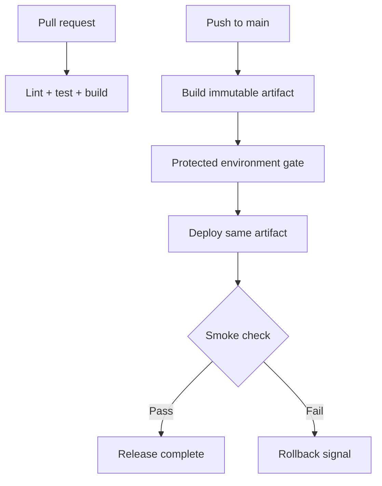

---
tags:
  - platform-engineering/ci-cd
---

# GitHub Actions

GitHub Actions runs repository automation described by YAML workflows. Events trigger workflows, jobs run on selected runners, and steps invoke actions or shell commands.

## Execution Model

```text
event -> workflow -> jobs -> steps -> commands/actions -> artifacts and status
```

Jobs are isolated unless they exchange declared artifacts, cache entries, or outputs. Express dependencies with `needs`, use concurrency controls for superseded deployments, and keep pull-request validation separate from privileged deployment.

## Worked CI Workflow

```yaml
name: CI

on:
  pull_request:
  push:
    branches: [main]

permissions:
  contents: read

concurrency:
  group: ci-${{ github.workflow }}-${{ github.ref }}
  cancel-in-progress: true

jobs:
  test:
    runs-on: ubuntu-latest
    timeout-minutes: 15

    steps:
      - name: Check out source
        uses: actions/checkout@v4

      - name: Configure Node.js
        uses: actions/setup-node@v4
        with:
          node-version: 22
          cache: npm

      - name: Install locked dependencies
        run: npm ci

      - name: Run repository checks
        run: npm run check

      - name: Build production assets
        run: npm run build
```

The workflow grants read-only repository contents, cancels superseded work on the same ref, bounds execution time, installs from the lockfile, and verifies a production build. Select action versions through review; higher-assurance workflows can pin the reviewed commit digest and update it deliberately.

## Security

- Pin third-party actions to trusted versions and review their permissions.
- Set the workflow or job `permissions` block to the minimum required.
- Treat pull-request source, issue text, branch names, and generated outputs as untrusted input.
- Prefer short-lived cloud federation to long-lived service-account keys.
- Protect deployment environments with reviewers or branch rules where risk requires it.
- Do not print secrets or pass them through artifacts and untrusted commands.

Repository secrets are not general configuration storage. Use non-secret variables for public identifiers and environment-specific values that do not require confidentiality.

## Builds and Deployments

Install from lockfiles, run checks before packaging, and upload or promote an immutable artifact rather than rebuilding differently during deployment. Give runtime and deployment identities separate permissions.

Caches improve speed but are not authoritative build inputs. Artifacts are explicit outputs with retention and access implications. Record test results, image identifiers, service URLs, and useful summaries without exposing credentials.

## Deployment Shape



Use a separate deployment job with `needs` so quality gates are explicit. Attach only the cloud identity and environment secrets required by that job. Prefer workload identity federation so the job receives a short-lived credential rather than storing a long-lived cloud key.

## Common Failure Modes

- granting write permissions to the whole workflow by default;
- exposing deployment credentials to untrusted pull-request code;
- using mutable third-party actions without a review/update policy;
- rebuilding a different artifact in each environment;
- interpolating untrusted branch or issue text into a shell command;
- using a dependency cache as though it were a release artifact;
- allowing an unbounded hung test or deployment;
- hiding flaky failures behind automatic retries without reporting them.

## Project Connections

The repositories use GitHub Actions to test and deploy Flask and React services to Cloud Run, build and sign Android artifacts, and validate health-data CSV storage with PowerShell.

## Worked Scenario: A Green Build With the Wrong Evidence

A pull request passes tests, but the deployment job builds again from a moving branch. Predict why the green check may not describe what reaches production.

**Check your reasoning:** Source or resolved inputs may have changed between runs. Identify the tested commit and immutable artifact, then promote that artifact through an explicitly dependent deployment job. Keep untrusted pull-request execution separate from identities allowed to publish or deploy.

Now two releases run concurrently. State which may supersede the other and whether cancellation is safe for the actual operation. Cancelling a test job differs from interrupting a database migration or Terraform apply. Verify the deployed artifact identifier and a meaningful smoke check rather than treating a successful job exit as proof of healthy user behaviour.

## Interview Questions

> [!question] Interview Questions
> - Why should a workflow's `permissions` block default to the minimum required rather than broad write access?
> - What's the risk of exposing deployment credentials to a pull-request-triggered job?
> - Why shouldn't a dependency cache be treated as a release artifact?
> - What's the danger of interpolating untrusted branch names or issue text directly into a shell command?

## Answer Notes

1. Least privilege limits what a compromised workflow or dependency can do with its token. Grant write permissions only to the job that needs them, especially separating validation from deployment.

2. Pull-request code and build steps may be attacker-controlled, so available credentials can be read or exfiltrated. Keep untrusted validation isolated from secrets and privileged deployment execution.

3. A dependency cache is an optional speed optimisation that may be stale or unavailable. A release artifact is the identifiable output that was built and tested; promote that exact artifact rather than reconstructing it from a cache.

4. Direct interpolation can turn user-controlled text into executable shell syntax. Pass values as data through appropriately quoted arguments or environment variables, and avoid evaluating the resulting text as code.

## Official References

- [Workflow syntax](https://docs.github.com/en/actions/reference/workflows-and-actions/workflow-syntax)
- [Expressions](https://docs.github.com/en/actions/reference/workflows-and-actions/expressions)
- [Security hardening for GitHub Actions](https://docs.github.com/en/actions/how-tos/security-for-github-actions/security-guides/security-hardening-for-github-actions)

## Related Guides

- [Backstage](../backstage.md) — expose delivery workflows alongside service ownership and documentation in a developer portal.
- [Continuous Integration and Delivery](./README.md)
- [Terraform](../terraform.md) — infrastructure plans, protected state, and controlled applies in CI.
- [Docker](../docker.md)
- [Cloud Run](../cloud/gcp/gcp-cloud-run.md)
- [IAM](../cloud/gcp/gcp-iam.md)

Return to [Continuous Integration and Delivery](./README.md).
