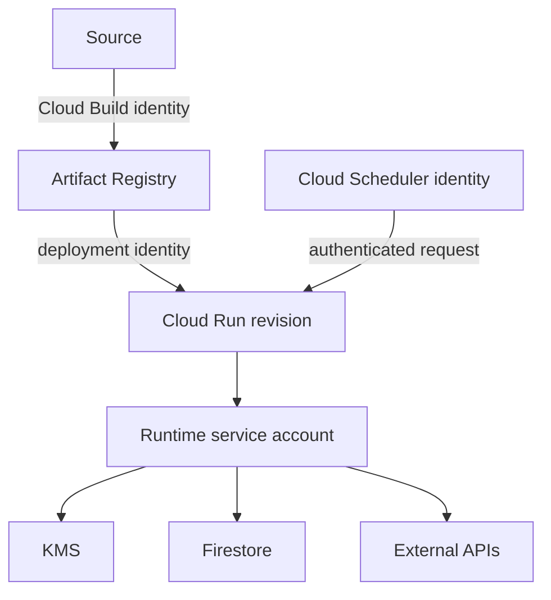

---
tags:
  - platform-engineering/cloud/gcp
---

# Google Cloud Application Services

Several projects combine Cloud Run with supporting Google Cloud services. Each service solves a different delivery or runtime concern and should use a dedicated identity, lifecycle, and access policy.

## Reference Flow



The build identity writes artifacts, the deployment identity selects what runs, and the runtime identity accesses application dependencies. Keeping those permissions separate prevents a compromised runtime from silently publishing its own replacement image.

## Artifact Registry

Artifact Registry stores versioned packages and container images. Use immutable release identifiers such as a commit digest, retain provenance and vulnerability information, and promote a tested image instead of rebuilding it for each environment.

Grant writers only to build or deployment identities and readers only to runtimes that pull artifacts. Define cleanup rules that preserve active releases and the rollback window.

## Cloud KMS

Cloud Key Management Service manages cryptographic keys and authorises cryptographic operations. Applications can send data for encryption or decryption without receiving the key material itself.

Use a resource-level encrypter/decrypter role only where needed. Record the ciphertext's key context, plan key rotation and destruction carefully, and remember that KMS protects keys—not plaintext already present in process memory, logs, or responses.

Envelope encryption is appropriate when data volume or throughput makes direct KMS operations unsuitable: a data-encryption key protects the data and KMS protects that key.

## Cloud Scheduler

Cloud Scheduler invokes an HTTP target or publishes a message on a schedule. Delivery can be retried, so the receiving operation must be idempotent or deduplicate work.

Authenticate scheduled calls with a platform identity where possible. If a shared secret is retained, rotate it, compare it safely, avoid logging it, and restrict the target endpoint. Monitor both scheduler delivery and the downstream job outcome.

### Idempotent Scheduled Operation

A daily reminder endpoint can derive an operation key such as `reminders:2026-08-15`. It records completion under that key before acknowledging success. A retry for the same schedule checks the record and does not notify users twice.

```text
authenticated request
    -> validate schedule and date
    -> begin transaction
    -> insert unique operation key
    -> enqueue per-user reminder work
    -> commit
```

If one request cannot atomically create all work, store progress and make each per-user reminder idempotent as well.

## Firebase Admin SDK

The Firebase Admin SDK gives trusted server code administrative access to Firebase services such as Firestore. Server SDK calls commonly use IAM and can bypass client security rules, so the application must enforce user ownership and authorisation itself.

## Common Failure Modes

- giving the runtime account build or deployment permissions;
- tagging an image only as `latest` and losing release provenance;
- encrypting a value with KMS but writing its plaintext to logs;
- assuming Cloud Scheduler calls only once;
- treating Firebase client security rules as authorisation for Admin SDK code;
- deleting artifacts still required by an active revision or rollback.

## Project Connections

Nyx and Aether publish images to Artifact Registry. The Janus APIs use Cloud KMS for provider credentials, Firebase Admin for Firestore access, and Cloud Scheduler for push-reminder requests.

## Interview Questions

> [!question] Interview Questions
> - Why should the build, deployment, and runtime identities in this flow each have different permissions?
> - What does Cloud KMS actually protect, and what can it not protect once data leaves it as plaintext?
> - Why must a Cloud Scheduler-triggered endpoint be idempotent, and how would you design the operation key for a daily job?
> - Why can server code using the Firebase Admin SDK bypass client security rules, and what does that mean for where authorisation must be enforced?
> - What goes wrong if the runtime service account is also granted deployment permissions?

## Related Guides

- [Cloud Run](./gcp-cloud-run.md)
- [Firestore](./gcp-firestore.md)
- [IAM](./gcp-iam.md)
- [Encryption](../../../engineering-foundations/engineering-foundations-encryption.md)

Return to [Google Cloud Platform](./README.md).
