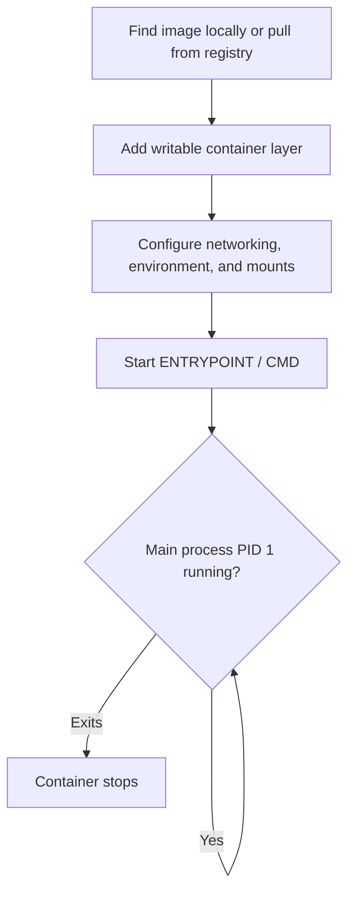
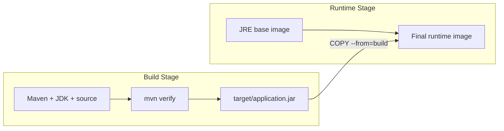
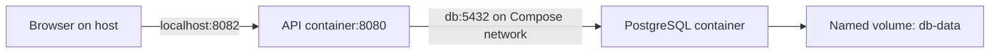

---
tags:
  - platform-engineering
---

# Docker

Docker packages an application and its runtime dependencies into a portable **image**. That image can be started as one or more isolated **containers**, giving the application a consistent environment across development, testing, and deployment.

Containers are processes, not miniature virtual machines. On Linux, the runtime uses kernel features such as namespaces for isolation and control groups for resource accounting and limits. Containers share the host kernel, so their isolation boundary and operating-system compatibility differ from those of virtual machines.

Docker is useful for reproducible development environments, CI dependencies, application packaging, and local multi-service systems. It does not by itself provide application architecture, data durability, security, or production orchestration.

## Explain Docker in a Conversation

Start with the problem it solves, then explain the mechanism:

> "Docker lets us package an application with its runtime and dependencies into an image. We run that image as containers, so developers and deployment environments use the same packaged application. Configuration, networking and persistent data are still managed separately."

For example, a team working on a Python API with PostgreSQL can declare the application image and database service instead of asking every developer to install matching versions manually. The same application image can be tested in CI and promoted to deployment without rebuilding it for each environment.

If someone asks whether that eliminates "works on my machine" problems:

> "It removes many differences in installed runtimes and dependencies. It doesn't make environments identical: configuration, CPU architecture, resource limits, permissions and external services can still differ."

Distinguish the names in ordinary discussion: a **Dockerfile** describes how to build an **image**; a **container** is an instance created from that image; a **registry** stores images; **Compose** describes how several services run together.

### Containers Versus Virtual Machines

| Aspect | Container | Virtual machine |
| :--- | :--- | :--- |
| What is isolated? | Application processes, with their filesystem and runtime configuration | A guest operating system running on virtualised hardware |
| Kernel | Shares the kernel of the environment hosting the containers | Has its own guest kernel |
| Typical overhead | Lower startup and resource overhead | Includes a guest operating system |
| Compatibility | Needs compatible OS/kernel support and CPU architecture, or suitable emulation | Runs a guest OS supported by the virtualisation platform |
| Isolation | Depends on kernel isolation and runtime configuration | Usually provides a stronger boundary between guest operating systems |

A natural explanation is: "A VM provides a whole operating system. A container isolates an application process and supplies the files it needs, while sharing a kernel. That is why containers are usually lighter."

An image may contain Linux distributions' user-space tools and libraries; it does not supply a separate Linux kernel. A Linux container also does not run directly on the Windows kernel. Docker Desktop's WSL 2 backend provides a Linux environment on Windows. Containers and VMs are often used together, including containers running on cloud VMs. See [containers versus VMs](https://docs.docker.com/get-started/docker-concepts/the-basics/what-is-a-container/) and [Docker Desktop's WSL 2 backend](https://docs.docker.com/desktop/features/wsl/).

## Core Concepts

### Image

An image is an immutable template containing the application, runtime, libraries, and configuration needed to start a container. Images are content-addressed and built from read-only layers.

An image is commonly referenced by repository and tag, such as `hello-docker:1.0`. Tags are convenient but mutable: the same tag can later point to different content. A digest such as `image@sha256:...` identifies exact content. Use versioned tags for readability and digests where deployment reproducibility requires an immutable identity.

### Container

A container is a running or stopped instance of an image. Containers use operating-system-level isolation and share the host's kernel, so they are generally lighter than virtual machines.

Each container receives a writable layer over the image. Data in that layer is tied to the container and is lost when the container is removed. Use a volume, bind mount, or external data service for state that must outlive it.

### Dockerfile

A `Dockerfile` is a declarative recipe for building an image. Docker sends a **build context** to the builder; `COPY` and `ADD` can access files in that context, not arbitrary client paths. A `.dockerignore` file reduces the context and prevents accidental inclusion.

Common instructions include:

| Instruction | Purpose |
| :--- | :--- |
| `FROM` | Selects the base image. |
| `WORKDIR` | Sets the working directory inside the image. |
| `COPY` | Copies files from the build context into the image. |
| `RUN` | Executes a command while the image is being built. |
| `ARG` | Defines a build-time value; it is not suitable for secrets. |
| `ENV` | Defines an environment variable in the image. |
| `EXPOSE` | Documents the port the application listens on. |
| `USER` | Selects the user that runs later instructions and the application. |
| `CMD` | Defines the default command used when a container starts. |
| `ENTRYPOINT` | Defines the executable that the container is built to run. |
| `HEALTHCHECK` | Defines a command that reports container health. |
| `LABEL` | Adds image metadata. |

### Registry

A registry stores and distributes images. Docker Hub is a public registry, while organisations often use a private registry. `docker pull` downloads an image and `docker push` uploads one.

### Docker Engine

The Docker command-line client sends requests to the Docker Engine API. The daemon builds images, manages networks and volumes, and asks a lower-level runtime to create containers.

```text
Docker CLI -> Docker Engine -> images, containers, networks, and volumes
                              |
                              -> image registry
```

Access to the Docker daemon is highly privileged. Do not expose its API or mount the Docker socket into a container without understanding that this can effectively grant control of the host.

## How a Container Starts



1. Docker finds the requested image locally or pulls it from a registry.
2. It adds a writable container layer on top of the read-only image layers.
3. It configures the requested networking, environment variables, and storage mounts.
4. It starts the image's configured process using `ENTRYPOINT` and/or `CMD`.
5. The container runs while its main process, process ID 1, is running. When that process exits, the container stops.

An image is not a miniature virtual machine. It is a packaged filesystem plus metadata. A container is an isolated process created from that image.

The main process must handle termination signals and child processes correctly. Exec-form `CMD` and `ENTRYPOINT` avoid an unnecessary shell that can interfere with signal delivery. The `--init` runtime option can add a small init process when the application does not reap child processes itself.

## Example: Dockerise a Simple Application

The following Python application uses only the standard library and returns a message over HTTP.

### Project Structure

```text
hello-docker/
|-- app.py
|-- Dockerfile
`-- .dockerignore
```

### Application Code

Create `app.py`:

```python
import os
from http.server import BaseHTTPRequestHandler, ThreadingHTTPServer


class Handler(BaseHTTPRequestHandler):
    def do_GET(self):
        if self.path == "/health":
            message = "OK"
        elif self.path == "/":
            message = os.getenv("APP_MESSAGE", "Hello from Docker!")
        else:
            self.send_error(404)
            return

        body = f"{message}\n".encode()

        self.send_response(200)
        self.send_header("Content-Type", "text/plain; charset=utf-8")
        self.send_header("Content-Length", str(len(body)))
        self.end_headers()
        self.wfile.write(body)


ThreadingHTTPServer(("0.0.0.0", 8080), Handler).serve_forever()
```

The server listens on `0.0.0.0`, rather than `localhost`, so traffic forwarded into the container can reach it.

### Dockerfile

Create `Dockerfile` with no file extension:

```dockerfile
# syntax=docker/dockerfile:1
FROM python:3.13-slim

WORKDIR /app

ENV PYTHONDONTWRITEBYTECODE=1 \
    PYTHONUNBUFFERED=1

COPY app.py .

RUN useradd --create-home --no-log-init --uid 10001 appuser
USER 10001

EXPOSE 8080

HEALTHCHECK --interval=30s --timeout=3s --start-period=5s --retries=3 \
    CMD ["python", "-c", "import urllib.request; urllib.request.urlopen('http://127.0.0.1:8080/health')"]

CMD ["python", "app.py"]
```

This image starts from a small Python base image, copies in the application, switches to a non-root user, defines a health check using the Python standard library, and runs the server. `EXPOSE 8080` documents the container port but does not publish it to the host.

### Docker Ignore File

Create `.dockerignore` to keep unnecessary or sensitive files out of the build context:

```text
.git
.gitignore
__pycache__/
*.pyc
.env
```

Never copy credentials or secret-bearing `.env` files into an image. Images and their layers may be shared or inspected later.

## Build the Image

Run this command from the directory containing the `Dockerfile`:

```bash
docker build -t hello-docker:1.0 .
```

- `-t hello-docker:1.0` assigns a repository name and tag.
- `.` sets the current directory as the build context.
- Docker can reuse unchanged layers from its build cache on later builds.

Confirm that the image exists:

```bash
docker image ls
```

For a routine rebuild that checks for an updated base image:

```bash
docker build --pull -t hello-docker:1.0 .
```

`--pull` refreshes the base-image reference but still allows other cached layers. `--no-cache` forces instructions to run again; it is useful for diagnosis or a clean rebuild, not as a substitute for understanding cache invalidation.

### Why Dockerfile Instruction Order Matters

For a Python application with dependencies, this order couples dependency installation to every source change:

```dockerfile
COPY . .
RUN pip install --no-cache-dir -r requirements.txt
```

Prefer copying the dependency declaration first:

```dockerfile
COPY requirements.txt .
RUN pip install --no-cache-dir -r requirements.txt
COPY app.py .
```

With the base image and preceding inputs unchanged, an edit to `app.py` can reuse the dependency installation cache. An edit to `requirements.txt` invalidates that step and the dependent steps after it. Copy all files that actually determine dependencies, including lockfiles where your package tool uses them.

Docker's build cache and `pip --no-cache-dir` are different: the first reuses build results; the second disables pip's download cache inside the build. A cached installation step does not automatically rerun because newer packages became available. Use an intentional dependency-update and rebuild process. `--no-cache` reruns build instructions, while `--pull` checks the referenced base image; neither updates an explicitly pinned dependency version for you.

In conversation: "I put dependency installation before frequently changing source files so source-only changes don't repeat the expensive installation step." See [build cache invalidation](https://docs.docker.com/build/cache/invalidation/).

### Multi-stage Build

A compiled application often needs build tools that should not ship in the runtime image. A multi-stage build copies only the produced artifact into a smaller final stage.

This Java example assumes Maven produces `target/application.jar`:

```dockerfile
# syntax=docker/dockerfile:1
FROM maven:3.9-eclipse-temurin-21 AS build

WORKDIR /workspace
COPY pom.xml .
RUN mvn --batch-mode dependency:go-offline

COPY src ./src
RUN mvn --batch-mode verify

FROM eclipse-temurin:21-jre AS runtime

RUN groupadd --gid 10001 app \
    && useradd --no-create-home --uid 10001 --gid 10001 app

WORKDIR /app
COPY --from=build --chown=10001:10001 /workspace/target/application.jar app.jar

USER 10001:10001
EXPOSE 8080
ENTRYPOINT ["java", "-jar", "/app/app.jar"]
```



The build stage contains Maven, a JDK, source, and test dependencies. The final stage contains only a JRE and the application artifact. Configure a deterministic artifact name in the Maven project rather than depending on an uncontrolled wildcard.

Base-image tags remain mutable. Production pipelines may pin an approved digest, rebuild regularly for security fixes, test the rebuilt image, and deliberately update the digest.

### Build Secrets

Do not pass credentials through `ARG` or `ENV` because they can persist in image metadata or layers. BuildKit secret mounts expose a value only to the instruction that needs it:

```dockerfile
RUN --mount=type=secret,id=repository_token \
    token="$(cat /run/secrets/repository_token)" \
    && private-package-client --token "$token"
```

```bash
docker build --secret id=repository_token,src=repository-token.txt .
```

The command is illustrative; use the authentication mechanism supported by the package client and ensure the instruction does not copy or print the secret.

## Run the Application

Start a container in the background:

```bash
docker run --name hello-app -d -p 127.0.0.1:8080:8080 hello-docker:1.0
```

- `--name hello-app` gives the container a memorable name.
- `-d` runs it in detached mode.
- `-p 127.0.0.1:8080:8080` maps host port `8080` to container port `8080` and binds it only to the host's loopback interface.
- `hello-docker:1.0` is the image to instantiate.

Omitting `127.0.0.1` normally publishes the port on all host interfaces. That may be intentional for a server, but loopback is the safer default for a local exercise.

Open `http://localhost:8080` in a browser or make a request:

```bash
curl http://localhost:8080
```

In PowerShell, this also works:

```powershell
Invoke-RestMethod http://localhost:8080
```

Pass configuration through an environment variable by recreating the container:

```bash
docker stop hello-app
docker rm hello-app
docker run --name hello-app -d -p 127.0.0.1:8080:8080 -e APP_MESSAGE="Configured at runtime" hello-docker:1.0
```

Configuration passed at runtime allows the same image to be reused in different environments.

Check the health status:

```bash
docker inspect --format "{{.State.Health.Status}}" hello-app
```

A health check reports status; Docker Engine does not automatically replace an unhealthy standalone container. Compose or an orchestrator can use health information as part of a wider recovery policy.

## Interact with Images and Containers

Images are build artefacts; containers are the processes created from them. Commands that inspect an image do not interact with a running application, so most runtime interaction targets the container.

### List Resources

```bash
# Running containers
docker ps

# Running and stopped containers
docker ps -a

# Local images
docker image ls
```

### Read Application Output

```bash
docker logs hello-app
docker logs --follow hello-app
```

Use `Ctrl+C` to stop following logs. This does not stop the container.

### Execute a Command Inside a Running Container

```bash
docker exec hello-app whoami
docker exec hello-app ls -la /app
docker exec -it hello-app sh
```

The final command opens an interactive shell. Small images may provide `sh` but not `bash`.

### Inspect Runtime Details

```bash
docker inspect hello-app
docker stats hello-app
docker top hello-app
docker port hello-app
```

- `inspect` returns detailed configuration and state as JSON.
- `stats` streams CPU and memory usage.
- `top` displays the container's running processes.
- `port` displays published port mappings.

### Inspect an Image

```bash
docker image inspect hello-docker:1.0
docker image history hello-docker:1.0
```

`inspect` shows image metadata, while `history` shows how its layers were created.

### Stop, Start, and Restart a Container

```bash
docker stop hello-app
docker start hello-app
docker restart hello-app
```

`docker stop` asks the main process to terminate gracefully before forcing it to stop after a timeout.

### Build, Restart, and Recreate Are Different

| Action | What changes? | What does not happen? |
| :--- | :--- | :--- |
| `docker build` | Produces an image and optionally assigns a tag | Existing containers are not updated |
| `docker run` | Creates and starts a new container from an image | It does not reuse an existing container with the same name |
| `docker restart` | Stops and starts the existing container | It does not switch to a newly built image or apply new environment variables |
| Remove and recreate | Creates a replacement using the chosen image and configuration | Data in the removed container's writable layer does not transfer automatically |

Suppose you build `hello-docker:1.0`, run `hello-app`, edit `app.py`, and rebuild the same tag. `hello-app` still refers to its original image. The tag now identifies the new build, but restarting the existing container does not update it. For this stateless example, stop and remove the old container, then run a new one from the rebuilt image. In Compose, use `docker compose up --build --detach` to reconcile changed builds and configuration; `docker compose restart` is not an application update workflow.

A bind mount is different: the container reads files from the mounted host directory instead of the image contents at that path. File edits can become visible immediately, but the application may still need to reload or restart. Installing a new dependency can still require rebuilding the image.

Try explaining the distinction aloud: "Building creates the package. Restarting reruns the existing instance. Recreating makes an instance from the package I now want to use."

### Remove the Example

Remove the container before removing its image:

```bash
docker stop hello-app
docker rm hello-app
docker image rm hello-docker:1.0
```

For a disposable container, `--rm` removes it automatically after it exits:

```bash
docker run --rm -p 127.0.0.1:8080:8080 hello-docker:1.0
```

## Persistent Data

Use a named volume when data must survive container replacement:

```bash
docker volume create app-data
docker run --rm --mount type=volume,source=app-data,target=/app/data hello-docker:1.0
docker volume inspect app-data
```

A **volume** is managed by Docker. A **bind mount** maps a specific host path into the container and is useful during local development:

```bash
docker run --rm --mount type=bind,source="$(pwd)",target=/app,readonly hello-docker:1.0
```

On PowerShell:

```powershell
docker run --rm --mount "type=bind,source=$($PWD.Path),target=/app,readonly" hello-docker:1.0
```

The `--mount` form is more explicit than `-v` and fails when a bind-mount source does not exist instead of silently creating a directory. The read-only option prevents the container from changing the host source. Remove it only when writes are intentional.

A bind mount hides any image content already present at its target for that container. It also couples the container to a host path. Avoid writing important data only to the container's writable layer because it is tied to that individual container.

Use a `tmpfs` mount for temporary data that should remain in memory and disappear with the container:

```bash
docker run --rm --mount type=tmpfs,target=/tmp hello-docker:1.0
```

## Container Networking

Containers on the same user-defined network can resolve one another by container name or network alias. They should use the **container port**, not a host-published port, for this communication.

Connect the running example to a network:

```bash
docker network create hello-net
docker network connect hello-net hello-app
docker network inspect hello-net
```

A second container on that network can address the application as `http://hello-app:8080`. A host port does not need to be published for container-to-container traffic.

Networks also provide separation: unrelated containers need not share the same default bridge. When finished:

```bash
docker network disconnect hello-net hello-app
docker network rm hello-net
```

## Docker Compose

Compose defines a local application made of one or more services, networks, and volumes in YAML. It is useful when a repeatable setup would otherwise require several long `docker run` commands.

Create `compose.yaml` next to the Dockerfile:

```yaml
services:
  app:
    build:
      context: .
    image: hello-docker:1.0
    init: true
    ports:
      - "127.0.0.1:8080:8080"
    environment:
      APP_MESSAGE: "Started with Compose"
```

Operate the project:

```bash
docker compose config
docker compose up --build --detach
docker compose ps
docker compose logs --follow app
docker compose down
```

- `config` renders and validates the resolved configuration.
- `up` creates the default project network and starts the services.
- `--build` rebuilds images whose source may have changed.
- `down` removes the project's containers and network.

Compose service names provide DNS names on the project network. `depends_on` can express startup order, but readiness requires a health check and a `service_healthy` condition. Applications should still tolerate dependencies restarting later.

If a Compose project declares named volumes, `docker compose down` preserves them. `docker compose down --volumes` deletes them and their data, so use that option deliberately.

### Worked Example: An API and a Database

This separate local exercise connects an API to PostgreSQL and proves that database data survives container replacement. Keep it in a new `docker-db-study/` folder so it does not change the earlier `hello-docker` example.



Create `requirements.txt`:

```text
psycopg[binary]>=3.2,<4
```

The range keeps this exercise simple. For reproducible team builds, resolve and pin tested dependencies through the project's lockfile or equivalent process.

Create `app.py`:

```python
import json
import os
from http.server import BaseHTTPRequestHandler, ThreadingHTTPServer

import psycopg


class Handler(BaseHTTPRequestHandler):
    def do_GET(self):
        if self.path == "/health":
            status, result = 200, {"status": "running"}
        elif self.path == "/messages":
            try:
                with psycopg.connect(
                    os.environ["DATABASE_URL"], connect_timeout=3
                ) as connection:
                    with connection.cursor() as cursor:
                        cursor.execute("SELECT message FROM messages ORDER BY id")
                        result = [row[0] for row in cursor.fetchall()]
                status = 200
            except psycopg.Error:
                status, result = 503, {"error": "Database unavailable"}
        else:
            status, result = 404, {"error": "Not found"}

        body = json.dumps(result).encode()
        self.send_response(status)
        self.send_header("Content-Type", "application/json")
        self.send_header("Content-Length", str(len(body)))
        self.end_headers()
        self.wfile.write(body)


ThreadingHTTPServer(("0.0.0.0", 8080), Handler).serve_forever()
```

Create `Dockerfile`:

```dockerfile
FROM python:3.13-slim
WORKDIR /app
ENV PYTHONDONTWRITEBYTECODE=1 PYTHONUNBUFFERED=1
COPY requirements.txt .
RUN pip install --no-cache-dir -r requirements.txt
COPY app.py .
RUN useradd --no-create-home --uid 10001 appuser
USER 10001
EXPOSE 8080
CMD ["python", "app.py"]
```

Create `init.sql`:

```sql
CREATE TABLE messages (
    id integer GENERATED ALWAYS AS IDENTITY PRIMARY KEY,
    message text NOT NULL
);
INSERT INTO messages (message) VALUES ('Hello from PostgreSQL');
```

Create `.dockerignore` containing `.git`, `.env`, `__pycache__/` and `*.pyc`, one pattern per line. Create `compose.yaml`:

```yaml
services:
  api:
    build: .
    init: true
    ports:
      - "127.0.0.1:8082:8080"
    environment:
      DATABASE_URL: "postgresql://study:example-only@db:5432/study"
    depends_on:
      db:
        condition: service_healthy
  db:
    image: postgres:17
    environment:
      POSTGRES_USER: study
      POSTGRES_PASSWORD: example-only
      POSTGRES_DB: study
    volumes:
      - db-data:/var/lib/postgresql/data
      - ./init.sql:/docker-entrypoint-initdb.d/init.sql:ro
    healthcheck:
      test: ["CMD-SHELL", "pg_isready -h 127.0.0.1 -U study -d study"]
      interval: 5s
      timeout: 3s
      retries: 10
      start_period: 10s
volumes:
  db-data:
```

The credentials are public demonstration values for a disposable local database. Real credentials belong in an appropriate secret-management workflow. The application uses the database's bootstrap user here to keep setup short; production applications need a dedicated identity with limited permissions.

Run these commands inside `docker-db-study/`:

```bash
docker compose config --quiet
docker compose up --build --detach
docker compose ps
docker compose logs api db
```

Open `http://localhost:8082/messages` to read the seeded message. The API connects to `db:5432`: `db` is the service name resolved on the Compose network, and `5432` is PostgreSQL's container port. No database host port is published. The browser uses host port `8082` to reach the API's container port `8080`. Inside the API, `localhost` would refer to the API container itself.

Add another message through the database container:

```bash
docker compose exec db psql -U study -d study -c "INSERT INTO messages (message) VALUES ('This survives container replacement');"
docker compose down
docker compose up --detach
```

Reload `/messages`: both messages should remain because the named volume is reused. Keep the same folder and Compose project name; changing the project name normally creates a different project-scoped volume. The PostgreSQL image runs `init.sql` only when initialising an empty data directory. Editing that file does not migrate an existing database. The volume path shown is for PostgreSQL 17; verify the image's storage layout before changing major versions. A persistent volume is not a backup.

`service_healthy` gates initial startup; it does not ensure the database remains available or automatically repair the API when it fails. The demonstration opens a fresh database connection per request and returns 503 when the database operation fails. A production service needs intentional connection pooling, timeouts and recovery behaviour. `/health` checks only that the HTTP process responds, so it can remain healthy while `/messages` fails.

For a diagnostic exercise, stop `db`, observe `/health` and `/messages`, then start `db` and try again. Explain why the API process can still run while a database-dependent request fails.

When finished, `docker compose down` removes containers and the project network while preserving the volume. Use `docker compose down --volumes` only when you intend to erase this exercise's database. See [Compose networking](https://docs.docker.com/compose/how-tos/networking/), [startup order](https://docs.docker.com/compose/how-tos/startup-order/) and the [PostgreSQL image's initialisation and storage rules](https://hub.docker.com/_/postgres).

## Tag and Publish an Image

Tag an image with the registry and repository that will store it:

```bash
docker image tag hello-docker:1.0 registry.example.com/team/hello-docker:1.0
docker login registry.example.com
docker image push registry.example.com/team/hello-docker:1.0
```

The registry returns a digest when content is pushed. A deployment can use the readable tag or pin the exact digest:

```text
registry.example.com/team/hello-docker@sha256:...
```

Do not place registry passwords in shell history, Dockerfiles, or source control. Use the CI platform's credential mechanism and the least-privileged registry identity available.

## Useful Dockerfile Practices

- Use a small base image from a trusted, maintained source.
- Pin an appropriate version or digest and define how updates are adopted.
- Rebuild images regularly; immutability does not make old dependencies secure.
- Copy dependency manifests before application source when possible so dependency layers remain cacheable.
- Use exec-form commands such as `CMD ["python", "app.py"]` so signals reach the application correctly.
- Run the application as a non-root user when it does not require elevated privileges.
- Keep one main responsibility per container and send logs to standard output and standard error.
- Keep secrets out of Dockerfiles, build arguments, environment defaults, source files, and image layers.
- Use multi-stage builds for compiled applications so build tools are not included in the final runtime image.
- Add a `.dockerignore` file to reduce build time and avoid copying unwanted files.
- Install only required packages and remove package-manager caches in the same `RUN` instruction.
- Build, scan, and test the image in CI before publishing it.

### `CMD` and `ENTRYPOINT`

- `CMD` supplies the default command or default arguments. Arguments after the image name in `docker run` replace it.
- `ENTRYPOINT` defines the executable when the image should behave like a command.
- Exec-form arrays avoid an intermediate shell and preserve argument and signal behaviour.
- A wrapper script should finish with `exec "$@"` so the application becomes the main process.

Use environment-variable expansion in a wrapper or application configuration; JSON exec form does not invoke a shell to expand `$VARIABLE`.

## Runtime Security and Limits

An image can be well built and still be run with unsafe privileges. Start with the least access the workload needs.

For this simple application, a stricter local run could be:

```bash
docker run --name hello-app-hardened --rm \
  --read-only \
  --tmpfs /tmp \
  --cap-drop ALL \
  --memory 256m \
  --cpus 1 \
  -p 127.0.0.1:8081:8080 \
  hello-docker:1.0
```

- `--read-only` prevents writes to the container layer.
- `--tmpfs /tmp` supplies ephemeral writable space if the process needs it.
- `--cap-drop ALL` removes Linux capabilities; add back only a capability the workload requires.
- `--memory` and `--cpus` constrain resource consumption.

These settings must be tested with the actual application. Other useful controls include the default seccomp profile, user namespaces or rootless mode, a read-only root filesystem in the orchestrator, and policies that prevent privileged containers.

Security guidelines:

- Never bake runtime credentials into an image.
- Treat environment variables as configuration, not an ideal secret store; they may be visible through management interfaces.
- Never mount the Docker socket merely to make tooling convenient.
- Do not use `--privileged` unless the workload and threat model explicitly require it.
- Avoid publishing ports that only other containers need.
- Scan operating-system and application dependencies, then rebuild and retest fixes.
- Record image provenance and produce an SBOM where supply-chain requirements justify it.
- Keep the host, Docker Engine, base images, and application dependencies supported and patched.

## Logs, Exit Codes, and Restart Behaviour

Containers should write application logs to standard output and standard error. Docker captures those streams for `docker logs` and for configured logging drivers.

The main process's exit code becomes the container exit code. A non-zero value normally represents failure, while zero represents successful completion. Inspect it with:

```bash
docker inspect --format "{{.State.ExitCode}}" hello-app
```

Restart policies such as `--restart on-failure` can recover from process exits, but they cannot correct a permanently invalid configuration. They also do not restart a standalone container merely because its health status becomes unhealthy.

## Common Problems

### The Application Is Not Reachable

Check that:

- the application listens on `0.0.0.0`, not only `127.0.0.1`;
- the container is running with `docker ps`;
- the port is published with `-p host-port:container-port`;
- the host port is not already in use;
- the application started successfully by reading `docker logs`.

### A Container Exits Immediately

A container stops when its main process exits. Check its status and logs:

```bash
docker ps -a
docker logs hello-app
docker inspect hello-app
```

### Code Changes Do Not Appear

Source code copied into an image is a snapshot taken during the build. Rebuild the image and recreate the container, or use a bind mount for a local development workflow.

### The Container Is Unhealthy

Inspect the recorded health-check output:

```bash
docker inspect --format "{{json .State.Health}}" hello-app
docker logs hello-app
```

Run the health command manually inside the container to distinguish an application failure from an incorrect probe.

### Permission Denied

The image runs as user ID `10001`. A mounted host directory or volume must grant the required access to that identity. Avoid solving the problem by running the whole container as root; instead, set intentional ownership and permissions or use a suitable runtime user mapping.

### Exec Format Error

An image or binary may have been built for a different CPU architecture. Inspect the image and host:

```bash
docker image inspect --format "{{.Os}}/{{.Architecture}}" hello-docker:1.0
docker info
```

Build and publish the platforms the deployment actually requires. Multi-platform images use a manifest list so the client can select the appropriate variant.

### Containers Cannot Reach Each Other

Confirm that both containers share a user-defined network, use the destination's container port, and address it by container or service name. Check:

```bash
docker network ls
docker network inspect NETWORK_NAME
```

Do not use `localhost` to reach another container: inside a container, `localhost` refers to that same container.

## Quick Command Reference

| Task | Command |
| :--- | :--- |
| Build an image | `docker build -t hello-docker:1.0 .` |
| List images | `docker image ls` |
| Run a container | `docker run --name hello-app -d -p 127.0.0.1:8080:8080 hello-docker:1.0` |
| List containers | `docker ps -a` |
| View logs | `docker logs --follow hello-app` |
| Open a shell | `docker exec -it hello-app sh` |
| Inspect a container | `docker inspect hello-app` |
| Check health | `docker inspect --format "{{.State.Health.Status}}" hello-app` |
| Stop a container | `docker stop hello-app` |
| Remove a container | `docker rm hello-app` |
| Remove an image | `docker image rm hello-docker:1.0` |
| Validate Compose | `docker compose config` |
| Start Compose project | `docker compose up --build --detach` |
| Stop Compose project | `docker compose down` |

## Interview Questions

> [!question] Interview Questions
> - How would you explain Docker, images and containers to a colleague, and how do containers differ from virtual machines?
> - Why does a multi-stage build produce a safer, smaller final image than a single-stage one?
> - How would you decide between a volume, a bind mount, and a `tmpfs` mount for a given piece of data?
> - How would you diagnose a container that exits immediately after starting?

## Answer Notes

1. Docker builds and runs containerised applications. An image is a packaged filesystem and configuration; a container is a running instance with isolated processes and a writable layer. Containers share the host kernel, whereas virtual machines run a guest OS and kernel.

2. Build in a stage containing compilers and development dependencies, then copy only required runtime artifacts into the final stage. This reduces size and exposed tooling, provided secrets and unnecessary files are not copied into the final image.

3. Use a volume for Docker-managed persistent data, a bind mount for an explicit host path, and tmpfs for disposable in-memory files. Choose based on lifetime, portability and host coupling; none substitutes for a backup strategy.

4. Inspect the exit code and logs, then check the command, entrypoint, configuration, permissions and dependencies. The main process must keep running for the container to remain alive; starting a background process and exiting the entrypoint stops it.

### Short Answers to Practise Aloud

These are starting points for a 30–60 second answer. Explain the idea in your own words, add an example, and then answer the follow-up. Describe personal experience only where you actually have it.

#### What Problem Does Docker Solve?

> "Docker packages the application and its runtime dependencies so we can run the same application image in development, CI and deployment. For example, a team can share an API image rather than installing the runtime manually on every machine. We still manage configuration, external services and persistent data separately."

**Follow-up:** Does Docker guarantee identical behaviour everywhere? No: architecture, kernel support, permissions, resource limits, configuration and dependencies outside the image still matter.

#### What Is the Difference Between an Image and a Container?

> "An image is the packaged filesystem and metadata used to create containers. A container is an instance with its own runtime configuration and writable layer. We can start several containers from one image. Rebuilding an image doesn't update containers that already exist; we replace them to use the new build."

**Follow-up:** Does restarting pick up a rebuilt image? No. It restarts the same container with its original image. Recreate the container from the chosen new image.

#### How Is a Container Different from a VM?

> "A VM runs a guest operating system with its own kernel. A container isolates application processes while sharing the kernel of its hosting environment. Containers are usually lighter to start and run, but need compatible operating-system and architecture support. We can also run many containers inside a VM."

**Follow-up:** How do Linux containers run on Windows? Docker Desktop can provide the required Linux environment through its WSL 2 backend; the containers do not use the Windows kernel as a Linux kernel.

#### What Happens to Data When a Container Is Removed?

> "Files written only to the container's writable layer disappear with that container. For data that must survive replacement, I use an appropriate volume, bind mount or external service. A named volume has a separate lifecycle, although it can still be deliberately deleted. Persistence also doesn't replace backups."

**Follow-up:** Which mount would you choose? A named volume for Docker-managed persistent data, a bind mount for a specific host path such as development source, and `tmpfs` for disposable in-memory files.

#### Why Use a Multi-stage Build?

> "Building an application may require compilers, source code and test tools that it doesn't need at runtime. A multi-stage Dockerfile builds in one stage and copies the required output into a separate runtime stage. For a Java service, that can leave Maven and the JDK out of the final image and keep only a JRE and the application."

**Follow-up:** Does that make the image secure? It reduces unnecessary contents, but the final stage still needs maintained dependencies, scanning and suitable runtime permissions.

#### How Would You Diagnose a Container That Exits Immediately?

> "I'd start with `docker ps -a`, then read `docker logs` and inspect the exit code and state. A container stops when its main process exits, so I'd check its startup command, required configuration, permissions and dependency errors. I'd also distinguish successful completion of a short task from an application crash."

**Follow-up:** Would you add a restart policy first? I'd identify the cause first. A restart policy can recover from some exits, but repeated restarts won't fix a bad command or missing configuration.

#### How Do Docker and Kubernetes Relate?

> "Docker gives us tools to build, distribute and run container images. Kubernetes manages containerised workloads across a cluster, including scheduling, replicas, service discovery and rollouts. An image built with Docker can be deployed to Kubernetes. Kubernetes nodes use a compatible container runtime; they don't need Docker Engine specifically."

**Follow-up:** Where does Compose fit? Compose declares a multi-service application and is useful for repeatable local setups or suitable single-host deployments. Kubernetes handles cluster-level orchestration.

For practice, answer each opening question without reading the example, then give a concrete example and one limitation. Use the advanced questions above to check whether you can explain the operational details as well as the definitions.

## Official Documentation

- [Dockerfile reference](https://docs.docker.com/reference/dockerfile/)
- [Building best practices](https://docs.docker.com/build/building/best-practices/)
- [Docker run reference](https://docs.docker.com/reference/cli/docker/container/run/)
- [Storage](https://docs.docker.com/engine/storage/)
- [Networking](https://docs.docker.com/engine/network/)
- [Docker Compose](https://docs.docker.com/compose/)
- [Build secrets](https://docs.docker.com/build/building/secrets/)
- [Build cache invalidation](https://docs.docker.com/build/cache/invalidation/)
- [Compose networking](https://docs.docker.com/compose/how-tos/networking/)
- [Compose startup order](https://docs.docker.com/compose/how-tos/startup-order/)
- [Docker Desktop WSL 2 backend](https://docs.docker.com/desktop/features/wsl/)
- [PostgreSQL official image](https://hub.docker.com/_/postgres)

## Related Guides

- [Technology Stack](../engineering-foundations/technology-stack.md)
- [Kubernetes](./kubernetes.md)
- [Testing](../quality-engineering/testing.md)

Return to [Platform Engineering](./README.md).
