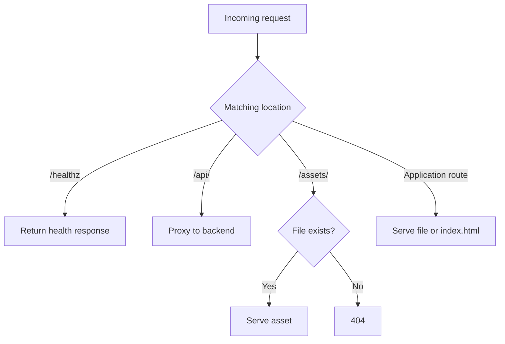

---
tags:
  - platform-engineering
---

# Nginx

Nginx is a web server and reverse proxy. In the frontend projects it serves compiled static assets from a small container and provides single-page application route fallback.

## Static Frontend Pattern

```nginx
location /assets/ {
    try_files $uri =404;
}

location / {
    try_files $uri $uri/ /index.html;
}
```

Only application routes should fall back to `index.html`; missing asset requests should remain `404` so deployment mistakes are visible.

## Caching

Fingerprint assets during the build, then cache those immutable names for a long period. Keep the HTML entry point revalidated or short-lived because it selects the current asset versions.

Compression, media types, character encoding, and security headers must match the actual application. Test the resulting headers rather than assuming a copied configuration is correct.

## Container Operation

- Run one foreground server process per container.
- Listen on the platform's expected port.
- Expose a lightweight health endpoint that does not depend on the SPA fallback.
- Keep the image free of source and build dependencies by using a multi-stage build.
- Disable unnecessary server information and writable paths.
- Send access and error logs to the container logging stream where operationally useful.

## Worked Example: Static UI and an API

This `server` block belongs inside Nginx's `http` context, commonly through an included file. Assume built frontend files are under `/usr/share/nginx/html`, fingerprinted assets are under `/assets/`, and `backend:3000` resolves to a reachable application server. The HTTP configuration must load its normal MIME-type mappings.

```nginx
server {
    listen 8080;
    root /usr/share/nginx/html;

    location = /healthz {
        default_type text/plain;
        return 200 "ok\n";
    }

    location = /index.html {
        add_header Cache-Control "no-cache";
    }

    location /assets/ {
        try_files $uri =404;
        add_header Cache-Control "public, max-age=31536000, immutable";
    }

    location /api/ {
        proxy_pass http://backend:3000;
        proxy_connect_timeout 5s;
        proxy_read_timeout 30s;
    }

    location / {
        try_files $uri $uri/ /index.html;
    }
}
```

Requests branch according to the configured locations:



The `proxy_pass` above has no URI component, so `/api/orders` is forwarded with that path. Adding a trailing `/` supplies a replacement URI and, in this ordinary prefix location, forwards `/orders` instead. Match the backend's routing contract. A reverse proxy forwards requests; the application still owns authorisation.

`no-cache` permits storing HTML but requires revalidation before reuse; it does not mean `no-store`. Only immutable, fingerprinted assets belong under the long-cache policy. Route other static files explicitly if the build emits them elsewhere. The health endpoint proves Nginx can respond, not that the API or every asset works. `proxy_read_timeout` limits inactivity between reads, not the complete business operation's duration. Select or generate configuration matching the host platform's expected port; this example uses a fixed 8080.

## Worked Prediction: Three Requests

Predict `/reports/730`, `/assets/missing.js`, and `/api/orders` when the frontend entry file exists but the backend is unavailable.

**Check your reasoning:** The report route serves the SPA entry point, the missing asset returns 404, and the API request produces an upstream error rather than HTML fallback. Connection failure commonly yields 502; an upstream timeout can yield 504. Inspect the error log to distinguish them.

Validate with `nginx -t` in the intended environment, then inspect responses with `curl -i`. Check status, content type, cache headers, and body, not just whether the root page appears to load.

## Project Connections

Aether builds React assets in a Node stage and serves them from Nginx on Cloud Run. Nyx's deployment workflow creates a similar Nginx image dynamically.

## Interview Questions

> [!question] Interview Questions
> - Why should a missing asset return `404` instead of falling back to `index.html` for a single-page application?
> - Why would you cache fingerprinted asset files aggressively but keep the HTML entry point short-lived or revalidated?
> - Why does a multi-stage build matter for an Nginx image serving a frontend app?
> - What would a lightweight health endpoint need to avoid depending on, and why?

## Answer Notes

1. Returning HTML with a successful status for a missing script or stylesheet hides the missing asset and causes parsing or MIME-type failures. Restrict the SPA fallback to application routes and let absent assets return 404.

2. A fingerprinted filename changes when its content changes, so old versions can be cached for a long time. The HTML selects current asset names and must update promptly; revalidation avoids keeping clients on an old release.

3. Build frontend assets in a stage containing Node and build tools, then copy the output into the Nginx runtime image. The deployed server needs the generated files, not the entire build toolchain or source tree.

4. A lightweight server-health endpoint should avoid fragile downstream calls or expensive work. It can prove Nginx is responding, but does not establish that the API or every user journey is healthy; monitor those separately.

## Official References

- [Nginx beginner's guide](https://nginx.org/en/docs/beginners_guide.html)
- [Core HTTP directives and try_files](https://nginx.org/en/docs/http/ngx_http_core_module.html)
- [HTTP proxy directives](https://nginx.org/en/docs/http/ngx_http_proxy_module.html)

## Related Guides

- [Vite](../programming/tooling/vite.md)
- [Docker](./docker.md)
- [Cloud Run](./cloud/gcp/gcp-cloud-run.md)
- [Caching](./caching.md)

Return to [Platform Engineering](./README.md).
