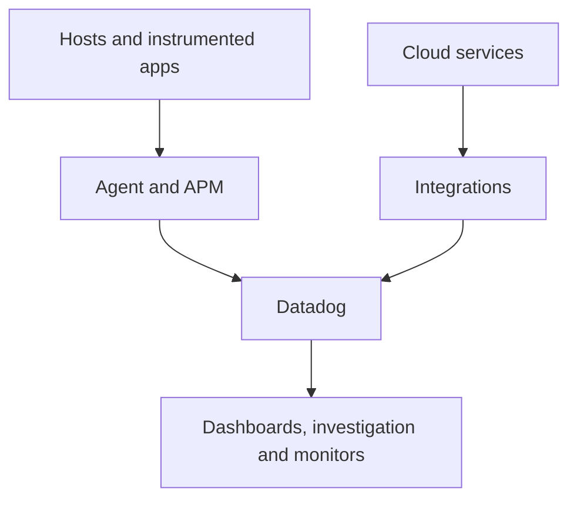

---
tags:
  - platform-engineering/observability
---

# Datadog

Datadog is a managed observability platform for investigating infrastructure and application behaviour. It brings telemetry into a shared environment for dashboards, investigation and monitors; your collection and instrumentation determine what it can actually show. [Agent overview](https://docs.datadoghq.com/agent/) and [log investigation](https://docs.datadoghq.com/getting_started/logs/).

## Quick Refresh

| Concept | What to remember |
| --- | --- |
| Agent and integrations | Collect host, workload or service information; collection paths vary by integration |
| Metrics | Measurements over time, such as request rates and memory usage |
| Logs | Events and diagnostic context; decide what to collect and retain |
| APM and traces | Application Performance Monitoring uses instrumented requests and spans to investigate time spent across components |
| Tags | Identify and group telemetry, including environment, service and deployed version |
| Monitors | Evaluate conditions and notify the responsible team |

Installing an Agent does not automatically provide complete application traces or useful business metrics. Application instrumentation and collection configuration still matter. [Application instrumentation](https://docs.datadoghq.com/tracing/trace_collection/).

A typical setup has several routes into the platform:

## Worked Example: Investigating a Release Regression

Suppose checkout errors increase after version `v2` is deployed. Use consistent service tags, for example `env:prod`, `service:checkout` and `version:v2`. Datadog calls this convention **unified service tagging**. [Tagging guide](https://docs.datadoghq.com/getting_started/tagging/).

1. Scope the investigation to production checkout and the incident window.
2. Compare error rate, traffic and latency across the versions still receiving requests.
3. Inspect available traces to locate slow or failing operations, then use correlated logs for additional context. Correlation requires appropriate identifiers and configuration; sharing a dashboard is not enough.
4. Check dependency and infrastructure evidence before deciding to roll back. A database connection limit can affect multiple releases at once.

The same approach can help after a pipeline deploys a new artifact: identify the version, observe user outcomes, then verify recovery after mitigation.

## Common Failure Modes

Consistent service identity and environment naming make investigation easier. If traces use `checkout` while metrics use `checkout-api`, related evidence is harder to find. Missing instrumentation creates another gap: host CPU charts cannot explain every slow application operation.

A monitor with no data has not necessarily recovered. Missing-data behaviour depends on the monitor's type and configuration, so check collection delays and query scope before concluding the incident ended. [Monitor configuration](https://docs.datadoghq.com/monitors/configuration/).

Review collection volume, retention, sampling and custom-metric cardinality; costs and visibility depend on what you enable and retain. Keep passwords, tokens and unnecessary personal data out of telemetry, and give alerts a responsible team and a useful next action.

## Worked Prediction

A monitor filters on `service:checkout`. After a deployment, the new version emits its metrics as `service:checkout-api`. The old instances are removed and the monitor stops seeing data. Is the service healthy?

**Check your reasoning:** The filter no longer matches the new telemetry, so the missing result says nothing about service health. Inspect tags and collection, restore a consistent identity and verify the monitor sees live traffic. Explicitly test missing-data behaviour as well as threshold breaches. If both versions use the same service tag, use `version` to compare them instead of renaming the service.

## Interview Questions

> [!question] Interview Questions
> - Why does installing the Datadog Agent not guarantee complete application observability?
> - How do environment, service and version tags help investigate a deployment?
> - How would you use metrics, traces and logs together to investigate a slow request?
> - What would you check before treating a monitor with no data as healthy?

## Answer Notes

1. The Agent collects configured signals, while application traces and business-level measurements need suitable instrumentation. Verify that the important operations actually produce useful telemetry.

2. They separate environments, keep one service's signals identifiable and show which release produced them. Consistent tags make comparisons possible; tags alone do not establish causation.

3. Metrics establish the scope and timing, traces help locate time spent across operations, and logs supply event details. Align the time range and identifiers, and remember that sampling or incomplete collection can leave gaps.

4. Check collection health, freshness, delays, changed tags and query filters. Inspect the monitor's configured missing-data handling and verify service behaviour independently; no data is not an observed successful result.

## Official References

- [Getting started with the Agent](https://docs.datadoghq.com/getting_started/agent/)
- [Troubleshooting no data in monitors](https://docs.datadoghq.com/monitors/guide/troubleshooting-no-data/)

## Related Guides

- [Grafana](./grafana.md) — compare data-source-driven dashboards and the wider Grafana platform.
- [Kubernetes](../kubernetes.md) — investigate the workloads behind service telemetry.
- [GitHub Actions](../ci-cd/github-actions.md) — connect release identity with post-deployment verification.

Return to [Observability](./README.md).
