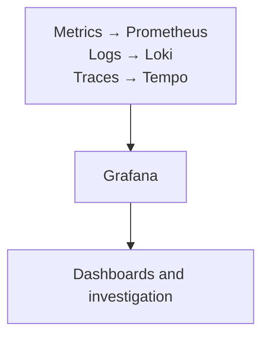

---
tags:
  - platform-engineering/observability
---

# Grafana

Grafana lets you query, visualise and alert on data from connected sources. Think of it as a place to investigate system behaviour: it needs useful telemetry and suitable backends behind the graphs. [About Grafana](https://grafana.com/docs/grafana/latest/introduction/).

## Quick Refresh

| Concept | What to remember |
| --- | --- |
| Data source | Connection to a system Grafana queries, such as Prometheus for metrics, Loki for logs or Tempo for traces |
| Panel and dashboard | A panel presents query results; a dashboard groups panels around an operational question |
| Variables and time range | Let you focus on an environment, service or incident window |
| Exploration | Ad-hoc investigation beyond the predefined dashboard |
| Alerting | Evaluates rules and routes notifications when conditions warrant attention |

Grafana OSS can be self-hosted. Grafana Cloud is a managed platform that also provides telemetry backends. Installing Grafana alone does not automatically collect and retain all application metrics, logs and traces. [Product overview](https://grafana.com/docs/grafana/latest/introduction/).

In one possible setup, separate backends supply the signals used during an investigation:

## Worked Example: A Slow API After Deployment

Imagine a checkout API becomes slower just after a release. A useful dashboard shows request volume, error rate, latency percentiles and resource or dependency pressure.

1. Select production and the affected service, then narrow the time range around the release.
2. Compare the change in latency with traffic and errors. Look at a high percentile as well as the average so slow requests are not hidden.
3. Inspect relevant logs or traces, where available, to distinguish application work from database or external-service delays.
4. Check the suspected cause before acting. A deployment marker is a clue, not proof that the release caused the problem.

The dashboard should help answer a question such as "which dependency became slower?" rather than merely display many charts. [Dashboard concepts](https://grafana.com/docs/grafana/latest/visualizations/dashboards/).

## Alerting and Common Failure Modes

A dashboard is for investigation; an alert rule evaluates a defined condition. Configure its query, evaluation behaviour, missing-data handling and notification route deliberately. Grafana Alerting uses contact points and notification policies to direct notifications. [Alerting fundamentals](https://grafana.com/docs/grafana/latest/alerting/fundamentals/).

Check the dashboard's scope before interpreting it. A staging filter or an overly long time range can hide a production incident, while broken collection or a failed query can look reassuring if missing values are presented as zero.

A momentary spike without meaningful user impact may not justify waking someone up. Give actionable alerts an owner and a response procedure so the notification leads to useful work.

Review data-source credentials and access controls as well as dashboard permissions. A saved view is not the entire security boundary.

## Worked Prediction

Requests are still reaching the API, but its metrics collector stops sending data. The request-rate panel becomes empty. Has traffic fallen to zero?

**Check your reasoning:** You cannot conclude that. Missing samples are different from observed zero traffic. Check data freshness, the collector, the data source and the query filters, then verify traffic independently. If fresh samples explicitly report zero, investigate a genuine traffic change instead.

## Interview Questions

> [!question] Interview Questions
> - How does Grafana differ from a metrics backend such as Prometheus?
> - How would you use a dashboard to investigate an API slowdown after a release?
> - Why does an empty panel not prove that a service has no traffic or errors?
> - What makes an alert useful rather than merely noisy?

## Answer Notes

1. Grafana queries and presents data and can evaluate alert rules. A backend such as Prometheus collects and stores metrics; the complete setup needs both appropriate telemetry and somewhere to retain it.

2. Select the correct service, environment and time window, then compare traffic, errors and latency with resource and dependency evidence. Use logs or traces to test a hypothesis rather than assuming the release is the cause.

3. Collection, connectivity, credentials or filters may have failed. Check fresh data and an independent signal before interpreting absence as a healthy result.

4. It identifies a meaningful condition, reaches an owner and suggests an action. Its duration, recovery and missing-data behaviour should reflect the service rather than arbitrary thresholds.

## Official References

- [Grafana documentation](https://grafana.com/docs/grafana/latest/)
- [Data sources](https://grafana.com/docs/grafana/latest/datasources/)

## Related Guides

- [Datadog](./datadog.md) — compare an integrated managed observability platform.
- [Kubernetes](../kubernetes.md) — relate service symptoms to workload and cluster behaviour.

Return to [Observability](./README.md).
