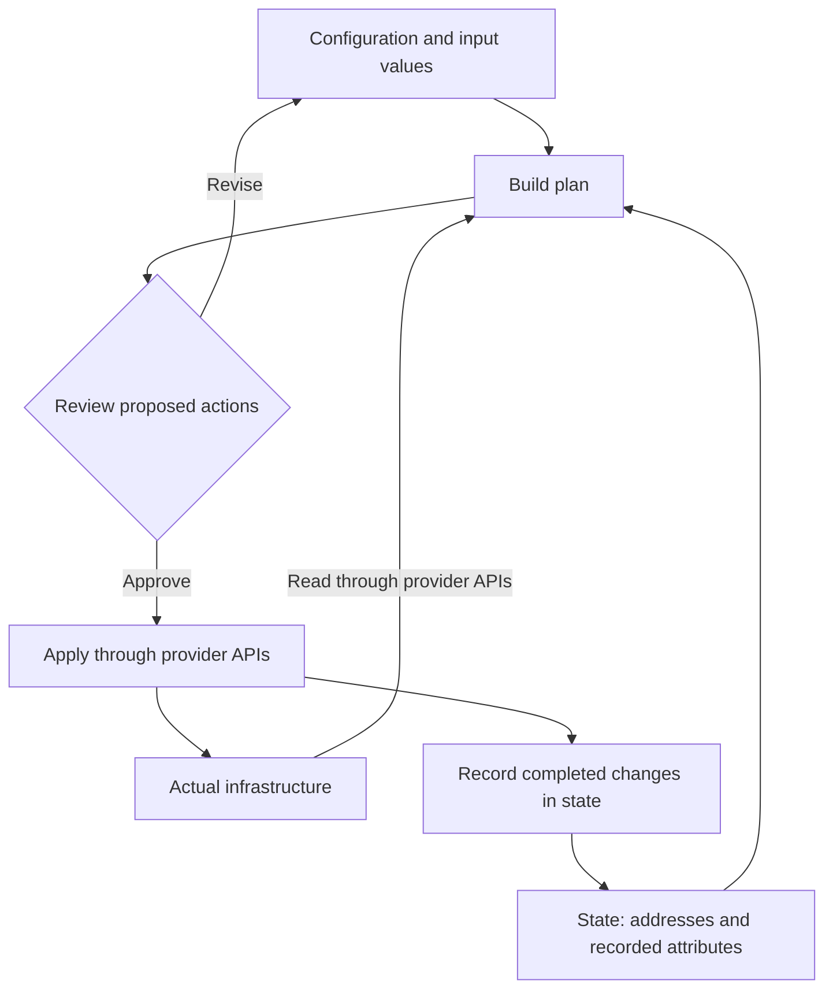

---
tags:
  - platform-engineering
---

# Terraform

Terraform manages infrastructure through declarative configuration and provider APIs. Its core mental model is **configuration describes intent, state records resource identity, and providers inspect and change actual infrastructure**. Terraform calculates a plan to reconcile these inputs; it does not continuously reconcile infrastructure in the background.

## Quick Refresh

| Concept | Purpose | Recall distinction |
| --- | --- | --- |
| Configuration | Describes desired resources and relationships in HCL | Intent, not a script executed from top to bottom |
| State | Maps Terraform resource addresses to remote objects and records attributes | A managed record, not a live copy of the cloud |
| Provider | Implements resource and data-source operations through APIs | Integration plugin, not a reusable infrastructure design |
| Resource | Declares an object whose lifecycle Terraform manages | Creates, updates, or deletes infrastructure |
| Data source | Reads information for use in configuration | Does not take ownership of the queried object's lifecycle |
| Module | Groups configuration behind inputs and outputs | Reuses a design; providers implement its operations |
| Backend | Determines where state is stored, with capabilities varying by backend | Remote storage does not automatically imply locking |
| Plan | Proposes actions for a particular configuration, inputs, and observed infrastructure | Review replacement and deletion, not just the final counts |
| Drift | A difference caused by changes outside the configuration workflow | Requires deciding whether to restore intent or adopt the change |

The planning and applying process combines several inputs:



State helps Terraform recognise that `aws_s3_bucket.notes` refers to a particular bucket. It does not contain the bucket's object data and cannot replace data backups.

## Core Workflow

| Command | What it does | What it does not prove |
| --- | --- | --- |
| `terraform init` | Initialises the backend and installs required providers and modules | That cloud permissions or resource settings are correct |
| `terraform fmt -check` | Checks canonical formatting; use `terraform fmt` to rewrite it | Semantic correctness |
| `terraform validate` | Checks configuration consistency using installed dependencies | That credentials, quotas, or live API operations will succeed |
| `terraform plan` | Normally refreshes managed objects and proposes changes | That an apply will succeed or that the world will remain unchanged |
| `terraform plan -out=tfplan` | Saves an executable plan | That the saved file is safe to publish |
| `terraform show tfplan` | Displays the saved plan for review | That every displayed value is safe for public logs |
| `terraform apply tfplan` | Executes the saved plan without another approval prompt | An all-or-nothing transaction |
| `terraform destroy` | Plans destruction of managed infrastructure and requests approval | Recovery of deleted data |

An ordinary `terraform apply` creates a fresh plan and asks for approval. Applying a saved plan executes that plan instead; a stale plan can be rejected, and intervening infrastructure changes can still cause failures. Re-plan when assumptions change.

Read the action symbols: `+` means create, `~` update in place, `-` destroy, and `-/+` destroy then create a replacement. A replacement using create-before-destroy appears as `+/-`. Look for the attribute that forces replacement, the affected dependencies, and the implications for data and availability.

## Configuration Fundamentals

HCL uses blocks, arguments, expressions, and references. All top-level `.tf` files in a directory form one module; splitting a directory into `main.tf`, `variables.tf`, and `outputs.tf` aids reading but does not impose execution order.

- **Variables** are a module's inputs. Declare types such as `string`, `number`, `bool`, `list(string)`, or `map(object({...}))`, and validate meaningful constraints.
- **Locals** name derived expressions or repeated values. They are not independently supplied inputs.
- **Outputs** expose selected results. A caller accesses a child module output through `module.<name>.<output>`.
- **References** connect values and normally infer dependencies. A bucket policy referring to a bucket ID establishes an ordering relationship.
- **`depends_on`** expresses a hidden dependency that value references cannot describe. Broad dependencies can postpone reads and make plans less precise.

A `.tfvars` file supplies variable values, while variable blocks declare their contracts. Terraform loads `terraform.tfvars` and `*.auto.tfvars` automatically; explicitly named files such as `dev.tfvars` need `-var-file=dev.tfvars`. Keep secrets out of committed variable files.

### Resource Identity: count and for_each

`count` creates indexed instances such as `aws_s3_bucket.example[0]`. When those indexes select names from a list, removing its first item shifts the remaining names onto different addresses. That can produce updates or replacements beyond the object you intended to remove.

`for_each` creates instances keyed by a map or set of strings:

```hcl
# Alternative resource pattern, not an addition required by the worked example.
variable "buckets" {
  type = map(string)
}

resource "aws_s3_bucket" "example" {
  for_each = var.buckets
  bucket   = each.value
}
```

With keys `logs` and `reports`, the addresses end in `["logs"]` and `["reports"]`. Removing `logs` leaves the other address stable. Renaming a key still changes identity unless accompanied by an appropriate move. Keys must be known before remote actions and cannot be sensitive values. Use `count` for genuinely interchangeable indexed instances and `for_each` when stable logical names matter.

**Predict before reading on:** Does using `for_each` prevent replacement when a bucket's physical name changes?

No. Stable Terraform identity avoids accidental index shifts; the provider still determines which attribute changes require replacing the underlying object.

## Worked Example

Create one private S3 bucket and explicitly block public access. This example uses Terraform 1.5 or later and the AWS provider's 6.x series; the provider lock file records the exact selected version. Later sections use configuration-driven import, available from Terraform 1.5.

To run it, use a separate scratch directory, a sandbox AWS account, an installed Terraform CLI, and short-lived AWS credentials available through the provider's normal authentication chain. The identity needs permissions to create, read, tag, configure public-access blocking, and delete the bucket. Use a globally unique valid bucket name. Cloud operations may incur charges; keep the bucket empty for this exercise. No credentials belong in the configuration.

Put this complete configuration in the scratch directory's `main.tf`:

```hcl
terraform {
  required_version = ">= 1.5, < 2.0"

  required_providers {
    aws = {
      source  = "hashicorp/aws"
      version = "~> 6.0"
    }
  }
}

provider "aws" {
  region = "eu-west-1"
}

variable "bucket_name" {
  description = "Globally unique name for the empty study bucket"
  type        = string
}

variable "environment" {
  type    = string
  default = "study"

  validation {
    condition     = contains(["study", "dev"], var.environment)
    error_message = "Use study or dev for this sandbox example."
  }
}

locals {
  common_tags = {
    Environment = var.environment
    ManagedBy   = "Terraform"
  }
}

resource "aws_s3_bucket" "notes" {
  bucket        = var.bucket_name
  force_destroy = false
  tags          = local.common_tags
}

resource "aws_s3_bucket_public_access_block" "notes" {
  bucket = aws_s3_bucket.notes.id

  block_public_acls       = true
  block_public_policy     = true
  ignore_public_acls      = true
  restrict_public_buckets = true
}

output "bucket_arn" {
  value = aws_s3_bucket.notes.arn
}
```

The public-access configuration references the bucket ID, so Terraform infers the dependency without `depends_on`. There are two managed resource addresses but only one bucket. The output is a result, not another resource.

Create `terraform.tfvars`, replacing the sample name with your own unique name:

```hcl
bucket_name = "replace-with-your-unique-study-bucket-name"
environment = "study"
```

Run the following from the scratch directory:

```shell
terraform init
terraform fmt
terraform validate
terraform plan -out=tfplan
terraform show tfplan
```

**Predict before reading on:** With empty state and an available bucket name, how many managed resources should the plan create?

Expect `2 to add, 0 to change, 0 to destroy`: the bucket and its public-access settings. Some attributes are shown as known only after apply. Confirm the account, region, bucket name, and actions before executing the reviewed plan:

```shell
terraform apply tfplan
terraform output bucket_arn
terraform plan
```

With no intervening changes, the final plan should report no changes. Repeated runs with unchanged intent and infrastructure should converge; this does not guarantee that every provider operation is infallible.

### Change and Predict

Change `environment` to `dev` in `terraform.tfvars`. Predict the plan before running it. This changes a bucket tag, so expect an in-place bucket update rather than replacement. Create and inspect a new saved plan, then apply that plan.

Now consider changing `bucket_name`. The physical name cannot be renamed in place; the plan proposes replacement. Do not apply that change just to test recall. Explain why unchanged Terraform address and changed physical identity can coexist in the plan.

For cleanup, restore the intended configuration if you only experimented with edits, then run `terraform destroy` and inspect its proposed deletions. With an empty bucket, cleanup should succeed. `force_destroy = false` prevents Terraform from automatically emptying a non-empty bucket; investigate unexpected data instead of bypassing that protection. Keep state until cleanup is complete.

## State and Collaboration

Local state defaults to `terraform.tfstate`. In a team, use a remote backend with suitable access controls, encryption, recovery/versioning, and locking support. Coordinate which configuration owns each resource: two independent states managing the same object can fight even when each state has a lock.

Locking serialises supported operations against the same state. It does not block a person using the cloud console or protect unrelated state files. When a lock blocks a run, determine whether its owner is still active. Force-unlock only a confirmed abandoned lock after investigating the failed operation.

### Drift and Secrets

A normal plan refreshes managed resources through provider APIs. If someone changes a managed tag manually, a later plan may propose restoring the configured value. Decide whether the manual change was wrong or whether configuration should be updated to adopt it.

Refresh-only planning proposes updates to state and outputs without changing infrastructure. It does not rewrite configuration; accepting refreshed state alone will not make a conflicting desired setting disappear from future normal plans.

`sensitive = true` redacts values in ordinary output; it does not encrypt state or prevent those values from being stored. Protect both state and saved plans. Newer Terraform versions support ephemeral values and provider-supported write-only arguments in restricted contexts, but these require explicit design and version support; redaction alone is not that mechanism.

In an infrastructure repository, commit configuration and `.terraform.lock.hcl`. Exclude `.terraform/`, state and backups, saved plan files, and secret-bearing input files. Never treat Git history as a state backend or edit state JSON by hand.

## Modules and Environments

A root module is the directory where Terraform runs. A child module is configuration called through a `module` block. Modules should express a cohesive infrastructure capability with useful inputs and outputs, rather than wrap every resource solely to add another layer.

For example, two environment roots can call the same local storage module:

```text
infra/
  modules/
    storage/
      main.tf
      variables.tf
      outputs.tf
  environments/
    dev/
      main.tf
    prod/
      main.tf
```

Each environment root needs its own state location and deliberate credentials, account/project boundary, and approval policy. The directory names alone enforce none of these protections. Configure providers in the root and pass aliases explicitly where a module needs multiple provider configurations.

CLI workspaces provide multiple states for a configuration using the same backend configuration. They are useful for some copies of an environment, but workspace names are not access-control boundaries. Use separate roots/backends and identities where production isolation requires them. HCP Terraform workspaces have a broader execution and configuration model and should not be confused with CLI workspaces.

The provider version constraint defines acceptable versions; `.terraform.lock.hcl` records selected provider versions and checksums. Review changes produced by `terraform init -upgrade`. The lock file does not pin remote module versions: constrain registry modules explicitly, or pin source revisions appropriately for Git modules.

## Safe Changes and Delivery

### Import Existing Infrastructure

Import associates an existing object with a resource address. It does not guarantee that your configuration matches the object's settings. For an existing bucket, a separate adoption configuration could contain:

```hcl
resource "aws_s3_bucket" "existing" {
  bucket = "your-existing-bucket-name"
}

import {
  to = aws_s3_bucket.existing
  id = "your-existing-bucket-name"
}
```

Inspect the plan for changes beyond the import and align configuration before applying. Import related settings through their own resource types when needed. Keep each remote object bound to one resource address; importing the same object into several states does not create independent copies.

### Refactor Addresses Without Recreating Objects

If the worked example's resource label changes from `notes` to `archive`, update its references and record the move:

```hcl
moved {
  from = aws_s3_bucket.notes
  to   = aws_s3_bucket.archive
}
```

With unchanged resource arguments, the plan should recognise an address move rather than bucket replacement. Moving into a child module follows the same principle using its full destination address. Keep migration declarations long enough for all affected states and module consumers to upgrade.

**Predict before reading on:** Does a `moved` block make a changed physical bucket name safe to rename in place?

No. The move preserves Terraform's address mapping. It does not override provider replacement rules for resource attributes.

### Lifecycle and Partial Failure

| Setting or situation | Reasoning to remember |
| --- | --- |
| `create_before_destroy` | Can reduce downtime, but requires capacity and names that allow both objects to coexist |
| `prevent_destroy` | Rejects a destructive plan while the rule remains in configuration; removing the entire resource block removes this protection |
| `ignore_changes` | Deliberately delegates selected attributes to another owner; can hide unwanted drift if used broadly |
| Failed apply | Some actions may already have completed; there is no automatic transaction rollback |
| Lost state | Does not imply infrastructure was deleted; recover a trustworthy state version or carefully reconstruct ownership |

After a failed apply, preserve diagnostics and state, inspect completed operations and actual infrastructure, resolve the cause, and generate a new plan. If persisting state failed, follow the recovery instructions before proceeding. Do not delete state or blindly retry destruction to make the error disappear. Restoring an older state snapshot alone does not roll back cloud resources.

### CI and Verification

A practical pipeline checks formatting and validation, produces a reviewable plan, and applies an approved plan through a trusted identity. Use a remote backend, serialise applies per state, protect saved plan artifacts, and bind approval to the configuration and plan being applied. A pull-request plan can differ from a later post-merge plan.

Keep untrusted pull-request code away from privileged cloud credentials. Prefer short-lived federation and environment-specific permissions. Avoid cancelling an active infrastructure apply merely because a newer commit arrived; investigate interrupted operations before the next run.

Use input validation and module tests to check contracts; inspect plans for unexpected replacement and privilege changes. The testing framework available from Terraform 1.6 uses `terraform test` to exercise assertions with plan or apply runs, and apply-based tests can create real infrastructure. Neither static validation nor a passing module test proves that production permissions, quotas, or recovery procedures are correct.

## Common Failure Modes

- Reading HCL as an ordered script and adding unnecessary `depends_on` links.
- Treating state as either disposable cache or a backup of application data.
- Using indexed list positions as stable business identities and causing accidental replacements.
- Reviewing only action counts and missing a destructive attribute change.
- Assuming remote state always provides locking, encryption, and access separation without backend configuration.
- Assuming `sensitive` keeps secrets out of state and saved plans.
- Treating CLI workspaces as production security boundaries.
- Using broad `ignore_changes` to silence drift without agreeing who owns each setting.
- Importing an object and applying before checking how configuration differs from reality.
- Expecting a failed apply to undo completed operations automatically.

## Interview Questions

> [!question] Interview Questions
> - How do configuration, state, and provider APIs work together to produce a Terraform plan?
> - What happens when someone manually changes a resource that Terraform manages, and how would you decide whether to restore or adopt that change?
> - Why might removing an item from a collection cause unexpected changes with `count`, and how can `for_each` help?
> - How would you manage and protect state when several engineers and a CI pipeline work on the same environment?

## Answer Notes

1. Configuration describes desired resources, state associates Terraform addresses with real objects, and providers read and change those objects through APIs. Planning compares the desired configuration with tracked and refreshed information to propose actions; it does not itself apply them.

2. A refreshed plan can reveal drift and propose restoring the configured value, depending on what the provider can observe. Investigate the reason for the manual change, then either restore the reviewed intent or deliberately update configuration to adopt it and review a new plan.

3. count identifies instances by numeric index, so removing an earlier list item can shift later identities and cause unexpected updates or replacements. for_each uses stable keys, preserving identity when unrelated entries are removed; changing a key still changes identity.

4. Use a remote backend with suitable locking, narrowly scoped access, encryption and recovery/versioning controls. Serialize changes to each state, protect state and plan files as sensitive data, and keep state and credentials out of Git; marking an output sensitive does not remove its value from state.

## Official References

- [Core Terraform workflow](https://developer.hashicorp.com/terraform/intro/core-workflow)
- [Configuration language](https://developer.hashicorp.com/terraform/language)
- [CLI commands](https://developer.hashicorp.com/terraform/cli/commands)
- [State](https://developer.hashicorp.com/terraform/language/state) and [state locking](https://developer.hashicorp.com/terraform/language/state/locking)
- [Sensitive data](https://developer.hashicorp.com/terraform/language/manage-sensitive-data)
- [Dependency lock file](https://developer.hashicorp.com/terraform/language/files/dependency-lock)
- [CLI workspaces](https://developer.hashicorp.com/terraform/cli/workspaces)
- [Module refactoring and moved blocks](https://developer.hashicorp.com/terraform/language/modules/develop/refactoring)
- [Lifecycle rules](https://developer.hashicorp.com/terraform/language/meta-arguments/lifecycle)
- [Terraform tests](https://developer.hashicorp.com/terraform/language/tests)
- [AWS S3 bucket resource](https://registry.terraform.io/providers/hashicorp/aws/latest/docs/resources/s3_bucket) and [public-access block resource](https://registry.terraform.io/providers/hashicorp/aws/latest/docs/resources/s3_bucket_public_access_block)

## Related Guides

- [Amazon Web Services](./cloud/aws.md) — account boundaries, identity, and services managed by the example provider.
- [Google Cloud Platform](./cloud/gcp/README.md) — applying the same infrastructure-management concepts to projects and GCP services.
- [Continuous Integration and Delivery](./ci-cd/README.md) — review gates and controlled infrastructure delivery.
- [GitHub Actions](./ci-cd/github-actions.md) — workflow permissions, federation, and trusted execution.
- [Git](../engineering-foundations/git.md) — versioning configuration and reviewing changes.
- [Code Review](../engineering-foundations/code-review.md) — evaluating intended behaviour, risk, and failure scenarios.

Return to [Platform Engineering](./README.md).
