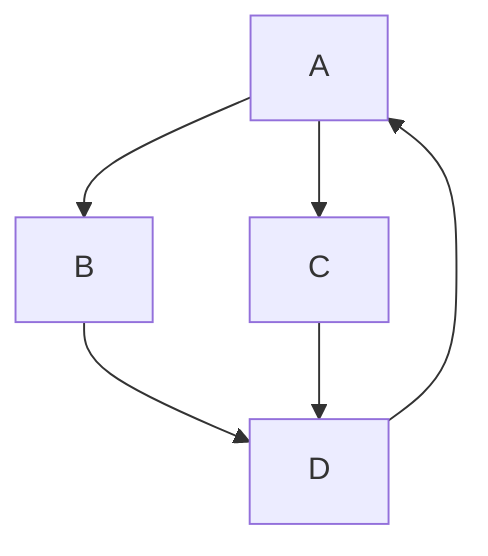

---
tags:
  - programming/data-structures-and-algorithms
---

# Graphs

A graph contains vertices and edges describing relationships. Edges may be directed or undirected, and may carry weights. Service dependencies, network routes and workflow prerequisites can all be modelled as graphs, but their edge meanings differ.

Unlike a tree, a general graph may contain cycles, multiple routes to the same vertex and disconnected components. Define direction, weight and reachability before selecting an algorithm.

## Quick Refresh

| Representation | Storage | Strength |
| --- | --- | --- |
| Adjacency list | `O(V + E)` | Efficient neighbour traversal for sparse graphs |
| Adjacency matrix | `O(V²)` | Constant-time check for a particular edge |

With plain neighbour lists, checking whether one specific edge exists can require scanning a vertex's neighbours. A set-based neighbour representation changes that lookup trade-off. For an undirected graph, store both directions consistently; the constant factor does not change the asymptotic storage bound.

Breadth-first search (BFS) uses a queue to explore by distance in edges. Depth-first search (DFS) follows a branch before returning to alternatives, using recursion or an explicit stack. Both need visited-state handling on general graphs.

## Worked Example: An Unweighted Shortest Path

The graph below is directed and contains a cycle. Every edge counts as one step:



```python
from collections import deque


def shortest_path(graph, start, target):
    pending = deque([start])
    parent = {start: None}

    while pending:
        node = pending.popleft()
        if node == target:
            path = []
            while node is not None:
                path.append(node)
                node = parent[node]
            return path[::-1]

        for neighbour in graph.get(node, []):
            if neighbour not in parent:
                parent[neighbour] = node
                pending.append(neighbour)
    return None


graph = {"A": ["B", "C"], "B": ["D"], "C": ["D"], "D": ["A"]}
print(shortest_path(graph, "A", "D"))  # ['A', 'B', 'D']
print(shortest_path(graph, "A", "Z"))  # None
```

This example uses string vertex identifiers; `None` marks the end of a parent chain. A missing adjacency entry means no outgoing edges. `start == target` returns a one-vertex path, because the start is treated as an existing vertex.

The parent map also records discovery. Marking a vertex when it is enqueued prevents both routes to `D` from adding it again. The queue processes all distance-one vertices before distance-two vertices, so the first discovery gives a shortest path in edge count. The chosen path among ties depends on neighbour order.

With adjacency lists, traversal takes `O(V + E)` time and `O(V)` auxiliary space in the worst case, assuming expected constant-time dictionary operations. Reconstructing the path is linear in its length. Reaching only one component can visit less than the whole graph.

## DFS, Cycles and Dependency Order

DFS is useful for reachability and structural questions. On a directed graph, distinguish vertices on the current active path from vertices whose exploration is complete. An edge back to an active vertex proves a directed cycle; an edge to any previously visited vertex does not, because separate branches can converge.

For undirected cycle detection, account for the edge back to a node's parent rather than treating that ordinary reverse edge as a cycle. If the graph may be disconnected, restart from each still-unvisited vertex when the task concerns the entire graph.

A directed acyclic graph (DAG) admits a topological ordering. If an edge goes from prerequisite to dependent, the prerequisite appears first. One method repeatedly removes vertices with no remaining incoming edges; if vertices remain but none can be removed, a cycle prevents a complete ordering.

## Weighted Paths and Common Failure Modes

BFS minimises edge count, not arbitrary travel time or cost. Dijkstra's algorithm is a standard choice for non-negative edge weights; negative weights require different reasoning and algorithms. A reachable negative cycle can make a shortest-path cost unbounded below for affected destinations.

DFS can find a path without finding the shortest path. Neither a diagram's layout nor alphabetical vertex names imply distance. Choose the algorithm from the edge contract and the desired result.

## Worked Prediction

Give edges `A -> B` and `B -> D` weights of 10 each, while `A -> C` and `C -> D` each cost 1. Will this BFS implementation return the cheapest route?

**Check your reasoning:** It still returns `A, B, D` with the given neighbour order, because it ignores weights. Both paths have two edges, but their costs are 20 and 2. A weight-aware algorithm must minimise total cost. Changing only neighbour order would not make BFS generally correct for weighted paths.

## Interview Questions

> [!question] Interview Questions
> - When would an adjacency list be preferable to a matrix?
> - Why does BFS find shortest paths in an unweighted graph?
> - Why should the example mark a vertex when enqueueing it?
> - Why is an edge to a visited vertex not always a directed cycle?

## Answer Notes

1. When the graph is sparse and algorithms mostly enumerate neighbours. A matrix spends quadratic space even when few edges exist, but offers direct edge lookup.

2. The FIFO queue explores vertices in nondecreasing edge distance, so a vertex cannot first be reached by a longer route while a shorter layer remains unexplored.

3. Multiple vertices may discover the same neighbour before it is processed. Marking on enqueue prevents duplicate work and keeps one parent from the first, shortest discovery.

4. The visited vertex may belong to a completed branch. Directed cycle detection needs an edge to the current active DFS path, not merely to any previously discovered vertex.

## Further Reading

- [Princeton: Graph Traversal](https://algs4.cs.princeton.edu/41graph/)
- [MIT: Algorithm Lecture Notes, including shortest paths](https://ocw.mit.edu/courses/6-006-introduction-to-algorithms-spring-2020/pages/lecture-notes/)

## Related Guides

- [Stacks and Queues](./stacks-and-queues.md) — the ordering behind DFS and BFS.
- [Trees and Heaps](./trees-and-heaps.md) — priority queues support weighted-path algorithms.
- [Recursion and Backtracking](./recursion-and-backtracking.md) — active paths and controlled exploration.

Return to [Data Structures and Algorithms](./README.md).
