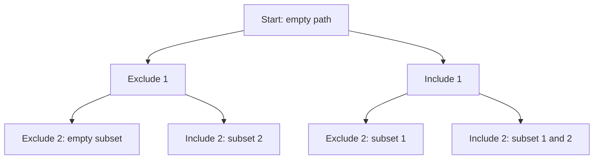

---
tags:
  - programming/data-structures-and-algorithms
---

# Recursion and Backtracking

Recursion solves a problem by calling the same procedure on a smaller or simpler state. A base case finishes without another recursive call, and a progress measure explains why every path eventually reaches it.

Backtracking explores a choice, solves the remaining problem and then undoes the choice before trying another. It fits tasks that need combinations, paths or arrangements rather than one pass through a sequence.

## Quick Refresh

| Idea | Question to ask |
| --- | --- |
| State | What fully describes the remaining problem? |
| Base case | When can this call return an answer directly? |
| Progress | What gets smaller or closer to completion? |
| Call stack | What must this call remember while a child runs? |
| Backtracking | What shared state must be restored before the next choice? |
| Pruning | Why can this branch never lead to a valid answer? |

Recursive calls do not erase the caller's local state. Each suspended call occupies a stack frame until its child returns. A linear-depth recursion therefore uses linear stack space even when each frame stores only a few values.

## Worked Example: Enumerate Subsets

For each position, choose whether to exclude or include its value. The example assumes distinct input values so different position choices produce different subsets:

```python
def subsets(values):
    result = []
    path = []

    def visit(index):
        if index == len(values):
            result.append(path.copy())
            return

        visit(index + 1)

        path.append(values[index])
        visit(index + 1)
        path.pop()

    visit(0)
    return result


print(subsets([1, 2]))  # [[], [2], [1], [1, 2]]
```

At entry to `visit(index)`, `path` records the choices made for earlier positions. Both branches advance the index. The final `pop()` restores the caller's path after the inclusion branch, and `copy()` preserves a result independently of later mutations.

For two input positions, the choice tree is:



There are `2^n` leaves. Copying all resulting subsets takes `Theta(n × 2^n)` total time and output storage for nontrivial growing `n`. The active path and call stack need `O(n)` auxiliary space excluding the returned results. Empty input returns `[[]]`: the empty set has one subset, not zero.

## Pruning and Alternatives

Pruning skips a branch only when you can prove it cannot succeed. In a target-sum search with non-negative candidates, a partial total above the target cannot be repaired by adding more values. Allowing negative candidates invalidates that justification.

Backtracking can still be exponential after useful pruning. If only a count or best score is required, storing every candidate is often unnecessary. Repeated equivalent states may instead suggest memoisation or dynamic programming.

Iteration with an explicit stack can represent the same exploration. It avoids the language's recursion-depth limit, but does not automatically reduce the number of states or eliminate the memory needed to remember pending work. Python does not optimise away ordinary tail-recursive calls.

## Common Failure Modes

A base case is insufficient if some branch fails to move towards it. Check empty inputs and ensure the progress argument covers every branch, including failure paths.

Appending `path` directly would store references to one mutable list. Later changes would alter previous results. Forgetting to undo a choice has a different effect: a sibling branch inherits state that belongs to the previous branch.

## Worked Prediction

Replace `result.append(path.copy())` with `result.append(path)` and run the example for `[1, 2]`. What does it return after exploration finishes?

**Check your reasoning:** It returns `[[], [], [], []]`, with all four entries referring to the same now-empty path. Restoring the copy fixes that aliasing. Separately, duplicate input values can create duplicate value-subsets because this algorithm distinguishes positions; avoiding those duplicates requires an explicit policy.

## Interview Questions

> [!question] Interview Questions
> - What must a recursive algorithm establish beyond having a base case?
> - Why does subset enumeration take exponential work even with short code?
> - Why do backtracking examples often need both a copy and an undo operation?
> - When is pruning a branch valid, and how can changed input constraints break it?

## Answer Notes

1. Every recursive path must make progress towards a base case. It also needs a correctness argument for combining or recording child results and a stack-space bound.

2. Each of `n` independent include/exclude choices doubles the number of subsets. Materialising their elements adds total copying proportional to `n × 2^n`.

3. Copying freezes a recorded result; undo restores working state for a sibling branch. They solve different mutation problems.

4. A branch can be removed only if it cannot yield a required answer. A sum-above-target rule based on non-negative inputs becomes invalid if negative values can reduce the total later.

## Further Reading

- [Princeton: Recursion](https://introcs.cs.princeton.edu/java/23recursion/)

## Related Guides

- [Trees and Heaps](./trees-and-heaps.md) — recursive traversal of hierarchical structures.
- [Greedy Algorithms and Dynamic Programming](./greedy-and-dynamic-programming.md) — avoid recomputing equivalent subproblems.
- [Arrays and Strings](./arrays-and-strings.md) — understand shallow copying and aliasing.

Return to [Data Structures and Algorithms](./README.md).
