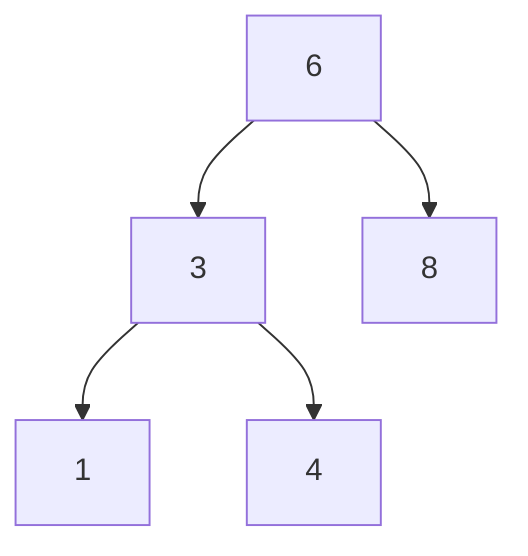

---
tags:
  - programming/data-structures-and-algorithms
---

# Trees and Heaps

A tree represents hierarchical relationships without cycles. A rooted tree has a root, parent-child links and leaves with no children. Depth counts edges from the root to a node; height measures the longest downward path. Stating whether you count edges or nodes avoids off-by-one disagreements.

A binary tree has at most two children per node. A binary search tree (BST) adds an ordering rule; a binary heap adds a different ordering rule for efficient priority access. Being binary does not imply either rule.

## Quick Refresh

| Structure | Invariant | Useful operations |
| --- | --- | --- |
| BST with unique keys | Every left-subtree key is smaller; every right-subtree key is larger | Search, ordered traversal and ranges |
| Balanced search tree | Maintains search ordering and logarithmic height | Predictable logarithmic search and updates |
| Min-heap | Each parent is no greater than its children | Read the minimum, insert and remove the minimum |

BST search takes `O(h)` time for height `h`. A balanced tree has logarithmic height; an unbalanced tree can become a linear chain. Duplicate keys need an explicit convention, such as storing a count or replacing the associated value. [Binary search trees](https://algs4.cs.princeton.edu/32bst/).

## Worked Example: Search and Traverse a BST

This tree satisfies the unique-key ordering rule throughout each subtree, not just between immediate parent-child pairs:



```python
class TreeNode:
    def __init__(self, value, left=None, right=None):
        self.value = value
        self.left = left
        self.right = right


def bst_contains(root, target):
    while root is not None:
        if target == root.value:
            return True
        root = root.left if target < root.value else root.right
    return False


def inorder(root):
    result = []

    def visit(node):
        if node is None:
            return
        visit(node.left)
        result.append(node.value)
        visit(node.right)

    visit(root)
    return result


root = TreeNode(6, TreeNode(3, TreeNode(1), TreeNode(4)), TreeNode(8))
print(bst_contains(root, 4))  # True
print(inorder(root))         # [1, 3, 4, 6, 8]
```

Search for `4` follows `6 -> 3 -> 4`, discarding a whole subtree at each comparison. It uses `O(h)` time and constant auxiliary space. Inorder traversal takes `O(n)` time, `O(h)` recursive stack space and `O(n)` output space.

Preorder visits the node before its children; postorder visits it after them. For this tree, preorder is `6, 3, 1, 4, 8` and postorder is `1, 4, 3, 8, 6`. Level-order traversal uses a queue to visit one depth at a time.

## Heaps and Priority Queues

A binary heap is commonly stored in an array with no gaps in its complete-tree shape. For zero-based index `i`, children are at `2*i + 1` and `2*i + 2` when those positions exist. In a min-heap, only the ancestor-to-descendant ordering is guaranteed; siblings and the whole array need not be sorted.

```python
import heapq

jobs = [(3, "cleanup"), (1, "restore"), (2, "build")]
heapq.heapify(jobs)
print(heapq.heappop(jobs))  # (1, 'restore')
```

`heapify` builds a heap in `O(n)` time. Reading its root is constant time; pushing or popping is `O(log n)`. Finding an arbitrary value is still linear without another index. Python's `heapq` operates on a list as a min-heap. [Heap queue documentation](https://docs.python.org/3/library/heapq.html).

For equal priorities, tuple comparison moves to the next field. Add a sequence number before a non-comparable payload if ties should preserve arrival order and avoid comparing payload objects. Repeated minimum removal produces sorted output; iterating the heap's list does not.

## Common Failure Modes

Checking only immediate children is not sufficient to validate a BST: every descendant must satisfy all ancestor bounds. Likewise, inserting already sorted keys into a plain BST can destroy the hoped-for logarithmic height.

Changing a stored heap priority directly can break the heap invariant. Use an update strategy supported by the implementation, such as rebuilding or tracking replacement entries, rather than assuming the queue automatically notices mutation.

## Worked Prediction

Insert `1`, `2`, `3` and `4` into an initially empty, unbalanced BST using ordinary leaf insertion. How many nodes can searching for `4` visit? Does a min-heap containing the same values also become a chain?

**Check your reasoning:** The BST becomes a rightward chain and search visits all four nodes. A binary heap maintains a complete-tree shape and does not become that chain. Its different invariant supports minimum retrieval, not BST-style arbitrary-key search.

## Interview Questions

> [!question] Interview Questions
> - What distinguishes a binary tree, a BST and a binary heap?
> - Why does BST lookup depend on height rather than simply the number of nodes?
> - Why is inorder traversal sorted only when the search-tree invariant holds?
> - When would a heap be preferable to repeatedly sorting a work queue?

## Answer Notes

1. Binary describes the number of children. A BST orders entire subtrees by key; a heap maintains parent-child priority order plus a complete-tree shape.

2. Lookup follows one root-to-leaf route. Balancing keeps that route logarithmic; a chain can make it linear.

3. In a BST, all left-subtree values come before the node and all right-subtree values after it. Arbitrary binary trees do not promise those relationships.

4. When work arrives over time and the next minimum or maximum is repeatedly needed. Heap updates avoid fully sorting the collection after every arrival, though arbitrary lookup remains a separate need.

## Related Guides

- [Recursion and Backtracking](./recursion-and-backtracking.md) — traversal frames and base cases.
- [Graphs](./graphs.md) — generalise beyond acyclic hierarchies.
- [Searching and Sorting](./searching-and-sorting.md) — compare sorting once with maintaining a structure.

Return to [Data Structures and Algorithms](./README.md).
