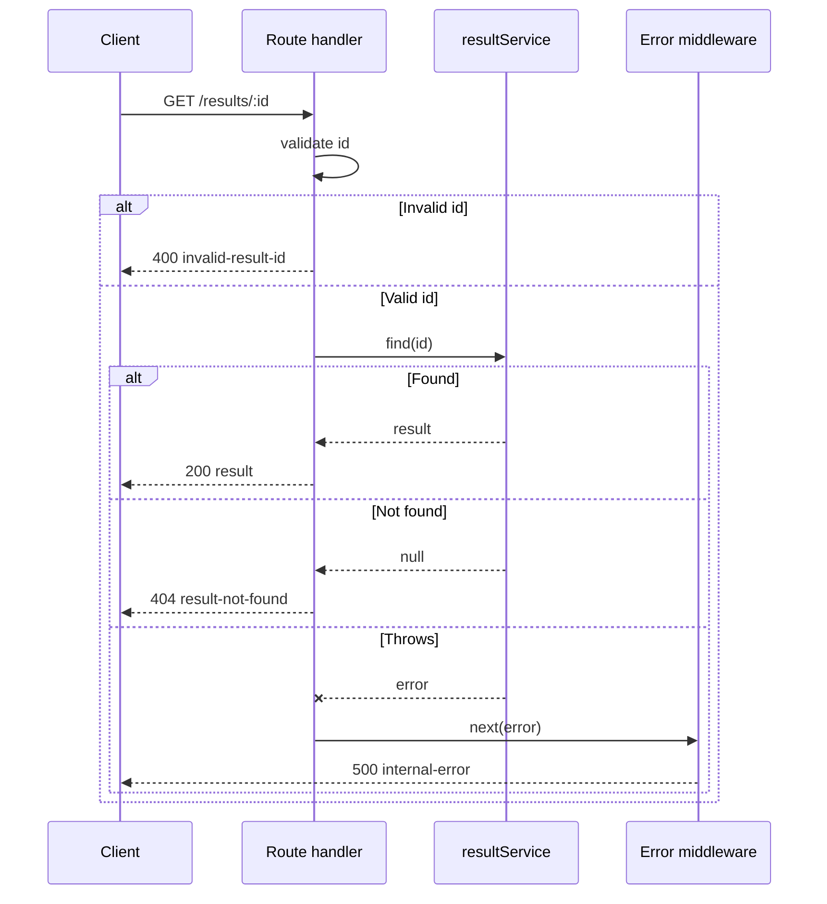

---
tags:
  - programming/frameworks
---

# Express

Express is a minimal web framework for Node.js. An application is a sequence of middleware and route handlers that receive a request, produce a response, or delegate to the next stage.

## Request Pipeline

```text
request -> cross-cutting middleware -> router -> service -> data adapter -> response
                                      -> error middleware
```

Middleware order is part of application behaviour. Apply parsing, correlation, authentication, and routing deliberately, then install error handling after routes.

## Service Design

- Keep route handlers thin and move business rules into testable modules.
- Validate path, query, header, and body data before it reaches persistence.
- Use parameterised database operations and a connection pool.
- Set timeouts and size limits for incoming requests and downstream calls.
- Return a response once; asynchronous failures must reach the error boundary.
- Shut down cleanly by refusing new work and closing servers and pools.

Express does not define the application's architecture, validation strategy, database model, or authentication policy. The team must make those choices explicit.

## Worked Route and Error Boundary

```javascript
import express from "express";

export function createApp(resultService) {
  const app = express();
  app.use(express.json({ limit: "32kb" }));

  app.get("/results/:id", async (request, response, next) => {
    try {
      const id = Number(request.params.id);
      if (!Number.isSafeInteger(id) || id < 1) {
        return response.status(400).json({
          type: "invalid-result-id",
          title: "Result ID must be a positive integer"
        });
      }

      const result = await resultService.find(id);
      if (result === null) {
        return response.status(404).json({
          type: "result-not-found",
          title: "Result not found"
        });
      }

      return response.json(result);
    } catch (error) {
      return next(error);
    }
  });

  app.use((error, request, response, next) => {
    request.log?.error({ error }, "request failed");
    response.status(500).json({
      type: "internal-error",
      title: "The request could not be completed"
    });
  });

  return app;
}
```



The route translates HTTP input and output while `resultService` owns application behaviour. The response does not expose the caught exception. A real service would add central schema validation, correlation, authentication, and an intentional error vocabulary.

## Testing

Test service logic directly, exercise the HTTP boundary with a representative server or request harness, and integration-test real database semantics where queries and constraints carry risk.

## Common Failure Modes

- installing error middleware before routes;
- accepting an unbounded JSON body;
- returning a response and then continuing to execute the handler;
- failing to pass rejected asynchronous work to the error boundary;
- treating CORS as authentication;
- placing SQL, provider calls, and business rules directly in route handlers;
- closing the HTTP server but leaving pools or workers alive during shutdown.

## Project Connections

`tododos-express-api` uses Express with CORS middleware and MySQL, packaged in a Node.js Docker image.

## Interview Questions

> [!question] Interview Questions
> - Why does middleware order matter, and what breaks if error middleware is installed before the routes?
> - Why must a rejected promise inside a route handler be passed to `next(error)` instead of left to reject silently?
> - Why isn't CORS a substitute for authentication?
> - What's the risk of accepting an unbounded JSON request body?
> - How would you shut an Express server down cleanly without dropping in-flight requests or leaving pools open?

## Related Guides

- [Node.js and npm](../tooling/nodejs-and-npm.md)
- [REST APIs](../../quality-engineering/rest-api.md)
- [MySQL](../../platform-engineering/mysql.md)
- [Docker](../../platform-engineering/docker.md)

Return to [Frameworks and Libraries](./README.md).
