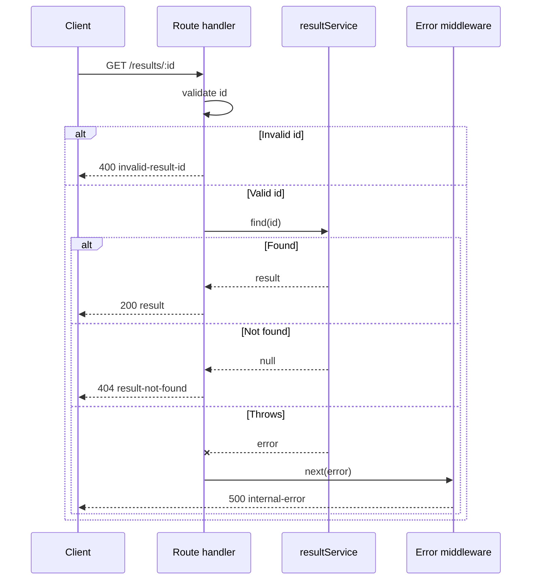

---
tags:
  - programming/frameworks
---

# Express

Express is a minimal web framework for Node.js. An application is a sequence of middleware and route handlers that receive a request, produce a response, or delegate to the next stage.

## Request Pipeline

```text
request -> cross-cutting middleware -> router -> service -> data adapter -> response
                                      -> error middleware
```

Middleware order is part of application behaviour. Apply parsing, correlation, authentication, and routing deliberately, then install error handling after routes.

## Service Design

- Keep route handlers thin and move business rules into testable modules.
- Validate path, query, header, and body data before it reaches persistence.
- Use parameterised database operations and a connection pool.
- Set timeouts and size limits for incoming requests and downstream calls.
- Return a response once; asynchronous failures must reach the error boundary.
- Shut down cleanly by refusing new work and closing servers and pools.

Express does not define the application's architecture, validation strategy, database model, or authentication policy. The team must make those choices explicit.

## Worked Route and Error Boundary

```javascript
import express from "express";

export function createApp(resultService) {
  const app = express();
  app.use(express.json({ limit: "32kb" }));

  app.get("/results/:id", async (request, response, next) => {
    try {
      const id = Number(request.params.id);
      if (!Number.isSafeInteger(id) || id < 1) {
        return response.status(400).json({
          type: "invalid-result-id",
          title: "Result ID must be a positive integer"
        });
      }

      const result = await resultService.find(id);
      if (result === null) {
        return response.status(404).json({
          type: "result-not-found",
          title: "Result not found"
        });
      }

      return response.json(result);
    } catch (error) {
      return next(error);
    }
  });

  app.use((error, request, response, next) => {
    if (response.headersSent) return next(error);
    if (error.type === "entity.parse.failed") {
      return response.status(400).json({ type: "invalid-json" });
    }
    if (error.type === "entity.too.large") {
      return response.status(413).json({ type: "body-too-large" });
    }
    request.log?.error({ error }, "request failed");
    response.status(500).json({
      type: "internal-error",
      title: "The request could not be completed"
    });
  });

  return app;
}
```


```mermaid
sequenceDiagram
    participant C as Client
    participant R as Route handler
    participant S as resultService
    participant E as Error middleware
    C->>R: GET /results/:id
    R->>R: validate id
    alt Invalid id
        R-->>C: 400 invalid-result-id
    else Valid id
        R->>S: find(id)
        alt Found
            S-->>R: result
            R-->>C: 200 result
        else Not found
            S-->>R: null
            R-->>C: 404 result-not-found
        else Throws
            S--xR: error
            R->>E: next(error)
            E-->>C: 500 internal-error
        end
    end
```

The route translates HTTP input and output while `resultService` owns application behaviour. The response does not expose the caught exception. A real service would add central schema validation, correlation, authentication, and an intentional error vocabulary.

Express 5 automatically forwards rejected promises returned by route handlers to error middleware. Explicit `try`/`catch` and `next(error)` also work and are needed for comparable Express 4 handlers without an async wrapper. Detached promises and callback failures still need an owner. The example preserves parser errors as 400/413 and delegates errors after headers have been sent instead of attempting a second response.

## Testing

Test service logic directly, exercise the HTTP boundary with a representative server or request harness, and integration-test real database semantics where queries and constraints carry risk.

## Common Failure Modes

- installing error middleware before routes;
- accepting an unbounded JSON body;
- returning a response and then continuing to execute the handler;
- failing to pass rejected asynchronous work to the error boundary;
- treating CORS as authentication;
- placing SQL, provider calls, and business rules directly in route handlers;
- closing the HTTP server but leaving pools or workers alive during shutdown.

## Project Connections

`tododos-express-api` uses Express with CORS middleware and MySQL, packaged in a Node.js Docker image.

## Interview Questions

> [!question] Interview Questions
> - Why does middleware order matter, and what breaks if error middleware is installed before the routes?
> - How does Express 5 handle a returned rejected promise, and why do detached promises or callback errors still need explicit handling?
> - Why isn't CORS a substitute for authentication?
> - How would you shut an Express server down cleanly without dropping in-flight requests or leaving pools open?

## Answer Notes

1. Express traverses middleware in registration order. Body parsing and other prerequisites must run before handlers that need them, and error middleware belongs after routes because later failures cannot travel backwards to an earlier handler.

2. A returned rejected promise from an Express 5 handler is forwarded to error handling. A detached promise or asynchronous callback sits outside that returned chain, so its failure must be caught and passed to the appropriate error boundary explicitly.

3. CORS controls whether browsers expose certain cross-origin responses to scripts. It does not identify a caller or prevent non-browser clients from making requests; authentication and authorisation must be enforced by the server.

4. Stop accepting new work, allow in-flight requests a bounded drain period, then close database pools and other resources. Handle termination signals and set a deadline so stuck requests cannot prevent shutdown indefinitely.

## Official References

- [Express error handling](https://expressjs.com/en/guide/error-handling.html)
- [Body-parser errors](https://expressjs.com/en/resources/middleware/body-parser.html#errors)

## Related Guides

- [Node.js and npm](../tooling/nodejs-and-npm.md)
- [REST APIs](../../quality-engineering/rest-api.md)
- [MySQL](../../platform-engineering/mysql.md)
- [Docker](../../platform-engineering/docker.md)

Return to [Frameworks and Libraries](./README.md).
