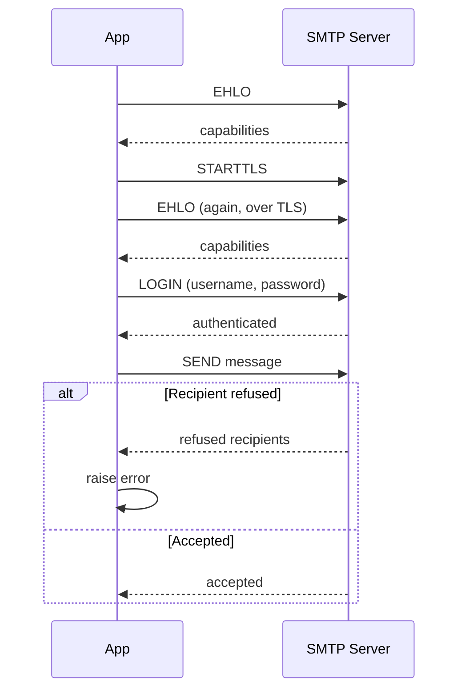

---
tags:
  - programming/integrations
---

# Email and SMTP

SMTP transfers email between clients and mail servers. Application code usually authenticates to a provider, submits a message, and lets the provider handle onward delivery.

## Message Flow

```text
application -> authenticated SMTP submission -> mail provider -> recipient server
```

Construct messages with the standard email types rather than hand-building headers. Validate recipients, set an intentional plain-text or HTML content type, and prevent untrusted values from injecting headers or misleading links.

## Credentials and Delivery

- Store SMTP credentials outside source and rotate them when exposed.
- Use encrypted transport and verify server certificates.
- Apply connection and send timeouts.
- Distinguish temporary failures from permanent recipient or authentication failures.
- Avoid retrying indefinitely or sending duplicates after an ambiguous timeout.
- Log delivery identifiers and error categories without recording credentials or sensitive message bodies.

For larger or user-facing systems, use a queue or outbox so request latency and transient mail failure do not control the main transaction. Define rate limits, bounce handling, suppression, monitoring, and legal or consent requirements appropriate to the messages.

## Worked Python Example

```python
import os
import smtplib
import ssl
from email.message import EmailMessage


def send_report(recipient, report_date):
    message = EmailMessage()
    message["From"] = "reports@example.test"
    message["To"] = recipient
    message["Subject"] = f"Report for {report_date:%Y-%m-%d}"
    message.set_content(
        f"Your report for {report_date:%Y-%m-%d} is ready."
    )

    context = ssl.create_default_context()
    with smtplib.SMTP("smtp.example.test", 587, timeout=10) as client:
        client.ehlo()
        client.starttls(context=context)
        client.ehlo()
        client.login(
            os.environ["SMTP_USERNAME"],
            os.environ["SMTP_PASSWORD"],
        )
        refused = client.send_message(message)

    if refused:
        raise RuntimeError(f"recipients refused: {list(refused)}")
```



The example uses the email library to encode headers and the body, upgrades the authenticated connection with certificate verification, and checks for recipients refused during the transaction. It does not prove inbox placement or user receipt.

For user-controlled display names, subjects, and links, validate against the product contract and render from trusted templates. Do not let an arbitrary user choose the envelope sender or turn the service into an open relay.

## Common Failure Modes

- treating SMTP acceptance as confirmed delivery;
- retrying after an ambiguous timeout and sending duplicates;
- building headers by joining untrusted strings;
- logging credentials, complete bodies, or password-reset links;
- sending synchronously inside a transaction that also changes business data;
- omitting bounce, suppression, consent, and rate-limit handling.

## Testing

Unit-test message composition and recipient selection without sending real mail. Use a local or sandbox SMTP server for integration tests, then keep a narrow opt-in check for the real provider configuration.

## Project Connections

The Playwright CEX crawler builds a text email with Python's standard email library and submits it through `smtplib` using credentials loaded from environment configuration.

## Interview Questions

> [!question] Interview Questions
> - Why doesn't SMTP acceptance prove the email actually reached an inbox?
> - Why is retrying an email send after an ambiguous timeout risky, and how would you avoid sending a duplicate?
> - Why must user-controlled display names and subjects be validated before going into a message?
> - Why would you unit-test message composition separately from actually sending mail?

## Answer Notes

1. SMTP acceptance means a server accepted responsibility for that delivery step. Later relays, mailbox rules, spam filtering or bounces can prevent inbox delivery; track downstream delivery events where available.

2. The server may have accepted the message before the connection timed out, making a blind retry a duplicate send. Record a stable logical send operation and provider outcome where possible, using provider idempotency or reconciliation when supported; a Message-ID alone does not guarantee deduplication.

3. Untrusted header values can contain invalid characters or attempted header injection. Use a mail library's structured fields and validate values rather than constructing raw headers through string concatenation.

4. Composition tests can assert recipients, headers and body deterministically without network access or accidental delivery. Separate transport tests verify the sending adapter and delivery integration under controlled conditions.

## Related Guides

- [Python](../languages/python.md)
- [Testing](../../quality-engineering/testing.md)
- [GitHub Actions](../../platform-engineering/ci-cd/github-actions.md)

Return to [External Integrations](./README.md).
