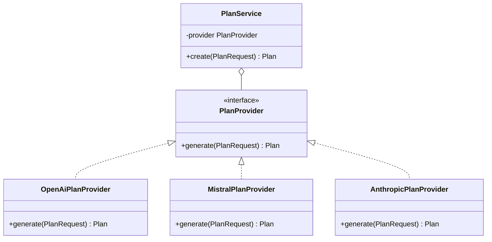

---
tags:
  - programming/integrations
---

# Generative AI APIs

Applications can integrate model providers through HTTP APIs or provider SDKs. The Janus services support OpenAI, Mistral AI, and Anthropic behind one application-owned contract.

## Provider Boundary

```text
validated request -> application contract -> provider adapter -> model API
                                      <- normalised result or error <-
```

Keep provider-specific clients, request shapes, model names, and exceptions inside adapters. The application should own its domain schema and map each provider response into it.

### Example Application Contract

```python
from dataclasses import dataclass
from typing import Protocol


@dataclass(frozen=True)
class PlanRequest:
    goal: str
    days: int


@dataclass(frozen=True)
class Plan:
    title: str
    activities: tuple[str, ...]


class PlanProvider(Protocol):
    def generate(self, request: PlanRequest) -> Plan:
        ...


class PlanService:
    def __init__(self, provider: PlanProvider):
        self._provider = provider

    def create(self, request: PlanRequest) -> Plan:
        if not 1 <= request.days <= 14:
            raise ValueError("days must be between 1 and 14")

        plan = self._provider.generate(request)
        if len(plan.activities) != request.days:
            raise ValueError("provider returned the wrong activity count")
        return plan
```



An OpenAI, Mistral, or Anthropic adapter translates its provider response into `Plan`. The service does not branch on provider names and enforces domain rules after model output has been parsed.

## Structured Output

Define a strict schema for the result, validate every provider response, and reject invalid or incomplete output. Pydantic or another schema library can validate types and constraints, but the application must still enforce domain rules and user confirmation for consequential changes.

Treat prompts, model output, and tool arguments as untrusted data. Do not allow generated text to become an SQL query, shell command, credential, or authorisation decision without a controlled intermediary.

## Credentials and Privacy

- Keep provider credentials on the trusted server, never in a public frontend bundle.
- Encrypt stored credentials and restrict decryption to the runtime identity that needs it.
- Avoid writing keys, bearer headers, prompts, or sensitive responses to logs.
- Define retention, deletion, and provider data-use expectations.
- Make user and tenant ownership checks independent of model behaviour.

## Reliability and Cost

Use deadlines, bounded retries with jitter for safe transient failures, rate-limit handling, request-size limits, and explicit model configuration. Track latency, error class, usage, and cost without recording sensitive content. A fallback provider can change output semantics, so fallback must be a product decision rather than an invisible retry.

## Testing

Unit-test adapters with controlled fake responses for valid output, schema failure, authentication failure, rate limits, timeouts, and provider-specific errors. Keep a small opt-in integration suite for live credentials and models; do not make every local test depend on billable external calls.

```python
class FixedProvider:
    def generate(self, request):
        return Plan("Starter plan", ("Walk", "Rest"))


def test_plan_requires_one_activity_per_day():
    service = PlanService(FixedProvider())

    try:
        service.create(PlanRequest(goal="Run 5 km", days=3))
        assert False, "expected invalid provider output"
    except ValueError as error:
        assert str(error) == "provider returned the wrong activity count"
```

Use provider-specific contract tests to prove each adapter maps valid, refused, truncated, and malformed responses correctly. A mock that returns only ideal output hides the most important integration risk.

## Common Failure Modes

- allowing model output to make an authorisation or safety decision by itself;
- coupling domain code to one provider's response classes;
- parsing “JSON-like” prose without strict validation;
- retrying every failure, including invalid requests and exhausted quotas;
- silently changing model or provider and assuming equivalent behaviour;
- storing prompts and responses without a privacy and retention decision;
- running the normal test suite against live, variable, billable models.

## Project Connections

The Janus APIs use the OpenAI, Mistral AI, and Anthropic Python SDKs and validate structured nutrition and workout results with Pydantic. Nyx and Aether expose user settings but send requests through Janus rather than directly to providers.

## Interview Questions

> [!question] Interview Questions
> - Why should provider-specific clients and exceptions stay behind an adapter instead of leaking into domain code?
> - Why is validating a model's output against a strict schema not enough on its own — what else must the application still enforce?
> - Why is it dangerous to let generated text become a SQL query, shell command, or authorisation decision directly?
> - Why does switching providers silently risk more than just a different response format?
> - Why shouldn't your normal test suite call live, billable models?

## Related Guides

- [Flask](../frameworks/flask.md)
- [REST APIs](../../quality-engineering/rest-api.md)
- [Cloud KMS and Application Services](../../platform-engineering/cloud/gcp/application-services.md)
- [Software Design](../../software-design/README.md)

Return to [External Integrations](./README.md).
