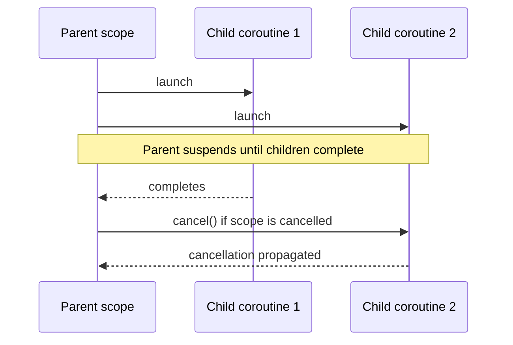

---
tags:
  - programming/languages
---

# Kotlin

Kotlin is a statically typed language designed for concise, interoperable application development. It is widely used on the JVM and Android, while Kotlin Multiplatform can share selected code across platforms.

## Kotlin and the JVM

Kotlin/JVM compiles to JVM bytecode and can call Java libraries directly. Java interoperability is a practical strength, but Java declarations may expose platform types whose nullability Kotlin cannot prove.

```text
Main.kt -- Kotlin compiler --> JVM bytecode -- JVM --> running program
```

Use Gradle or the project’s chosen build tool to keep compiler, dependency, test, and packaging configuration repeatable.

## Values, Types, and Null Safety

Prefer `val` for a reference that is not reassigned and use `var` only when rebinding is required. `val` does not make a referenced mutable object immutable.

Nullable types carry `?` explicitly:

```kotlin
fun displayName(name: String?): String = name?.trim()?.takeIf { it.isNotEmpty() } ?: "Unknown"
```

Use safe calls, Elvis expressions, smart casts, and explicit validation. Avoid normalising `!!`; it converts a missing-value possibility into a runtime failure.

## Functions and Data Modelling

Functions may be top-level, local, extension, higher-order, or members. Named and default arguments can make calls readable.

```kotlin
data class TestResult(val name: String, val passed: Boolean)

fun failures(results: List<TestResult>): List<String> =
    results.filterNot(TestResult::passed).map(TestResult::name)
```

Data classes provide generated value-oriented operations. Sealed classes and interfaces are useful for closed outcome hierarchies that `when` can check exhaustively.

## Collections and Sequences

Kotlin distinguishes read-only interfaces such as `List<T>` from mutable interfaces such as `MutableList<T>`. A read-only view does not guarantee that another reference cannot mutate the underlying object.

Collection operations are eager. Sequences can apply a chain lazily, which may help for large pipelines or early termination but adds overhead for small collections. Measure rather than assuming one is faster.

## Extension Functions and Scope Functions

Extension functions add callable syntax without modifying or subclassing the receiver type. They are resolved statically and cannot access private members.

Scope functions—`let`, `run`, `with`, `apply`, and `also`—differ in receiver name and return value. Use them when they clarify a small operation; deeply nested chains can hide control flow and null handling.

## Coroutines

Coroutines support suspending work without tying every operation to a dedicated thread. A `suspend` function may suspend, but it is not automatically concurrent or assigned to a background dispatcher.

```kotlin
suspend fun loadProfile(client: ProfileClient, id: String): Profile =
    client.fetch(id)
```



Structured concurrency ties child work to a scope so completion, cancellation, and failure have an owner. Avoid unscoped background work, propagate cancellation, choose dispatchers according to workload, and test with coroutine-aware test utilities.

## Error and Resource Handling

Kotlin exceptions are unchecked. Use exceptions for operations that cannot fulfil their contracts, and sealed results or nullable returns where an expected absence is clearer.

JVM resources implementing `Closeable` can use `use` for deterministic cleanup:

```kotlin
val firstLine = file.bufferedReader().use { it.readLine() }
```

## Testing and Tooling

Test public behaviour and important boundaries. Keep coroutine tests deterministic, avoid real delays, and isolate platform APIs behind focused interfaces when testing shared logic.

Useful build tasks vary by project but commonly include:

```bash
./gradlew test
./gradlew check
```

Use compiler warnings, static analysis, formatting, IDE inspections, stack traces, and debugger state as complementary feedback.

## Interview Questions

> [!question] Interview Questions
> - Why doesn't `val` make a referenced object immutable, only the reference itself?
> - What's the risk of using `!!` instead of a safe call or explicit null check?
> - How does structured concurrency tie a coroutine's cancellation to its parent scope?
> - Why are Kotlin collection operations eager by default, and when would a sequence change that?
> - What's a platform type, and why can't Kotlin prove its nullability when calling into Java?

## Related Guides

- [Android](../platforms/android.md)
- [Java](./java/README.md)

## Official References

- [Kotlin documentation](https://kotlinlang.org/docs/home.html)
- [Null safety](https://kotlinlang.org/docs/null-safety.html)
- [Coroutines guide](https://kotlinlang.org/docs/coroutines-guide.html)
- [Java interoperability](https://kotlinlang.org/docs/java-interop.html)

Return to [Programming Languages](./README.md).
