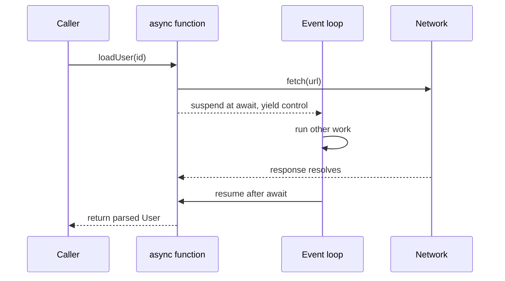

---
tags:
  - programming/languages
---

# JavaScript and TypeScript

JavaScript is a dynamic language implemented by browsers and server-side runtimes such as Node.js. TypeScript adds static analysis and type syntax, then emits JavaScript for a target runtime. Understanding JavaScript runtime behaviour remains essential because TypeScript’s types do not exist as runtime validation.

## Values, Scope, and Equality

Prefer `const` when a binding is not reassigned and `let` when reassignment is intentional. Avoid `var` in modern code because its function scope and hoisting behaviour are easier to misuse.

JavaScript has primitive values and objects. Object assignment copies a reference:

```javascript
const original = { status: "queued" };
const alias = original;
alias.status = "complete";

console.log(original.status); // complete
```

Use strict equality, `===` and `!==`, unless coercive equality is explicitly required and understood. Remember that truthiness is not the same as validity: `0`, `""`, `false`, `null`, and `undefined` may represent different domain states.

## Functions, Closures, and Objects

Functions are values and closures retain access to their lexical environment. This supports callbacks and factories, but captured mutable state can create hidden coupling.

```javascript
function createCounter() {
  let count = 0;
  return () => ++count;
}
```

Objects inherit through prototype chains. `class` syntax provides a familiar surface over that model. Prefer composition and small modules over deep inheritance hierarchies.

## Collections and Immutability

Arrays provide ordered collections; `Map` supports arbitrary keys; `Set` stores unique values. Methods such as `map`, `filter`, and `reduce` create expressive transformations, but a loop is clearer when control flow or mutation is central.

Spread syntax makes shallow copies only. Nested objects remain shared unless copied or modelled immutably.

## Modules and Runtime Boundaries

ECMAScript modules use `import` and `export`. Module resolution, package exports, the target runtime, and build tooling must agree. Browser, Node.js, and other runtimes expose different global APIs even when they execute the same language.

Keep environment-specific code at boundaries and avoid assuming that a TypeScript compiler option changes what the runtime actually supports.

## Promises and the Event Loop

A promise represents a future completion or failure. `async` functions return promises, and `await` pauses the function until a promise settles without blocking the runtime’s event loop.

```typescript
async function loadUser(id: string, signal: AbortSignal): Promise<User> {
  const response = await fetch(`/api/users/${id}`, { signal });
  if (!response.ok) throw new Error(`Request failed: ${response.status}`);
  return response.json() as Promise<User>;
}
```



Start independent work before awaiting it when concurrency is intended, but bound large fan-out. Handle rejection, cancellation, timeouts, and cleanup. A successful HTTP request still needs application-level status and data validation.

## TypeScript’s Type System

TypeScript uses structural typing: compatibility depends mainly on members rather than declared names. Type inference reduces unnecessary annotations, while explicit types are valuable at public boundaries.

```typescript
type TestResult = {
  name: string;
  status: "passed" | "failed" | "skipped";
};

function failures(results: readonly TestResult[]): TestResult[] {
  return results.filter(result => result.status === "failed");
}
```

Prefer `unknown` over `any` for untrusted values, then narrow through checks. Union types and discriminated unions model alternatives well. Generics preserve relationships between inputs and outputs; they should express real constraints rather than add abstraction for its own sake.

Static types do not validate JSON, DOM input, environment variables, or database results. Validate external data at runtime before treating it as a trusted type.

## Packages and Configuration

`package.json` records scripts and dependency intent; a lockfile captures a resolved dependency graph. Commit the lockfile used by the package manager and use deterministic installation in CI. Separate runtime dependencies from development tools and review lifecycle scripts and supply-chain risk.

TypeScript compiler settings are part of the program’s contract. Enable strict analysis for new projects and understand target, module, module resolution, library, and interoperability choices.

## Testing and Debugging

Test pure functions cheaply, integrate real boundaries deliberately, and keep browser end-to-end tests focused on user-critical behaviour. Avoid assertions that merely reproduce implementation details.

Use linting, formatting, type checking, unit tests, browser developer tools, source maps, network inspection, and runtime profiling as complementary feedback. A typical project exposes stable commands such as:

```bash
npm run typecheck
npm test
npm run build
```

## Interview Questions

> [!question] Interview Questions
> - Why doesn't `await` block the JavaScript event loop, and what happens while a promise is pending?
> - What's the difference between JavaScript's runtime behaviour and what TypeScript's type system checks?
> - Why is `unknown` safer than `any` for untrusted values, and how would you narrow it?
> - Why don't TypeScript's static types protect you from malformed JSON or DOM input at runtime?
> - What's the difference between a shallow copy from spread syntax and a deep copy, and when does that distinction bite you?

## Frameworks and Libraries

- [React](../frameworks/frameworks-react.md)

## Official References

- [JavaScript guide](https://developer.mozilla.org/docs/Web/JavaScript/Guide)
- [ECMAScript language specification](https://tc39.es/ecma262/)
- [TypeScript handbook](https://www.typescriptlang.org/docs/handbook/intro.html)
- [Node.js documentation](https://nodejs.org/docs/latest/api/)

Return to [Programming Languages](./README.md).
