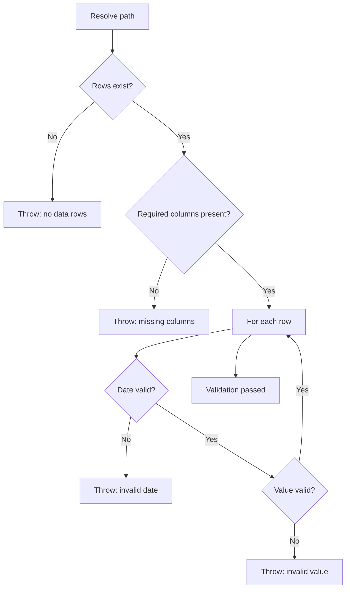

---
tags:
  - programming/languages
---

# PowerShell

PowerShell is a cross-platform automation shell and scripting language built around structured objects rather than plain-text pipelines. It is useful for repository checks, administration, CI tasks, and Windows-oriented workflows.

## Object Pipeline

Commands emit objects whose properties can be filtered, grouped, sorted, and passed to later commands:

```powershell
Get-ChildItem -File |
    Where-Object Extension -eq '.csv' |
    Select-Object Name, Length
```


Prefer object properties to parsing formatted display text. Formatting commands belong at the output boundary because they turn objects into presentation data.

## Reliable Scripts

- Use `[CmdletBinding()]` and a `param` block for an explicit interface.
- Set terminating-error behaviour intentionally and use `try`, `catch`, and `finally` where cleanup matters.
- Resolve paths with `Join-Path` and `$PSScriptRoot` instead of assuming the current directory.
- Use `-LiteralPath` when a path should not interpret wildcard characters.
- Write useful pipeline output and keep diagnostic chatter separate.
- Make repeated execution safe when the script may run locally and in CI.

## Data Validation

`Import-Csv` turns rows into objects, which makes schema and value checks readable. Validate headers before relying on properties, report file and row context, and fail the process with a non-zero exit code when CI must stop.

### Worked CSV Validator

```powershell
[CmdletBinding()]
param(
    [Parameter(Mandatory)]
    [string] $Path
)

$ErrorActionPreference = 'Stop'
$requiredColumns = @('Date', 'Category', 'Value')

try {
    $resolvedPath = (Resolve-Path -LiteralPath $Path).Path
    $rows = @(Import-Csv -LiteralPath $resolvedPath)

    if ($rows.Count -eq 0) {
        throw "CSV contains no data rows: $resolvedPath"
    }

    $actualColumns = @($rows[0].PSObject.Properties.Name)
    $missingColumns = @($requiredColumns |
        Where-Object { $_ -notin $actualColumns })

    if ($missingColumns.Count -gt 0) {
        throw "Missing columns: $($missingColumns -join ', ')"
    }

    for ($index = 0; $index -lt $rows.Count; $index++) {
        $parsedDate = [datetime]::MinValue
        $parsedValue = 0.0
        $csvLine = $index + 2

        if (-not [datetime]::TryParse($rows[$index].Date, [ref] $parsedDate)) {
            throw "Invalid Date at CSV line $csvLine"
        }

        if (-not [double]::TryParse($rows[$index].Value, [ref] $parsedValue)) {
            throw "Invalid Value at CSV line $csvLine"
        }
    }
}
catch {
    Write-Error $_
    exit 1
}
```



The array wrappers preserve a predictable collection when the CSV has zero or one row. Diagnostics report CSV line numbers rather than zero-based indexes. For portable data, parse dates and decimals with an explicit invariant format rather than the current machine's culture.

## Common Failure Modes

- parsing formatted console text when a command already returns objects;
- assuming a one-row pipeline result is always an array;
- resolving paths relative to whichever directory invoked the script;
- allowing non-terminating errors to pass through a CI step;
- writing diagnostic text to the success pipeline and surprising callers;
- accepting culture-sensitive dates or decimals without defining the file format.

## Project Connections

`health-os` uses a PowerShell script and GitHub Actions to validate yearly CSV filenames, schemas, dates, and duplicate rows.

## Interview Questions

> [!question] Interview Questions
> - Why is it a mistake to parse a command's formatted console text instead of using its object properties directly?
> - Why can a one-row pipeline result silently stop being an array, and how would you guard against that?
> - Why would you resolve paths with `$PSScriptRoot` instead of the current working directory?
> - What's the risk of letting a non-terminating error pass through a CI step unnoticed?
> - Why does parsing dates or decimals with the current machine's culture make a script unreliable across environments?

## Related Guides

- [GitHub Actions](../../platform-engineering/ci-cd/ci-cd-github-actions.md)
- [Testing](../../quality-engineering/quality-engineering-testing.md)

Return to [Programming Languages](./README.md).
