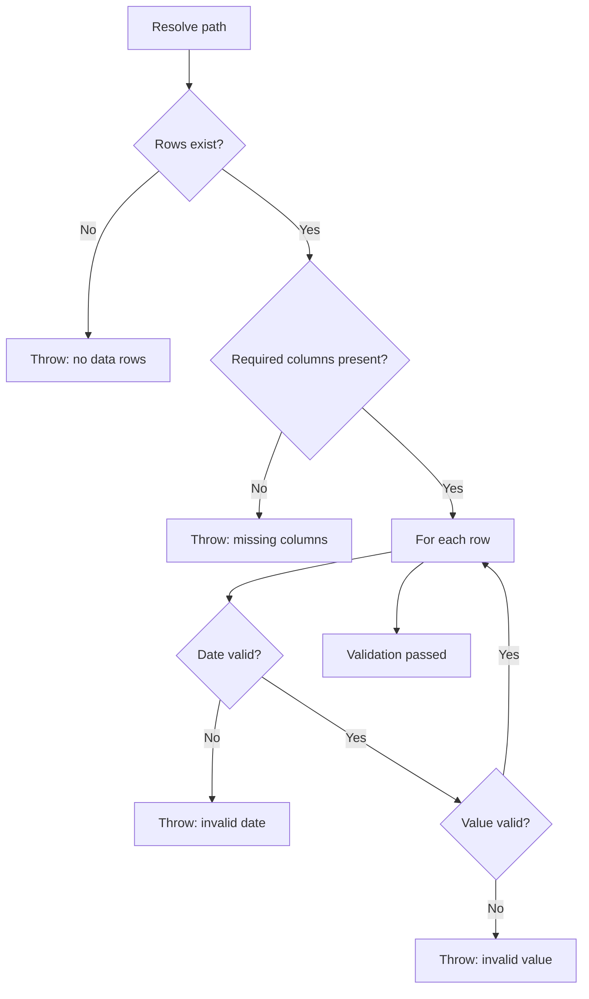

---
tags:
  - programming/languages
---

# PowerShell

PowerShell is a cross-platform automation shell and scripting language built around structured objects rather than plain-text pipelines. It is useful for repository checks, administration, CI tasks, and Windows-oriented workflows.

## Object Pipeline

Commands emit objects whose properties can be filtered, grouped, sorted, and passed to later commands:

```powershell
Get-ChildItem -File |
    Where-Object Extension -eq '.csv' |
    Select-Object Name, Length
```


Prefer object properties to parsing formatted display text. Formatting commands belong at the output boundary because they turn objects into presentation data.

## Reliable Scripts

- Use `[CmdletBinding()]` and a `param` block for an explicit interface.
- Set terminating-error behaviour intentionally and use `try`, `catch`, and `finally` where cleanup matters.
- Resolve paths with `Join-Path` and `$PSScriptRoot` instead of assuming the current directory.
- Use `-LiteralPath` when a path should not interpret wildcard characters.
- Write useful pipeline output and keep diagnostic chatter separate.
- Make repeated execution safe when the script may run locally and in CI.

## Data Validation

`Import-Csv` turns rows into objects, which makes schema and value checks readable. Validate headers before relying on properties, report file and row context, and fail the process with a non-zero exit code when CI must stop.

### Worked CSV Validator

```powershell
[CmdletBinding()]
param(
    [Parameter(Mandatory)]
    [string] $Path
)

$ErrorActionPreference = 'Stop'
$requiredColumns = @('Date', 'Category', 'Value')
$culture = [System.Globalization.CultureInfo]::InvariantCulture

try {
    $resolvedPath = (Resolve-Path -LiteralPath $Path).Path
    $rows = @(Import-Csv -LiteralPath $resolvedPath)

    if ($rows.Count -eq 0) {
        throw "CSV contains no data rows: $resolvedPath"
    }

    $actualColumns = @($rows[0].PSObject.Properties.Name)
    $missingColumns = @($requiredColumns |
        Where-Object { $_ -notin $actualColumns })

    if ($missingColumns.Count -gt 0) {
        throw "Missing columns: $($missingColumns -join ', ')"
    }

    for ($index = 0; $index -lt $rows.Count; $index++) {
        $parsedDate = [datetime]::MinValue
        $parsedValue = 0.0
        $recordNumber = $index + 1

        if (-not [datetime]::TryParseExact(
            $rows[$index].Date, 'yyyy-MM-dd', $culture,
            [System.Globalization.DateTimeStyles]::None, [ref] $parsedDate)) {
            throw "Invalid Date at data record $recordNumber"
        }

        if (-not [double]::TryParse(
            $rows[$index].Value, [System.Globalization.NumberStyles]::Float,
            $culture, [ref] $parsedValue) -or
            [double]::IsNaN($parsedValue) -or [double]::IsInfinity($parsedValue)) {
            throw "Invalid Value at data record $recordNumber"
        }
        if ([string]::IsNullOrWhiteSpace($rows[$index].Category)) {
            throw "Missing Category at data record $recordNumber"
        }
    }
}
catch {
    Write-Error $_ -ErrorAction Continue
    exit 1
}
```



The array wrappers preserve a predictable collection when the CSV has zero or one row. Dates must use `yyyy-MM-dd`; numeric values use an invariant decimal point and must be finite. Diagnostics identify data records rather than physical lines because quoted CSV fields can span lines. The catch block reports the error without terminating before the explicit non-zero exit.

## Common Failure Modes

- parsing formatted console text when a command already returns objects;
- assuming a one-row pipeline result is always an array;
- resolving paths relative to whichever directory invoked the script;
- allowing non-terminating errors to pass through a CI step;
- writing diagnostic text to the success pipeline and surprising callers;
- accepting culture-sensitive dates or decimals without defining the file format.

## Project Connections

`health-os` uses a PowerShell script and GitHub Actions to validate yearly CSV filenames, schemas, dates, and duplicate rows.

## Interview Questions

> [!question] Interview Questions
> - Why is it a mistake to parse a command's formatted console text instead of using its object properties directly?
> - Why can a one-row pipeline result silently stop being an array, and how would you guard against that?
> - What's the risk of letting a non-terminating error pass through a CI step unnoticed?
> - Why does parsing dates or decimals with the current machine's culture make a script unreliable across environments?

## Answer Notes

1. PowerShell pipelines carry objects with typed properties, while formatted text is presentation that can change with width, culture or formatting. Select and transform the properties directly, and apply formatting only at the display boundary.

2. Pipeline assignment can produce no value, a single scalar or an array depending on result count. Wrap the expression in @() when subsequent code requires array semantics, including zero- and one-row cases.

3. A non-terminating error may be reported while the script continues and exits successfully, giving CI a false pass. Use terminating errors where required, handle failures deliberately and return a non-zero exit code when the operation fails.

4. The same text can mean different dates or numbers under different cultures. Define the input format explicitly and use appropriate exact or invariant-culture parsing, validating failures rather than silently accepting environment-dependent values.

## Related Guides

- [GitHub Actions](../../platform-engineering/ci-cd/github-actions.md)
- [Testing](../../quality-engineering/testing.md)

Return to [Programming Languages](./README.md).
