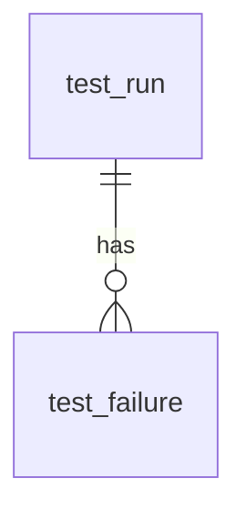

---
tags:
  - programming/languages
---

# SQL

SQL is a declarative language for defining, querying, and changing relational data. You describe the required result; the database optimiser chooses an execution plan. Correct SQL therefore depends on data meaning, keys, cardinality, transaction boundaries, and the behaviour of the selected database—not syntax alone.

## Tables, Keys, and Constraints

A table represents a relation with named columns and rows. Constraints keep invalid states out of the database. This study schema uses PostgreSQL-style identity syntax; adapt it to your engine:

```sql
CREATE TABLE test_run (
    id          BIGINT GENERATED ALWAYS AS IDENTITY PRIMARY KEY,
    suite_name  VARCHAR(200) NOT NULL,
    status      VARCHAR(20) NOT NULL
                CHECK (status IN ('passed', 'failed', 'cancelled')),
    started_at  TIMESTAMP NOT NULL,
    duration_ms BIGINT CHECK (duration_ms >= 0),
    UNIQUE (suite_name, started_at)
);
```

Primary keys identify rows. Foreign keys enforce relationships. `NOT NULL`, `UNIQUE`, and `CHECK` constraints express invariants nearer to the data than application validation alone. The join examples use this child table:

```sql
CREATE TABLE test_failure (
    id       BIGINT GENERATED ALWAYS AS IDENTITY PRIMARY KEY,
    run_id   BIGINT NOT NULL REFERENCES test_run(id),
    severity VARCHAR(20) NOT NULL
);
```

## Query Processing

A useful conceptual order for a `SELECT` is:

```text
FROM and JOIN -> WHERE -> GROUP BY -> HAVING -> SELECT -> ORDER BY -> LIMIT
```

This explains why a `SELECT` alias is often unavailable in `WHERE`: filtering conceptually happens earlier.

```sql
SELECT suite_name, COUNT(*) AS failed_count
FROM test_run
WHERE status = 'failed'
GROUP BY suite_name
HAVING COUNT(*) >= 3
ORDER BY failed_count DESC;
```

Without `ORDER BY`, row order is not guaranteed.

## Joins and Cardinality

Choose a join from the relationship required:

- `INNER JOIN` keeps matching rows.
- `LEFT JOIN` keeps every left row and supplies `NULL` for missing right rows.
- `CROSS JOIN` forms combinations deliberately.

Before joining, state whether each side is one-to-one, one-to-many, or many-to-many. Unexpected duplicates are often a cardinality problem, not something to hide with `DISTINCT`.



Each `test_run` can have zero or more `test_failure` rows; a `LEFT JOIN` keeps a run even when it has none.

```sql
SELECT r.id, COUNT(f.id) AS failure_count
FROM test_run AS r
LEFT JOIN test_failure AS f ON f.run_id = r.id
GROUP BY r.id;
```

`COUNT(f.id)` returns zero for a run without failures; `COUNT(*)` would count the retained left row.

## Missing Values

`NULL` represents missing or unknown information and introduces three-valued logic. Use `IS NULL` and `IS NOT NULL`, not `= NULL`. Comparisons with `NULL` normally produce unknown, which a `WHERE` clause does not retain.

Use `COALESCE` only when substituting a value is semantically correct. Missing, zero, empty text, and false are not automatically equivalent.

## Aggregates and Window Functions

Aggregation collapses rows into groups. Window functions calculate across related rows while retaining individual rows:

```sql
SELECT
    suite_name,
    started_at,
    duration_ms,
    AVG(duration_ms) OVER (
        PARTITION BY suite_name
        ORDER BY started_at
        ROWS BETWEEN 6 PRECEDING AND CURRENT ROW
    ) AS moving_average
FROM test_run;
```

Specify ordering and frame semantics explicitly when the calculation depends on them.

## Transactions and Concurrency

A transaction groups changes into one unit of work:

```sql
BEGIN;
UPDATE account SET balance = balance - 100 WHERE id = 1;
UPDATE account SET balance = balance + 100 WHERE id = 2;
COMMIT;
```

Rollback restores the transaction when the operation cannot complete. Isolation levels balance consistency against concurrency and permit different phenomena. Keep transactions short, access resources in a consistent order, and handle deadlocks or serialization failures according to the database contract.

## Indexes and Performance

Indexes can accelerate selective lookup, joins, ordering, and uniqueness checks, but they consume storage and add write cost. Index design should follow real query predicates and ordering, not every column.

Inspect the database’s execution plan and measure with representative data. Common performance problems include:

- fetching unused columns or unbounded rows;
- missing or ineffective indexes;
- applying functions that prevent useful index access;
- repeated application queries instead of set-based work;
- incorrect cardinality estimates or stale statistics;
- long transactions and lock contention.

## Application Safety and Testing

Always bind untrusted values as parameters. String concatenation creates injection risk and can break quoting rules.

Test migrations forward and, where supported, recovery or rollback procedures. Verify constraints, transaction behaviour, permissions, indexes, and queries against the actual database engine because SQL dialects and concurrency semantics differ.

## Worked Prediction: Where a Filter Belongs

Assume runs have IDs `1`, `2`, and `3`. The failure table has two rows for run `1`, one for run `2`, and none for run `3`. Predict the earlier `LEFT JOIN` aggregation: the counts are `2`, `1`, and `0` because `COUNT(f.id)` ignores the null placeholder.

Now count only critical failures while retaining every run:

```sql
SELECT r.id, COUNT(f.id) AS critical_count
FROM test_run AS r
LEFT JOIN test_failure AS f
  ON f.run_id = r.id AND f.severity = 'critical'
GROUP BY r.id
ORDER BY r.id;
```

**Check your reasoning:** The `ON` predicate decides which failure rows match while preserving all left-hand runs. Moving `f.severity = 'critical'` into `WHERE` removes null-extended rows and runs without critical matches. Replacing `COUNT(f.id)` with `COUNT(*)` incorrectly counts the placeholder as one.

Create cases with zero, one, and multiple critical failures, plus only non-critical failures. Predict the complete output table before executing either query. These tests distinguish correct cardinality from a query that merely runs without error.

## Interview Questions

> [!question] Interview Questions
> - Why does string concatenation for building a query create an injection risk even if you "trust" the input?
> - How would you predict what a `LEFT JOIN` does to your row count compared to an `INNER JOIN` on the same tables?
> - What's the difference between an aggregate function and a window function?
> - How would you read an execution plan to decide whether a new index would actually help a slow query?

## Answer Notes

1. Concatenation lets data become SQL syntax and depends on every caller and transformation remaining trustworthy. Use parameterised values and explicitly allowlist any dynamic identifiers that cannot be bound as parameters.

2. An INNER JOIN keeps matching row pairs; a LEFT JOIN also retains unmatched left rows with nulls on the right. Multiple matches can multiply left rows in either join, and a WHERE filter on right-side columns can remove the unmatched rows.

3. An aggregate normally collapses each group into a result row. A window function computes over a related set of rows while retaining individual rows, enabling rankings or group totals alongside row details.

4. Inspect access paths, estimated versus actual row counts where available, joins, sorts and the costly stages. Choose an index that fits filtering, joining or ordering, then verify the resulting plan and runtime against its write and storage cost.

## Official References

- [PostgreSQL SQL tutorial](https://www.postgresql.org/docs/current/tutorial-sql.html)
- [PostgreSQL SQL language reference](https://www.postgresql.org/docs/current/sql.html)
- [SQLite SQL language](https://www.sqlite.org/lang.html)
- [SQL Server documentation](https://learn.microsoft.com/sql/)

Return to [Programming Languages](./README.md).
