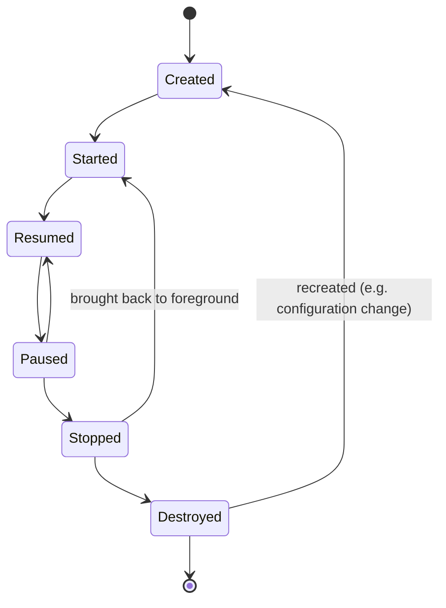

---
tags:
  - programming/platforms
---

# Android

Android is an application platform spanning an operating system, runtime, SDK, application-component model, device ecosystem, build system, and distribution channels. Android applications must tolerate lifecycle changes, constrained resources, unreliable networks, varied screens, and operating-system restrictions.

## Application Structure

An application contains one or more Gradle modules. The Android application module combines source code, resources, assets, dependencies, and a manifest into installable artifacts.

```text
source + resources + manifest + dependencies
                    |
             Android build tools
                    v
              APK or app bundle
```

The manifest declares application components, permissions, intent filters, and selected platform requirements. Keep exported components explicit and expose only the minimum external surface.

## Components and Intents

Core component types include:

- **Activity:** hosts a user-facing interaction surface.
- **Service:** performs work that may continue without a visible UI, subject to background restrictions.
- **Broadcast receiver:** responds to broadcast events.
- **Content provider:** exposes structured data through a defined interface.

Intents request an action from a component. Explicit intents identify the target; implicit intents allow the system to select a matching component. Treat incoming intent data as untrusted input and validate both content and authorisation.

## Lifecycle and State

The operating system owns component lifecycle. An activity may be stopped, destroyed, and recreated for configuration changes or resource pressure. A process may be killed after the app leaves the foreground.



Separate state by required lifetime:

| State | Appropriate owner |
| --- | --- |
| Temporary element interaction | Composable or view state |
| Screen state across recreation | State holder or `ViewModel` |
| Small restorable navigation/UI state | Saved instance state |
| Durable user or application data | Database, file, or remote source |

Do not assume an in-memory singleton is durable storage. Test recreation and process-death scenarios for important journeys.

## UI with Jetpack Compose

Compose describes UI as functions of state. State flows down and user events flow up:

```kotlin
@Composable
fun Counter(count: Int, onIncrement: () -> Unit) {
    Button(onClick = onIncrement) {
        Text("Count: $count")
    }
}
```

Keep composables as stateless as practical, hoist state to an owner that can apply business rules, and keep rendering free of uncontrolled side effects. `remember` retains a value while the composition entry remains; `rememberSaveable` can restore supported state, but neither replaces durable persistence.

View-based applications use XML layouts, view binding, fragments, and lifecycle-aware state. The same principles of clear ownership, accessibility, and lifecycle safety apply.

## Application Architecture

A maintainable application commonly separates:

```text
UI layer -> domain/use-case layer when useful -> data layer -> external sources
```

The UI observes immutable screen state and emits events. Repositories coordinate local and remote data according to a defined source-of-truth and caching policy. Add a domain layer when business rules need reuse or isolation; do not create layers that only forward every call.

Handle offline, loading, empty, partial, error, and retry states explicitly. Avoid allowing transport or database models to leak through every layer.

## Data and Background Work

Choose storage according to data shape, sensitivity, lifetime, and consistency needs. Structured local data commonly uses a database abstraction; small settings use an appropriate preference or data-store API. Sensitive values may require platform-backed key protection, but threat modelling still matters.

Use lifecycle-aware coroutines for screen-related work and WorkManager for deferrable, guaranteed background work. Foreground services are user-visible and restricted; they are not a general escape from background execution limits.

## Permissions and Security

Request only permissions needed for an immediate user-facing capability, explain the purpose in context, and handle denial gracefully. Platform versions can change permission behaviour.

Security checks include:

- explicit exported-component decisions;
- HTTPS and secure network configuration;
- safe WebView and deep-link handling;
- no secrets embedded in the application package;
- encrypted or access-controlled sensitive storage where justified;
- dependency and SDK update policy;
- server-side authorisation even when the client hides an action.

## Testing

Use the lowest-cost environment that can prove the behaviour:

- local unit tests for pure Kotlin or Java logic;
- coroutine and state-holder tests for state transitions;
- integration tests for persistence and network boundaries;
- Compose or view tests for UI semantics and interaction;
- instrumented tests for real framework, device, and lifecycle behaviour;
- physical-device and form-factor coverage for hardware or manufacturer-sensitive risks.

Test rotation, recreation, background/foreground transitions, permission denial, interrupted networks, slow storage, accessibility, and supported API levels.

## Build and Delivery

Build types and product flavours create variants. Keep variant behaviour intentional and ensure release builds receive appropriate shrinking, obfuscation, configuration, and testing.

Android App Bundles allow a store to generate optimised APKs for device configurations. Test the distributed artifact and staged rollout path, not only the IDE’s debug APK. Version codes identify upgrade order; release signing establishes application update identity and requires protected key custody.

```bash
./gradlew test
./gradlew lint
./gradlew connectedCheck
./gradlew bundleRelease
```

## Interview Questions

> [!question] Interview Questions
> - Why can an Activity be destroyed and recreated even when the user hasn't left the screen?
> - What state should survive process death, and where would you put it — Composable state, a `ViewModel`, or saved instance state?
> - Why is an in-memory singleton not durable storage on Android?
> - How would you separate UI, business rules, and data sources so a configuration change doesn't lose in-flight work?
> - Why should an app request the narrowest permission and exported-surface scope it actually needs?
> - How would you test a screen across lifecycle recreation, not just its happy-path rendering?

## Related Languages

- [Kotlin](../languages/languages-kotlin.md)
- [Java](../languages/java/README.md)

## Official References

- [Android developer guides](https://developer.android.com/develop)
- [Guide to app architecture](https://developer.android.com/topic/architecture)
- [Jetpack Compose](https://developer.android.com/develop/ui/compose)
- [Test apps on Android](https://developer.android.com/training/testing)
- [Configure the Android build](https://developer.android.com/build)

Return to [Application Platforms](./README.md).
