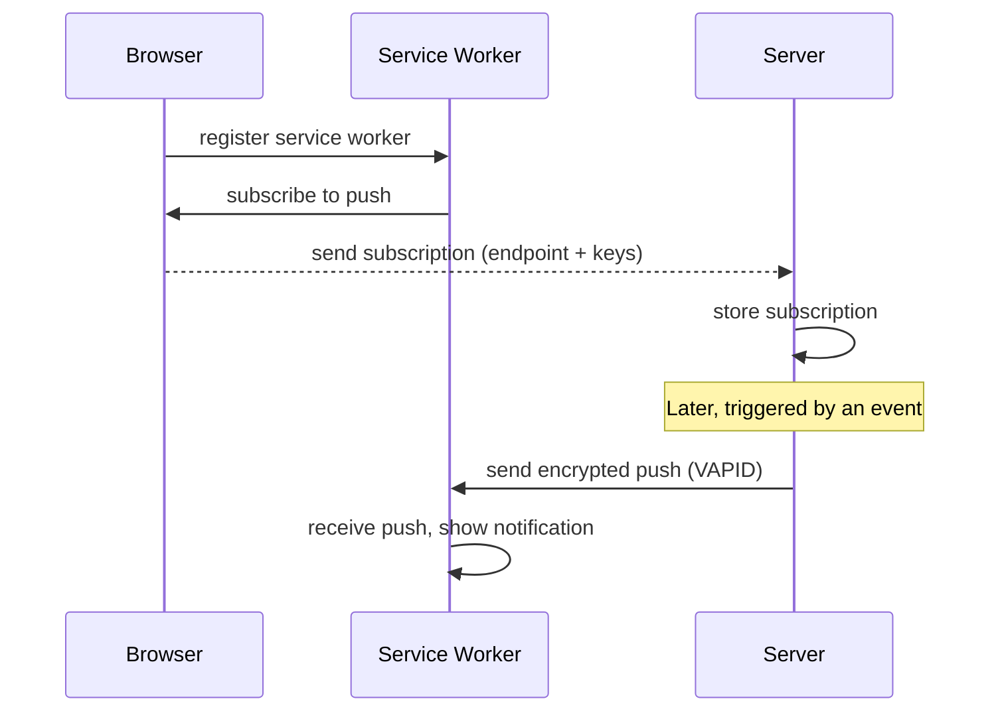

---
tags:
  - programming/web
---

# Browser Storage, Canvas, and Push

Browser applications can use platform APIs directly without adding a framework. The projects use local storage, canvas rendering, audio, pointer input, web application manifests, and server-triggered push capabilities.

## Web Storage

`localStorage` stores string values synchronously for an origin. It is suitable for small preferences and recoverable local state, not large datasets or authoritative records.

- Serialise and parse defensively.
- Namespace keys and plan schema changes.
- Handle quota, privacy mode, unavailable storage, and corrupted values.
- Never assume storage protects bearer tokens from script running in the same origin.
- Define logout and account-deletion cleanup deliberately.

IndexedDB supports larger asynchronous structured storage, indexes, and transactions. Add it only when offline or local-query requirements justify the lifecycle and migration complexity. A declared package or compatibility shim is not proof that an application currently uses IndexedDB.

### Versioned Preference Example

```javascript
const preferenceKey = "study-app:preferences:v1";
const defaults = { theme: "system", reducedEffects: false };

export function loadPreferences(storage = localStorage) {
  try {
    const raw = storage.getItem(preferenceKey);
    if (raw === null) return defaults;

    const value = JSON.parse(raw);
    return {
      theme: ["light", "dark", "system"].includes(value.theme)
        ? value.theme
        : defaults.theme,
      reducedEffects: value.reducedEffects === true
    };
  } catch {
    return defaults;
  }
}

export function savePreferences(preferences, storage = localStorage) {
  try {
    storage.setItem(preferenceKey, JSON.stringify(preferences));
    return true;
  } catch {
    return false;
  }
}
```

The wrapper handles missing, malformed, or unavailable storage and accepts a replacement storage object in tests. The stored value remains user-controlled input; validation is required even when this application originally wrote it.

## Canvas, WebGL, and Audio

Canvas is an immediate-mode drawing surface: application state must be redrawn when the frame changes. Separate the update loop, collision or domain rules, rendering, input, and audio so behaviour can be tested without pixels.

Use `requestAnimationFrame`, time-based movement, explicit pixel-density handling, and cleanup for event listeners and graphics resources. Canvas content needs DOM text or another accessible equivalent for essential controls and information.

Browsers commonly require a user gesture before audio starts. Provide mute controls, persist preferences carefully, and stop or release audio resources when no longer needed.

## Web Push

Web Push uses a service worker, a browser push subscription, and a server that sends encrypted push messages using VAPID credentials. Store subscriptions per user, validate their shape, delete expired endpoints, and avoid placing sensitive details in notification content.



A web application manifest supplies install metadata but does not by itself make an application offline-capable or prove that a service worker is registered.

## Common Failure Modes

- storing an authoritative record only in browser storage;
- assuming same-origin scripts cannot read a bearer token in `localStorage`;
- parsing stored JSON without a fallback or migration path;
- moving canvas objects by a fixed amount per frame on displays with different rates;
- leaving animation frames, audio contexts, or event listeners active after navigation;
- displaying push payload details that should remain private on a lock screen;
- calling a site a PWA because it has a manifest but no verified offline lifecycle.

## Project Connections

FlappyAI uses Canvas, pointer events, Web Audio, and `localStorage`. Aether and Nyx use `localStorage`; Nyx includes manifest assets but intentionally has no active offline/PWA layer. The Janus APIs store push subscriptions and send VAPID-backed reminders.

## Interview Questions

> [!question] Interview Questions
> - Why can't `localStorage` be assumed safe from any script running on the same origin, including a bearer token stored there?
> - Why would you version a `localStorage` key, and what happens if you don't when the stored shape changes?
> - Why does canvas movement need to be time-based rather than a fixed amount per frame?
> - Why doesn't having a web app manifest by itself make a site an installable, offline-capable PWA?
> - Why should push notification content avoid putting sensitive details in the payload shown on a lock screen?

## Related Guides

- [HTML](./html.md)
- [CSS](./css.md)
- [JavaScript and TypeScript](../languages/javascript-typescript.md)
- [Frontend Libraries](../tooling/frontend-libraries.md)

Return to [Web Foundations](./README.md).
