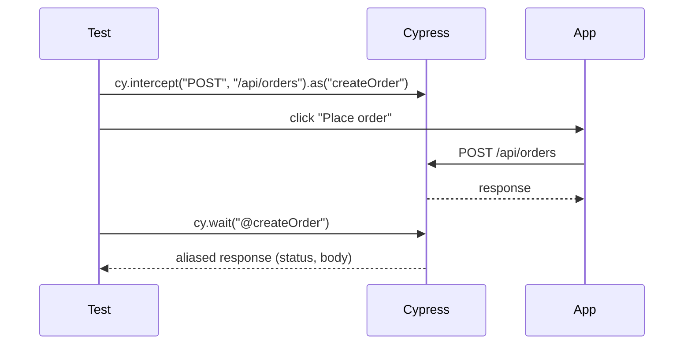

---
tags:
  - quality-engineering/test-automation
---

# Cypress

Cypress is a JavaScript and TypeScript testing tool for browser end-to-end and component tests. Its command queue, automatic retry behaviour, application iframe, network control, and interactive runner create a different mental model from direct WebDriver-style automation.

## Commands and the Queue

Cypress commands are enqueued and executed later by the runner. They do not return DOM values synchronously:

```typescript
cy.get("[data-cy='total']")
  .invoke("text")
  .then(total => {
    expect(total.trim()).to.equal("€42.00");
  });
```

Use command chains, aliases, and closures rather than assigning a command result to an ordinary variable and expecting it to contain the eventual subject.

## Queries, Assertions, and Retry-Ability

Linked queries and assertions retry until they pass or time out. Action commands execute once after Cypress determines that the target is actionable.

```typescript
cy.findByRole("button", { name: "Save" }).click();
cy.findByRole("status").should("have.text", "Saved");
```

Assert the state the user is waiting for. Avoid arbitrary `cy.wait(5000)` calls; use retried assertions or wait on an aliased network operation when the network contract is the intended synchronisation point.

## Selectors

Choose selectors according to the behaviour being protected:

- role, label, and visible name for accessibility and user-facing contracts;
- visible text when the copy itself matters;
- stable `data-*` attributes when implementation-independent test identity is needed;
- avoid styling classes, generated identifiers, and deep DOM structure.

A selector strategy should be agreed with application developers and code review should treat testability hooks as part of the interface.

## Test Isolation and Data

Tests should pass alone, in any order, and under parallel execution. With test isolation enabled, Cypress resets browser context between end-to-end tests, but the application database and external systems still need deliberate control.

Set required state before each test. Do not rely on an earlier test or cleanup that only runs in `afterEach`, because interrupted execution may skip teardown. Use APIs, tasks, or controlled fixtures to create state when UI setup is not the behaviour being tested.

## Authentication and Sessions

Keep a small number of tests for the real login interface. For unrelated scenarios, authenticate programmatically and use session caching where safe. Never share a mutable user across parallel tests without a data ownership strategy.

Cross-origin authentication has security and framework constraints. Prefer controlled identity environments and avoid automating third-party pages whose content, bot controls, or availability the team does not own.

## Network Control

`cy.intercept()` can observe, alias, modify, delay, or stub HTTP traffic:

```typescript
cy.intercept("POST", "/api/orders").as("createOrder");
cy.findByRole("button", { name: "Place order" }).click();
cy.wait("@createOrder").its("response.statusCode").should("eq", 201);
```



Register an intercept before triggering the request. Stub failures or edge cases when control adds value, but retain integration coverage against real services for the contracts the system depends on.

## End-to-End and Component Testing

End-to-end tests exercise a deployed application boundary and are valuable for critical journeys and integration risk. Component tests mount a component with controlled props and dependencies, giving quicker feedback for UI states and interaction.

Do not force every condition through the broadest test level. Keep pure logic in unit tests, component behaviour in component tests, service contracts near APIs, and a focused set of full journeys.

## Custom Commands and Abstractions

Add a custom command for a widely reused domain capability or missing Cypress primitive, not merely to shorten every line. Prefer small functions and clear tests over a large hidden command language.

Keep assertions near the scenario unless the abstraction owns a stable, reusable contract. Avoid page-object hierarchies that obscure Cypress’s command chain and retry semantics.

## Debugging and CI

Open mode provides the command log, time-travel snapshots, browser developer tools, and rapid reruns. CI runs should retain screenshots, videos where justified, test reports, console output, and relevant application logs.

```bash
npx cypress open
npx cypress run
```

Start the application outside the Cypress test process, wait for a readiness endpoint, and stop it after the run. Pin the Cypress binary and dependencies through the project’s package and CI image strategy.

## Interview Questions

> [!question] Interview Questions
> - Why don't Cypress commands return values synchronously, and how does that change how you write assertions?
> - What's the difference between a query, an action, and an assertion in Cypress's retry model?
> - How would you isolate browser and server state so tests can run independently and in parallel?
> - When would you use `cy.intercept()` to observe traffic versus stub it, and what's the risk of over-stubbing?
> - How would you diagnose a flaky Cypress test using the command log and CI artifacts?

## Official References

- [Cypress documentation](https://docs.cypress.io/)
- [Core concepts](https://docs.cypress.io/app/core-concepts/introduction-to-cypress)
- [Retry-ability](https://docs.cypress.io/app/core-concepts/retry-ability)
- [Best practices](https://docs.cypress.io/app/core-concepts/best-practices)

Return to [Test Automation Tools](./README.md).
