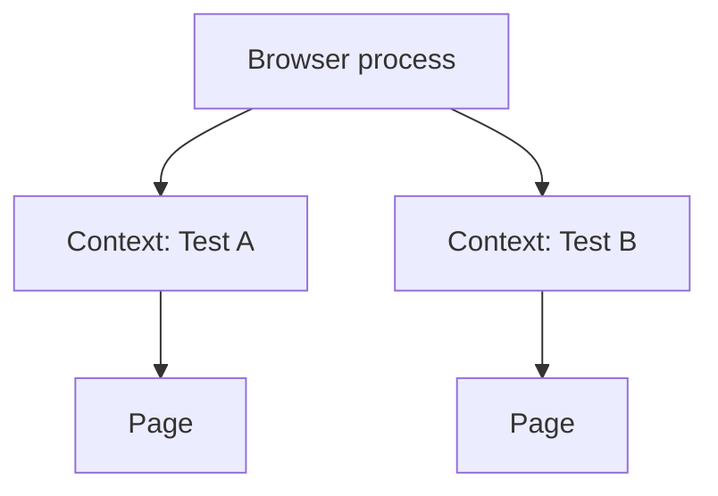

---
tags:
  - quality-engineering/test-automation
---

# Playwright

Playwright is a browser-automation library with an integrated test runner for modern web applications. Its browser contexts, locators, actionability checks, fixtures, tracing, and parallel execution support reliable end-to-end and component-oriented workflows when tests also control data and environment state.

## Browser Isolation

A browser process can contain multiple isolated browser contexts. Each test receives a fresh context and page by default in Playwright Test, providing cookie, storage, and session isolation without launching a new browser process for every test.



Tests must still isolate server-side data. Unique test identities, API setup, database seeding, and deterministic cleanup prevent workers from colliding.

## Locators and Actionability

Locators find the current DOM element when an action or assertion runs. Prefer user-facing semantics:

```typescript
await page.getByRole("textbox", { name: "Email" }).fill("user@example.com");
await page.getByRole("button", { name: "Sign in" }).click();
await expect(page.getByRole("heading", { name: "Dashboard" })).toBeVisible();
```

Role, label, text, and test-ID locators express different contracts. Use accessible roles and names when they are part of the product behaviour; use a stable test ID when visible content or semantics are not the intended assertion.

Before actions, Playwright checks conditions such as visibility, stability, event reception, and enabled state. Web-first assertions retry until their condition succeeds or times out. Avoid fixed sleeps; wait for a user-visible result, response, URL, or application state.

## Fixtures and Projects

Fixtures define setup, dependencies, scope, and teardown. Keep them focused and use worker scope only for resources safe to share across tests in one worker.

Projects run the same suite with different browsers, devices, locales, authentication states, or environment settings. Browser coverage should follow product support and risk rather than multiplying every test across every configuration.

## Authentication and Test Data

Authentication state can be saved and reused when tests do not need to verify the login UI. Do not share one mutable account across parallel tests. Separate:

- a small test of the real login journey;
- programmatic authentication for unrelated scenarios;
- per-worker or per-test accounts where server state changes.

Create required data through an API or controlled fixture when UI setup is not the behaviour under test. The test should own enough state to run alone and in any order.

## Network and API Testing

Playwright can observe, wait for, modify, or fulfil network requests and can send API requests outside a page.

Use interception deliberately:

- stub a rare dependency failure that is otherwise difficult to trigger;
- isolate a frontend component from an unstable external service;
- inspect an outgoing contract;
- avoid mocking the very integration an end-to-end test is intended to prove.

Register waits or listeners before the action that triggers the event to avoid races.

## Architecture

Prefer domain-oriented helpers over wrappers for every Playwright method. A page or component object should expose meaningful capabilities and keep assertions close to the behaviour they explain.

```typescript
class CheckoutPage {
  constructor(private readonly page: Page) {}

  async placeOrder(): Promise<void> {
    await this.page.getByRole("button", { name: "Place order" }).click();
  }
}
```

Avoid a large base page, hidden global state, or helpers that turn a clear test into an indirect sequence no one can diagnose.

## Parallelism, Retries, and Flakiness

Parallel execution reveals shared-state problems. Treat workers as independent processes and shard only after data and environment isolation are reliable.

Retries can identify intermittent failures and reduce transient build noise, but a passed retry still indicates instability. Preserve retry traces, classify the cause, and fix timing, data, environment, or product defects instead of normalising reruns.

## Diagnostics and CI

Use traces, screenshots, videos, console output, network details, and test-step annotations. A good CI configuration retains rich artifacts on failure while controlling storage.

```bash
npx playwright test
npx playwright test --project=chromium
npx playwright show-report
```

Pin Playwright and browser versions through the dependency and container strategy. Start the application before the suite, use a readiness signal, and terminate it after execution.

## Worked Example: Observe the Request and the Outcome

Inside a Playwright Test using its `page` fixture and `expect`, assume an isolated checkout already has an item and the application returns 201 from `POST /api/orders`:

```typescript
const created = page.waitForResponse(response =>
  new URL(response.url()).pathname === "/api/orders" &&
  response.request().method() === "POST"
);
await page.getByRole("button", { name: "Place order" }).click();
const response = await created;
expect(response.status()).toBe(201);
await expect(page.getByRole("heading", { name: "Order confirmed" }))
  .toBeVisible();
```

**Predict before reading on:** Why install the wait before clicking, and why check both the status and the heading?

**Check your reasoning:** A fast response could arrive before a later listener is installed. The response establishes the API outcome, while the heading checks that the UI presents it. Matching only successful responses can turn an actual 500 into an opaque timeout, so this predicate matches the relevant operation and checks its status separately. If only the UI contract matters, the retried heading assertion may suffice.

Change the server response to a controlled 500 and assert the intended error state without creating an order. A stubbed failure tests UI handling; a separate real integration check establishes server behaviour.

## Interview Questions

> [!question] Interview Questions
> - What's the difference between a browser, a context, and a page in Playwright, and why does that matter for test isolation?
> - How would you choose a locator strategy, and when would a test ID be more appropriate than a role-based locator?
> - Why should you rely on Playwright's web-first assertions instead of fixed sleeps?
> - How would you isolate authentication and server-side data when tests run in parallel?

## Answer Notes

1. A browser is the running browser instance; a context is an isolated session with its own cookies and storage; a page is a tab within that context. Fresh contexts isolate browser state, but do not isolate shared backend data.

2. Prefer user-facing roles, accessible names and labels when they express the behaviour under test. Use an agreed test ID where there is no stable meaningful user-facing locator, avoiding brittle DOM structure selectors.

3. Web-first assertions repeatedly check the expected condition within a timeout. Fixed sleeps guess at timing, wasting time when the app is fast and failing when it is slower; wait for meaningful state instead.

4. Use appropriately scoped authentication state and unique accounts or records when tests mutate shared data. Set up and clean up through controlled APIs or fixtures, and ensure workers do not reuse conflicting resources.

## Official References

- [Playwright documentation](https://playwright.dev/docs/intro)
- [Locators](https://playwright.dev/docs/locators)
- [Test fixtures](https://playwright.dev/docs/test-fixtures)
- [Trace viewer](https://playwright.dev/docs/trace-viewer)

Return to [Test Automation Tools](./README.md).
