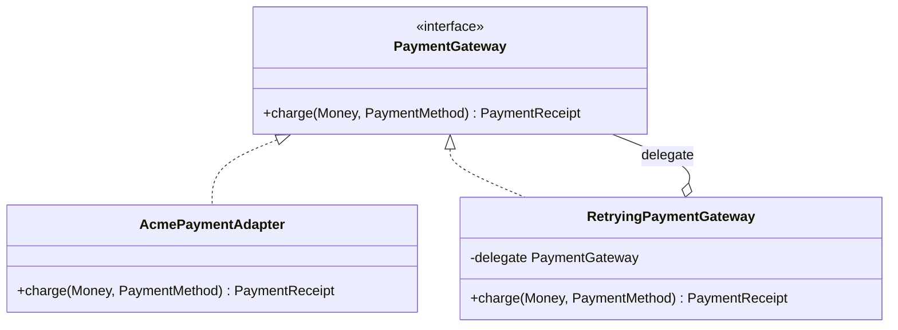
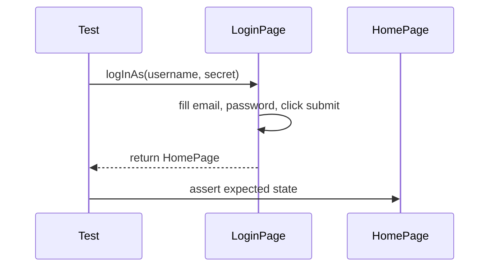

---
tags:
  - software-design
---

# Design Patterns

A design pattern is a named, reusable approach to a recurring design problem. It describes a context, collaborating roles, and trade-offs; it is not code to copy unchanged.

Patterns are useful because they give teams a shared vocabulary. “Use a strategy for pricing” communicates more than a diagram of unnamed classes. The name does not replace an explanation of why the pattern fits.

## Pattern Categories

| Category | Purpose | Examples |
| --- | --- | --- |
| Creational | Control or clarify object construction | Factory Method, Abstract Factory, Builder |
| Structural | Compose objects or adapt boundaries | Adapter, Decorator, Facade, Composite |
| Behavioural | Organise algorithms and collaboration | Strategy, Observer, Command, State |
| Architectural or domain | Shape larger boundaries and models | Repository, Ports and Adapters, CQRS |

The classic categories are useful for object-level patterns. Teams also use pattern language at domain, application, integration, and distributed-system levels.

## How to Select a Pattern

1. Describe the problem without naming a pattern.
2. Identify the forces: variation, lifecycle, coupling, performance, consistency, and failure.
3. Start with the simplest clear design.
4. Compare a pattern's benefit with its indirection and operational cost.
5. Confirm that tests and names still describe behaviour clearly.

Do not choose a pattern because its class diagram looks familiar.

## Factory

A factory centralises construction when selecting or assembling a concrete type would otherwise leak into clients.

```java
public final class NotificationChannelFactory {
    private final Map<String, Supplier<NotificationChannel>> channels;

    public NotificationChannelFactory(
            Map<String, Supplier<NotificationChannel>> channels) {
        this.channels = Map.copyOf(channels);
    }

    public NotificationChannel create(String name) {
        Supplier<NotificationChannel> supplier = channels.get(name);
        if (supplier == null) {
            throw new IllegalArgumentException("Unsupported channel: " + name);
        }
        return supplier.get();
    }
}
```

This registry allows composition code to add a channel without editing a switch. A small switch is still a reasonable factory when the choices are fixed.

“Factory” is an informal umbrella term. **Factory Method** delegates creation through an overridable method; **Abstract Factory** provides a family of related products. Use the precise name when the distinction matters.

**Costs:** hides direct construction, adds another abstraction, and can make dependencies less obvious if used as a service locator.

## Builder

A builder makes multi-step construction readable when an object has several optional values or must be assembled gradually.

```java
TestUser user = TestUser.builder()
        .withName("Ava")
        .withRole(Role.ADMIN)
        .active()
        .build();
```

Builders are especially useful for test data. A constructor or named factory is clearer when only a few required arguments exist.

Ensure `build()` validates the final object. A builder should not make invalid combinations silently possible.

## Strategy

Strategy encapsulates interchangeable algorithms behind one contract.

```java
public interface ShippingCost {
    Money calculateFor(Shipment shipment);
}

public final class Checkout {
    private final ShippingCost shippingCost;

    public Checkout(ShippingCost shippingCost) {
        this.shippingCost = shippingCost;
    }

    public Money totalFor(Shipment shipment) {
        return shipment.itemTotal().plus(shippingCost.calculateFor(shipment));
    }
}
```

Use Strategy when the algorithm varies independently of its caller and implementations share a meaningful contract. A lambda may be enough for a stateless, single-method strategy.

**Costs:** more types and configuration; the caller or composition root must choose an implementation.

## Adapter

An adapter translates an external or incompatible interface into the contract the application wants.

```java
public final class AcmePaymentAdapter implements PaymentGateway {
    private final AcmePaymentsClient client;

    public AcmePaymentAdapter(AcmePaymentsClient client) {
        this.client = client;
    }

    @Override
    public PaymentReceipt charge(Money amount, PaymentMethod method) {
        AcmeCharge response = client.createCharge(
                amount.minorUnits(),
                amount.currencyCode(),
                method.token());

        return new PaymentReceipt(response.id(), response.approved());
    }
}
```

The adapter contains provider-specific types and translation. Domain and application code remain expressed in their own language.

**Costs:** translation must be tested, error semantics may not map perfectly, and provider capabilities can leak if the local contract becomes too broad.

## Decorator

A decorator wraps an implementation of the same contract to add behaviour.

```java
public final class RetryingPaymentGateway implements PaymentGateway {
    private final PaymentGateway delegate;
    private final RetryPolicy retryPolicy;

    public RetryingPaymentGateway(
            PaymentGateway delegate,
            RetryPolicy retryPolicy) {
        this.delegate = delegate;
        this.retryPolicy = retryPolicy;
    }

    @Override
    public PaymentReceipt charge(Money amount, PaymentMethod method) {
        return retryPolicy.execute(
                () -> delegate.charge(amount, method));
    }
}
```

Decorators can add logging, caching, metrics, authorisation, or retry behaviour without changing the core implementation. Order matters when several decorators are stacked, and retries are safe only for operations with suitable idempotency guarantees.



The adapter and the decorator both implement the same `PaymentGateway` contract; the decorator wraps any implementation of it, including the adapter, without either knowing about the other.

## Observer and Domain Events

Observer notifies subscribers when something happens. In-process listeners are simple, while messages between processes introduce delivery, ordering, duplication, schema evolution, and observability concerns.

Use past-tense event names such as `OrderPlaced`. Treat events as facts, not commands. Handlers should be idempotent where a message may be delivered more than once.

Avoid hiding the primary business flow in an event maze. Direct calls are often clearer when the action is required for the use case to succeed.

## State

The State pattern moves behaviour that depends on lifecycle state into state-specific objects. It can replace large repeated conditionals for complex workflows.

For a small fixed lifecycle, an enum and explicit transition method may be clearer. The important design is that invalid transitions are rejected in one place.

## Repository

A repository presents collection-like access to aggregates or domain objects while hiding persistence mechanics.

```java
public interface OrderRepository {
    Optional<Order> findBy(OrderId id);
    void save(Order order);
}
```

Keep the interface expressed in domain terms. Returning database query builders or ORM sessions defeats the boundary. Repositories are most valuable in rich domain models; a direct data-access approach may be simpler for read-heavy or CRUD-only features.

## Page Object Model

Page objects model the services a page or reusable component offers to a UI test. They keep locators and interaction mechanics out of test intent.

```java
public final class LoginPage {
    private final WebDriver driver;

    private final By email = By.id("email");
    private final By password = By.id("password");
    private final By submit = By.cssSelector("[data-testid='login']");
    private final By error = By.cssSelector("[role='alert']");

    public LoginPage(WebDriver driver) {
        this.driver = driver;
        new WebDriverWait(driver, Duration.ofSeconds(10))
                .until(ExpectedConditions.visibilityOfElementLocated(submit));
    }

    public HomePage logInAs(String username, String secret) {
        driver.findElement(email).sendKeys(username);
        driver.findElement(password).sendKeys(secret);
        driver.findElement(submit).click();
        return new HomePage(driver);
    }

    public LoginPage attemptLogin(String username, String secret) {
        driver.findElement(email).sendKeys(username);
        driver.findElement(password).sendKeys(secret);
        driver.findElement(submit).click();
        return this;
    }

    public String errorMessage() {
        return new WebDriverWait(driver, Duration.ofSeconds(10))
                .until(ExpectedConditions.visibilityOfElementLocated(error))
                .getText();
    }
}
```



### Page Object Guidance

- Expose user-facing services such as `logInAs`, not every click and field.
- Keep locators and waiting details inside the page or component.
- Return the next page or component when navigation has a known result.
- Model repeated widgets as component objects.
- Keep test assertions in tests; a page object may verify that it loaded correctly.
- Inject the driver or browser session instead of storing it globally.
- Prefer composition of components over a deep base-page hierarchy.
- Do not create a page object for a trivial page when it adds no clarity.

A page object is a test design pattern, not a copy of the page's HTML structure.

## Pattern Interactions

Patterns commonly collaborate:

- a factory creates a configured strategy;
- an adapter implements a port owned by the application;
- decorators wrap that adapter with metrics and retry behaviour;
- a repository loads an aggregate;
- the aggregate records a domain event;
- a builder creates readable test data.

This does not mean all are needed together. Each pattern must earn its place.

## Common Misuses

- Pattern matching before understanding the problem.
- Creating abstractions with only a speculative future use.
- Naming a switch “Factory” and claiming no future code will change.
- Using Singleton for mutable global state.
- Using Observer for required synchronous steps.
- Wrapping every dependency in several pass-through layers.
- Building generic repositories that erase domain language.
- Creating page objects with public locators and assertions for every test.

## Interview Questions

> [!question] Interview Questions
> - How would you decide whether a design pattern is worth the indirection it adds, versus keeping the simpler design?
> - Given a checkout that needs to support several payment providers, how would you design the abstraction boundary, and where would you put provider selection?
> - How would you add metrics or retry behaviour to a payment adapter without editing the adapter itself?
> - What idempotency and retry decisions would you need to make for a payment charge, and why?
> - How do you know a pattern's name actually matches its structure and intent, rather than being applied because the name sounds right?
> - Could the pattern you chose be removed later without rewriting the whole system? What would make that hard?

## Related Guides

- [Object-Oriented Programming](./software-design-object-oriented-programming.md)
- [SOLID Principles](./software-design-solid-principles.md)
- [Domain-Driven Design](./software-design-domain-driven-design.md)
- [Testing](../quality-engineering/quality-engineering-testing.md)

Return to [Software Design](./README.md).
