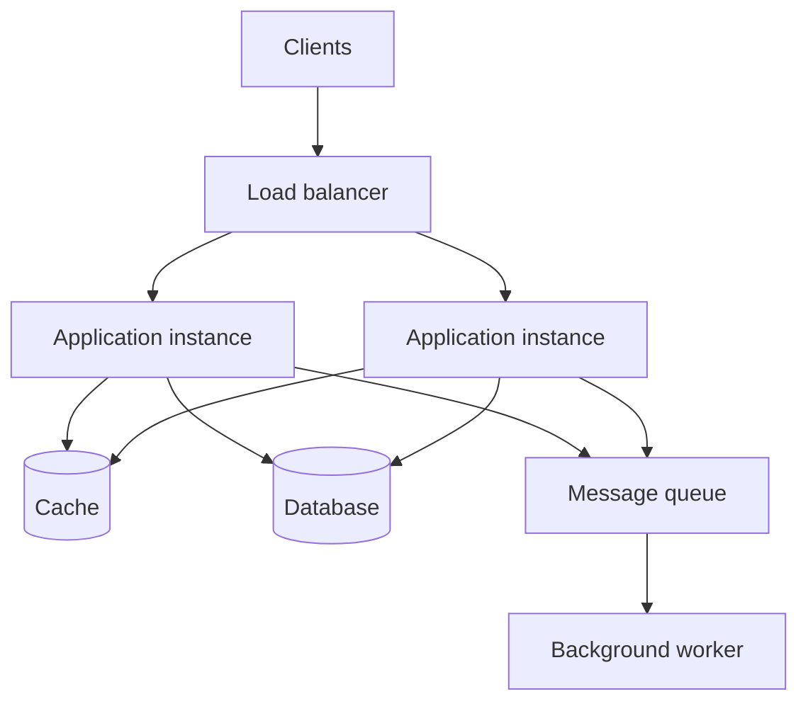

# System Design

System design is the process of deciding how the major parts of a software system work together to meet its functional and operational requirements. It sits above class-level software design: instead of asking how one class should be structured, it asks how clients, services, databases, caches, queues, and infrastructure should collaborate.

The goal is not to draw the most complicated architecture. The goal is to make important requirements and trade-offs explicit, then choose the simplest design that can satisfy them.

## Start With Requirements

Before choosing technologies, separate the problem into two kinds of requirements.

### Functional Requirements

These describe what users must be able to do. For a URL shortener, examples include:

- create a short URL;
- redirect a short URL to its original destination;
- optionally expire or delete a link.

### Non-Functional Requirements

These describe how well the system must work:

- **availability:** how often must it be usable?
- **latency:** how quickly must it respond?
- **throughput:** how many requests or events must it handle?
- **durability:** how much data loss is acceptable?
- **consistency:** how quickly must all users see the same data?
- **security and privacy:** who may access which data?
- **cost:** what level of infrastructure is justified?

Requirements drive architecture. A system used by 100 employees should not automatically receive the same design as a public service processing millions of requests per second.

## Estimate the Scale

Rough calculations help reveal where the pressure will be. Precision is less important than making assumptions visible.

Suppose a service receives 10 million requests per day:

```text
average requests per second = 10,000,000 / 86,400 ≈ 116
peak requests per second    = average × peak factor
                             ≈ 116 × 10 = 1,160
```

Also estimate:

- reads compared with writes;
- average payload size;
- daily and annual storage growth;
- bandwidth in and out;
- how long data must be retained.

These estimates tell you whether one application and one database may be sufficient, or whether caching, partitioning, asynchronous processing, or other techniques deserve consideration.

## A Basic Scalable Architecture



Each component should solve a stated problem:

- a **load balancer** distributes traffic and avoids depending on one application instance;
- **stateless application instances** can be added or replaced easily;
- a **database** stores durable source-of-truth data;
- a **cache** reduces repeated work and database reads;
- a **queue** absorbs bursts and separates slow work from the user request;
- a **worker** processes asynchronous jobs such as email, media processing, or analytics.

Do not add every component by default. Begin with a simple design and introduce complexity when a requirement or measured bottleneck justifies it.

## Core Building Blocks

### DNS, CDNs, and Load Balancers

- **DNS** maps a domain name to an endpoint.
- A **content delivery network (CDN)** stores static or cacheable content close to users.
- A **load balancer** routes requests across healthy application instances.

### Application Services

Stateless services are usually easier to scale horizontally because any instance can handle a request. User sessions and important state should live in an appropriate shared store rather than only in one process's memory.

A monolith can be an excellent starting point. Microservices become useful when independently owned or scaled boundaries outweigh the added network, deployment, data, and operational complexity.

### Databases

Relational databases are a strong default when data has relationships, transactions, and well-defined constraints. NoSQL databases are useful when their particular data model, scale characteristics, or access patterns fit the problem.

Common scaling techniques include:

- **indexes** to speed up specific queries at the cost of storage and slower writes;
- **read replicas** to distribute reads, usually with some replication delay;
- **partitioning or sharding** to divide data across machines;
- **denormalisation** to make reads cheaper by duplicating data;
- **connection pooling** to reuse a controlled number of database connections.

Choose a database from access patterns and consistency needs, not from popularity.

### Caches

A cache trades some freshness and invalidation complexity for lower latency and less work. A common cache-aside flow is:

1. read from the cache;
2. on a miss, read from the database;
3. put the result in the cache with an expiry;
4. return the result.

Always decide what happens when the cache is stale, unavailable, or suddenly empty. The database must survive the extra load caused by a cold cache or cache outage.

### Queues and Event Streams

Queues allow work to happen asynchronously and can smooth traffic spikes. They introduce questions about retries, duplicate delivery, ordering, dead-letter queues, and monitoring.

Consumers should generally be **idempotent**: processing the same message more than once should not produce an incorrect result. An email job, for example, may need a unique operation ID to prevent duplicate sends.

### Object Storage

Large files such as images, videos, backups, and exported reports usually belong in object storage rather than directly in a relational database. Applications commonly store the object's key and metadata in the database.

## Important Trade-offs

### Vertical and Horizontal Scaling

- **Vertical scaling** gives one machine more CPU, memory, or storage. It is simple but has a limit and can retain a single point of failure.
- **Horizontal scaling** adds more machines. It can improve capacity and resilience, but requires load distribution and coordination of shared state.

### Consistency and Availability

During a network partition, a distributed system may have to reject some operations to preserve strong consistency or continue serving with potentially stale data. The right choice depends on the operation. A social feed may tolerate brief staleness; a financial balance often needs stricter guarantees.

Consistency is not one global switch. Decide it per workflow and per piece of data.

### Synchronous and Asynchronous Work

- Use **synchronous** calls when the caller needs the result immediately.
- Use **asynchronous** processing when work can finish later, traffic needs buffering, or downstream failures should not block the user.

Asynchronous systems improve decoupling but make progress, failure, retries, and debugging less immediate.

### SQL and NoSQL

SQL versus NoSQL is not simply small versus large. Consider:

- data shape and relationships;
- required transactions and constraints;
- query and access patterns;
- consistency needs;
- operational experience;
- expected growth and distribution.

## Reliability and Failure Design

Assume every network call can fail, time out, or return late.

- Set **timeouts** so callers do not wait forever.
- Use **retries** only for transient failures, with exponential backoff and jitter.
- Make retried operations **idempotent**.
- Use **circuit breakers** to stop repeatedly calling an unhealthy dependency.
- Add **health checks** and remove unhealthy instances from traffic.
- Replicate important data and test **backup restoration**.
- Apply **backpressure** or rate limits when consumers cannot keep up.
- Define recovery objectives: **RPO** for acceptable data loss and **RTO** for acceptable recovery time.

A design is incomplete until it explains failure behaviour.

## Observability and Security

### Observability

- **metrics** show trends such as request rate, error rate, latency, and saturation;
- **logs** record useful event context;
- **traces** follow one request across service boundaries;
- **alerts** notify people about symptoms that require action.

Track percentiles such as p95 and p99 latency. An average can hide a poor experience for a meaningful number of users.

### Security

- authenticate identities and authorise every protected action;
- encrypt traffic in transit and sensitive data at rest;
- store secrets outside source code;
- validate input and apply least privilege;
- rate-limit abuse-prone endpoints;
- identify trust boundaries and avoid exposing internal services unnecessarily;
- record security-relevant actions in audit logs.

## A Repeatable Design Process

Use this order when solving a system-design problem:

1. **Clarify scope.** List the main user actions and what is explicitly out of scope.
2. **Define quality targets.** State availability, latency, durability, consistency, security, and cost expectations.
3. **Estimate scale.** Calculate approximate request rates, storage, bandwidth, and read/write ratios.
4. **Define the interface.** Sketch the important APIs, events, and data model.
5. **Draw the high-level design.** Show the request path and source of truth.
6. **Identify bottlenecks and failures.** Ask what reaches its limit first and what happens when each dependency fails.
7. **Deep-dive selectively.** Explore the two or three areas most important to the requirements.
8. **Explain trade-offs.** State why this design is appropriate and what would make you change it.

## Worked Example: URL Shortener

### Requirements and Assumptions

- Create a short URL from a long URL.
- Redirect quickly from the short URL.
- Reads greatly outnumber writes.
- Links must survive application restarts.
- A newly created link should work immediately.

### API

```http
POST /links
Content-Type: application/json

{"url": "https://example.com/a/very/long/path"}
```

```json
{"code": "aB3x9K", "shortUrl": "https://sho.rt/aB3x9K"}
```

```http
GET /aB3x9K
HTTP/1.1 302 Found
Location: https://example.com/a/very/long/path
```

### Data Model

```text
Link
- code: string, primary key
- destination_url: string
- created_at: timestamp
- expires_at: nullable timestamp
```

### Initial Design

1. The API creates a unique code and stores the mapping in a relational database.
2. A redirect request first checks Redis using the code as its key.
3. On a cache miss, the service reads the database and populates Redis.
4. Stateless service instances sit behind a load balancer.
5. Click analytics are sent to a queue so redirects do not wait for analytics writes.

### Trade-offs and Failure Cases

- Random codes distribute writes better than sequential database IDs but require collision handling.
- Cached mappings improve redirect latency but require a clear expiry and deletion strategy.
- If Redis fails, the service can read from the database, but database load may spike.
- Analytics delivery may be at least once, so consumers must deduplicate or tolerate duplicates.
- Rate limiting protects link creation and redirect endpoints from abuse.

The first version might need only one service and one database. The cache, queue, replicas, and partitioning should be introduced when requirements or measurements justify them.

## Common Failure Modes

- **Technology-first design:** selecting Kafka, Kubernetes, or microservices before establishing the problem.
- **No estimates:** claiming a system must scale without defining traffic or storage.
- **Happy-path-only diagrams:** ignoring dependency failures, retries, and recovery.
- **Cache as magic:** adding caching without expiry, invalidation, or cold-start plans.
- **Unbounded retries:** worsening an outage by immediately retrying every failure.
- **Ignoring data ownership:** letting several services directly modify the same tables without clear rules.
- **Premature microservices:** accepting distributed-system complexity without an organisational or scaling need.
- **One-size-fits-all consistency:** applying the same guarantees to every workflow.
- **No observability:** designing components without a way to detect or diagnose failure.

## Practice Designs

Work through these in increasing difficulty:

1. URL shortener
2. Pastebin or text-sharing service
3. Rate limiter
4. Notification service
5. File upload and processing service
6. Chat application
7. News feed
8. Video streaming platform

For each exercise, record requirements, estimates, APIs, data model, architecture, failure cases, security, observability, and the most important trade-offs.

## Completion Checklist

- [ ] I can separate functional and non-functional requirements.
- [ ] I can estimate requests per second, bandwidth, and storage.
- [ ] I can explain when to use a cache, queue, replica, or load balancer.
- [ ] I can compare vertical and horizontal scaling.
- [ ] I can discuss consistency, availability, latency, durability, and cost as trade-offs.
- [ ] I design timeouts, retries, idempotency, and failure handling explicitly.
- [ ] I include authentication, authorisation, rate limiting, and trust boundaries.
- [ ] I include metrics, logs, traces, and meaningful alerts.
- [ ] I can begin with a simple architecture and explain what evidence would make it evolve.

## Related Guides

- [Software Design](../software-design/README.md)
- [REST APIs](../quality-engineering/rest-api.md)
- [Caching](../platform-engineering/caching.md)
- [Redis](../platform-engineering/redis.md)
- [Publish/Subscribe](../platform-engineering/pub-sub.md)
- [RabbitMQ](../platform-engineering/rabbitmq.md)
- [Amazon SQS](../platform-engineering/amazon-sqs.md)
- [Docker](../platform-engineering/docker.md)
- [Kubernetes](../platform-engineering/kubernetes.md)
- [Cloud Platforms](../platform-engineering/cloud/README.md)
- [Documentation Library](../README.md)

[Return to the repository home](../../README.md).
